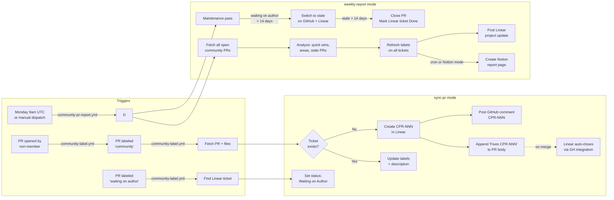

# Community PR Triage

A GitHub Action that automatically syncs community PRs from [strapi/strapi](https://github.com/strapi/strapi) to [Linear](https://linear.app) and generates weekly reports.

## How it works



## Modes

| Mode            | Trigger                                | Output                                                   |
| --------------- | -------------------------------------- | -------------------------------------------------------- |
| `sync-pr`       | PR labeled `community`                 | Linear ticket, GitHub comment, PR body append            |
| `sync-pr`       | PR labeled `waiting on author`         | Linear ticket status → "Waiting on Author"               |
| `weekly-report` | Cron Monday 9am (+ Notion)             | Maintenance pass + Linear project update + Notion report |
| `weekly-report` | Manual `weekly-report` dispatch        | Maintenance pass + Linear project update only            |
| `weekly-report` | Manual `weekly-report-notion` dispatch | Maintenance pass + Linear update + Notion report         |
| `notion-report` | Manual `notion-report` dispatch        | Notion report page only                                  |

## Signals

The action applies three objective signals — no heuristic scoring:

| Signal    | Label                  | Condition                                         |
| --------- | ---------------------- | ------------------------------------------------- |
| Quick win | `quick-win`            | ≤ 100 lines changed and ≤ 5 files                 |
| Stale     | `stale`                | No GitHub activity for > 30 days                  |
| Area      | e.g. `content-manager` | From `source:` GitHub label or changed file paths |

Labels are refreshed on all open tickets each weekly run so they stay accurate as PRs age.

## Waiting on author pipeline

When a PR needs a response from the contributor:

1. Manually add the `waiting on author` GitHub label
2. Linear ticket status is immediately set to **Waiting on Author**
3. After **14 days** with no response → label switches to `stale`, Linear status reverts to **Todo**
4. After **14 more days** stale → PR is closed, Linear ticket is marked **Done**

Only PRs that went through this pipeline are auto-closed. Activity-based stale PRs (flagged by the 30-day inactivity check) are not affected.

## Workflows

**`community-label.yml`** — has two jobs:

- `label`: fires when a PR is **opened** targeting the default branch. Automatically adds the `community` label if the author is not an org member/owner/contributor (bots are skipped).
- `triage`: fires when `community` or `waiting on author` is applied to a PR. Runs `sync-pr` mode accordingly.

**`community-pr-report.yml`** — runs every Monday at 9am UTC with Notion enabled. Manual dispatch supports three options: `weekly-report` (Linear only), `weekly-report-notion` (Linear + Notion), `notion-report` (Notion only).

## Secrets

| Secret               | Notes                                              |
| -------------------- | -------------------------------------------------- |
| `LINEAR_API_KEY`     | Personal API key                                   |
| `LINEAR_CPR_TEAM_ID` | CMS-Community-PRs team (triage tickets live here)  |
| `LINEAR_CMS_TEAM_ID` | CMS team (used to detect which PRs were picked up) |
| `LINEAR_PROJECT_ID`  | Project that receives weekly update posts          |
| `NOTION_API_KEY`     | Integration token                                  |
| `NOTION_DATABASE_ID` | Target database for report pages                   |

`GITHUB_TOKEN` is provided automatically by GitHub Actions.

## Action structure

```
.github/actions/community-pr-triage/
├── action.yml          # Input definitions
├── package.json
├── tsconfig.json
├── tsup.config.ts
├── src/
│   ├── index.ts        # Entry point — routes by mode
│   ├── modes/
│   │   ├── sync-pr.ts
│   │   ├── weekly-report.ts  # includes maintenance pass
│   │   └── notion-report.ts
│   └── lib/
│       ├── github.ts   # Octokit wrapper
│       ├── linear.ts   # Linear SDK wrapper
│       ├── notion.ts   # Notion client
│       ├── analyzer.ts # quick-win / area / stale detection
│       └── types.ts
└── dist/
    └── index.cjs       # Compiled bundle (committed)
```
