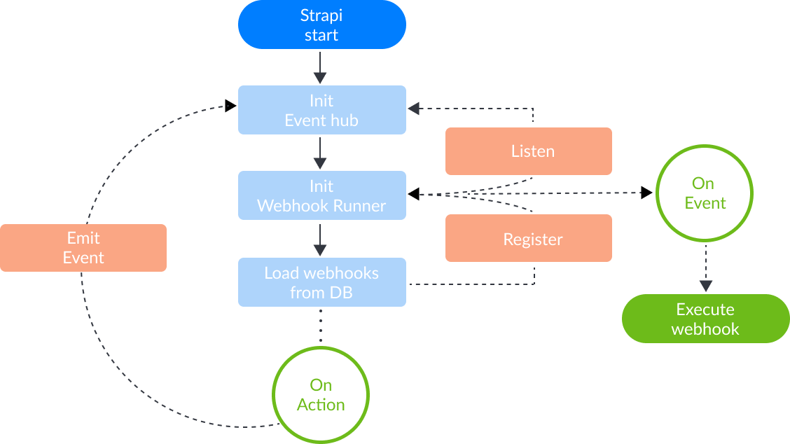

# Webhooks

## What is a webhook

A webhook is a way for an application to notify other applications that an event occured.
Using a webhook is a good way to tell third party providers to start some processing (CI, build, deployment...).

The way a webhook works is by delivering informations to a receiving application through HTTP requests (typically POST requests).

## How to use

### Create a webhook

### Test a webhook

### Enabled and disable a webhook

### Update a webhook

### Delete a webhook

## Available events

By default strapi webhook can be trigger by the following events:

- `entry.create`: Entry create
- `entry.update`: Entry update
- `entry.delete`: Entry delete
- `media.create`: Media create
- `media.delete`: Media delete

### Entry created

This event is triggered when a new entry is created.

**Example payload**

```json
{
  "event": "entry.create",
  "created_at": "2020-01-10T08:47:36.649Z",
  "model": "address",
  "entry": {
    "id": 1,
    "geolocation": {},
    "city": "Paris",
    "postal_code": null,
    "category": null,
    "full_name": "Paris",
    "created_at": "2020-01-10T08:47:36.264Z",
    "updated_at": "2020-01-10T08:47:36.264Z",
    "cover": null,
    "images": []
  }
}
```

### Entry updated

This event is triggered when an entry is updated.

**Example payload**

```json
{
  "event": "entry.update",
  "created_at": "2020-01-10T08:58:26.563Z",
  "model": "address",
  "entry": {
    "id": 1,
    "geolocation": {},
    "city": "Paris",
    "postal_code": null,
    "category": null,
    "full_name": "Paris",
    "created_at": "2020-01-10T08:47:36.264Z",
    "updated_at": "2020-01-10T08:58:26.210Z",
    "cover": null,
    "images": []
  }
}
```

### Entry deleted

This event is triggered when an entry is deleted.

**Example payload**

```json
{
  "event": "entry.delete",
  "created_at": "2020-01-10T08:59:35.796Z",
  "model": "address",
  "entry": {
    "id": 1,
    "geolocation": {},
    "city": "Paris",
    "postal_code": null,
    "category": null,
    "full_name": "Paris",
    "created_at": "2020-01-10T08:47:36.264Z",
    "updated_at": "2020-01-10T08:58:26.210Z",
    "cover": null,
    "images": []
  }
}
```

### Media created (uploaded)

This event is triggered when you upload a file on entry creation or through the media interface.

**Example payload**

```json
{
  "event": "media.create",
  "created_at": "2020-01-10T10:58:41.115Z",
  "media": {
    "id": 1,
    "name": "image.png",
    "hash": "353fc98a19e44da9acf61d71b11895f9",
    "sha256": "huGUaFJhmcZRHLcxeQNKblh53vtSUXYaB16WSOe0Bdc",
    "ext": ".png",
    "mime": "image/png",
    "size": 228.19,
    "url": "/uploads/353fc98a19e44da9acf61d71b11895f9.png",
    "provider": "local",
    "provider_metadata": null,
    "created_at": "2020-01-10T10:58:41.095Z",
    "updated_at": "2020-01-10T10:58:41.095Z",
    "related": []
  }
}
```

### Media deleted

This event is triggered only when you delete a media through the media interface.

**Example payload**

```json
{
  "event": "media.delete",
  "created_at": "2020-01-10T11:02:46.232Z",
  "media": {
    "id": 11,
    "name": "photo.png",
    "hash": "43761478513a4c47a5fd4a03178cfccb",
    "sha256": "HrpDOKLFoSocilA6B0_icA9XXTSPR9heekt2SsHTZZE",
    "ext": ".png",
    "mime": "image/png",
    "size": 4947.76,
    "url": "/uploads/43761478513a4c47a5fd4a03178cfccb.png",
    "provider": "local",
    "provider_metadata": null,
    "created_at": "2020-01-07T19:34:32.168Z",
    "updated_at": "2020-01-07T19:34:32.168Z",
    "related": []
  }
}
```

## Developer documentation

### Architecture



### Available configurations

You can set webhooks configurations inside the file `./config/environments/{env}/server.json`.

- `webhooks`
  - `defaultHeaders`: You can set default headers to use for your webhook requests. This option is overwritten by the headers set in the webhook itself.

**Example configuration**

```json
{
  "webhooks": {
    "defaultHeaders": {
      "Custom-Header": "my-custom-header"
    }
  }
}
```

### Securing your webhooks

Most of the time, webhooks make request to publicly avaialble URLs, therefore it is possible that someone find that URL and send it wrong informations.

To prevent this from happening you can send a header with an authentication token. Using the Admin panel you would have to do it for every webhook.
Another way is to define `defaultHeaders` to add to every webhook requests.

You can configure those global headers by updating the file at `./config/environments/{env}/server.json`:

:::: tabs

::: tab "Simple token"

```json
{
  "webhooks": {
    "defaultHeaders": {
      "Authroization": "Bearer my-very-secured-token"
    }
  }
}
```

:::

::: tab "Environment variable"

```json
{
  "webhooks": {
    "defaultHeaders": {
      "Authroization": "Bearer ${ process.env.WEBHOOK_TOKEN }"
    }
  }
}
```

::::

If you are developing the webhook handler yourself you can now verify the token by reading the headers.

### Programmatic use
