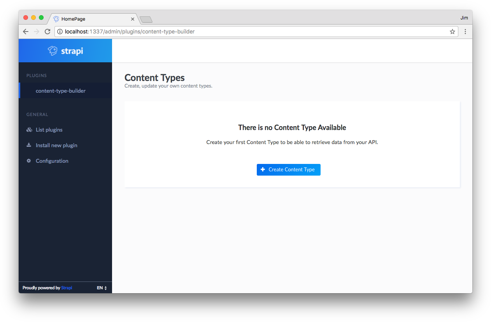

# Generate an API

There is two ways to create an API:
 - Using the Content Type Builder plugin.
 - Using the CLI.

## Content Type Builder

The easiest way is to use the Content Type Builder plugin: a powerful UI to help you to create an API within a few clicks.

To create your API using the Content Type Builder:
 - Start your project and visit the admin panel at the following address: http://localhost:1337/admin/plugins/content-type-builder.
 - Click on "Create Content Type", set `product` as name and submit the form.
 - Then, click on "Add fields", add the following fields:
   - A `string` field named `name`.
   - A `text` field named `description`.
   - A `float` field named `price`.
 - Save.

That's it: your API is created!



## CLI generator

You can also use the [CLI](CLI.md) and its powerful generators.

Type in your terminal the following command:

```
$ strapi generate:api product name:string description:text price:float
```

Here are some explanations:
 - `product` is the name of your Content Type.
 - `name`, `description` and `price` are the attributes.
 - `string`, `text` and `float` are the types of the attributes.

For more information, read the [CLI documentation](CLI.md).


### Files structure (I think we should remove this part)

Whatever option you used to create your API, a new directory has been created in the `api` folder of your application which contains all the needed stuff for your `product` Content Type: API, routes, controller, service and model. Take a look at the [API structure documentation](API.md) for more informations.
