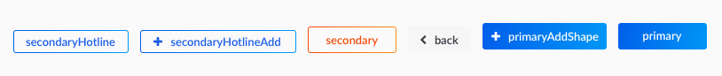

# UI components

Strapi provides built-in UI Components to make development faster.

## Button

Button library based on bootstrap classes.

  

### Usage

| Property | Type | Required | Description |
| -------- | ---- | -------- | ----------- |
| `children`| node | no | Ex: `<Button primary>Click me</Button>` |
| `className` | any | no | Sets a custom className. Ex: `<Button className={styles.myCustomClass} label="Click me" />` |
| `kind` | string | no | Sets the built-in className to the button. Ex: `<Button kind="primaryAddShape"  label="Click me" />` |
| `label` | string | no | Sets the button label with i18n Ex: `<Button label="myPlugin.button.label" primary />` |
| `labelValue` | string | no | Sets the button label with i18n and a dynamic value Ex:  ```<Button label="myPlugin.button.label" labelValue={{ foo: 'bar' }} primary />```  |
| `loader` | bool | no | Displays a button loader. Ex: `<Button loader />` |
| `primary` | bool | no | [Bootstrap className](https://v4-alpha.getbootstrap.com/components/buttons/) |
| `primaryAddShape` | bool | no | Inserts fontAwesone plus icon inside the button. Ex: `<Button primaryAddShape>Click me</Button>` |
| `secondary`| bool | no | [Bootstrap className](https://v4-alpha.getbootstrap.com/components/buttons/) |
| `secondaryHotline` | bool | no | Sets className |
| `secondaryHotlineAdd` | bool | no | Inserts fontAwesone plus icon inside the button. Ex: `<Button secondaryHotlineAdd>Click me</Button>` |
| `type` | string | no | Sets the button type |

### Example

 **Path —** `./plugins/my-plugin/admin/src/translations/en.json`.
```json
{
  "myPlugin.button.label": "Add a new"
}
```


**Path —** `./plugins/my-plugin/admin/src/components/Foo/index.js`.
```js
// Make sure you don't have any other component called Button otherwise it will
// import the one from your ./components folder instead.
import React from 'react';

import Button from 'components/Button';
import styles from './styles.scss';

function Foo() {
  // Define your buttons
  const buttons = [
    {
      kind: 'primaryAddShape',
      label: 'myPlugin.button.label',
      labelValues: {
        foo: 'Bar',
      },
      onClick: () => console.log('Click'),
    },
  ];

  return (
    <div className={styles.foo}>
      {buttons.map(buttonProps => <Button key={buttonProps.label} {...buttonProps} />)}
    </div>
  );

  // Same as
  // return (
  //    <div className={styles.foo}>
  //       <Button
  //         label="myPlugin.button.label"
  //         labelValues={{ foo: 'Bar' }}
  //         onClick={() => console.log('Click')}
  //         primaryAddShape
  //       />
  //    </div>
  // );
}

// Will display a primaryAddShape button with label: 'Add a new Bar'
export default Foo;
```

***

## ExtendComponent

ExtendComponent allows a plugin to inject components into another one.

> Refer to the use cases [documentation](./frontend-use-cases.md#inject-design) to see how to use it.

***

## Ico

Ico components that works with fontAwesome.

### Usage

| Property | Type | Required | Description |
| -------- | ---- | -------- | ----------- |
| `icoType` | string | no (default: `trash`) | fontAwesome ico name. Ex: <Ico icoType="pencil" /> |
| `onClick` | func | no | Function executed onClick. |

### Example

```js
import React from 'react';
import Ico from 'components/Ico';
import PopUpWarning from 'components/PopUpWarning';
import styles from 'styles';

class FooPage extends React.Component {
  constructor(props) {
    super(props);
    this.state = { showModal: false };
  }

  handleClick = () => this.setState({ showModal: true });

  render () {
    return (
      <div className={styles.fooPage}>
        <Ico icoType="trash" onClick={this.handleClick} />
        <PopUpWarning
          isOpen={this.state.showModal}
          onConfirm={() => this.setState({ showModal: false })}
          toggleModal={() => this.setState({ showModal: false })}
        />
      </div>
    );
  }
}

export default FooPage;
```

***

## IcoContainer

Container containing icons, generally used for editing or deleting data.

### Usage
| Property | Type | Required | Description |
| -------- | ---- | -------- | ----------- |
| icons | array | no | Array containing icons' props. |

### Example

```js
import React from 'react';
import IcoContainer from 'components/IcoContainer';
import PopUpWarning from 'components/PopUpWarning';
import styles from 'styles';

class FooPage extends React.Component {
  constructor(props) {
    super(props);
    this.state = { showModal: false };
  }

  handleClick = () => this.setState({ showModal: true });

  render() {
    const icons = [
      { icoType: 'pencil', onClick: () => console.log('click on pencil icon') },
      { icoType: 'trash',  onClick: this.handleClick },
    ];

    return (
      <div className={styles.fooPage}>
        <IcoContainer icons={icons} />
        <PopUpWarning
          isOpen={this.state.showModal}
          onConfirm={() => this.setState({ showModal: false })}
          toggleModal={() => this.setState({ showModal: false })}
        />
      </div>
    );
  }
}

export default FooPage;
```

***

## InputsIndex

Strapi provides a built-in input library which includes :
  - All kind of inputs
  - Front-End validations
  - Error highlight
  - i18n


### Usage

| Property | Type | Required | Description |
| -------- | ---- | -------- | ----------- |
| `addon` | string | no | Allows to add a string addon in your input, based on [Bootstrap](https://v4-alpha.getbootstrap.com/components/input-group/#basic-example). Ex: `<Input {...this.props} addon="@" />` |
| `addRequiredInputDesign` | bool | no | Allows to add an asterix on the input. Ex: `<Input {...this.props} addRequiredInputDesign />` |
| `customBootstrapClass` | string | no | Allows to override the input bootstrap col system. Ex: `<Input {...this.props} customBootstrapClass="col-md-6 offset-md-6 pull-md-6" />` |
| customInputs | Object | no | Allows to add a new input type |
| `deactivateErrorHighlight` | bool | no | Prevents from displaying error highlight in the input: Ex: `<Input {...this.props} deactivateErrorHighlight />` |
| `didCheckErrors` | bool | no | Use this props to display errors after submitting a form. Ex: `<Input {...this.props} didCheckErrors={this.state.error} />` |
| `disabled` | bool | no | Disable the input. Ex: `<Input {...this.props} disabled />` |
| `errors` | array | no | Allows to display custom error messages. Ex: `<Input {...this.props} errors={[{ id: 'components.Input.error.custom-error', errorMessage: 'Something is wrong' }]} />` |
| `inputDescription` | string | no | Allows to add an input description that is displayed like [bootstrap](https://v4-alpha.getbootstrap.com/components/forms/#defining-states). |
| `label` | string | yes | Displays the input's label with i18n. |
| `linkContent` | object | no | Allows to display a link within the input's description. Ex:  ``` <Input {...this.props} linkContent={{ description: 'check out our', link: 'tutorial video' }} />```  |
| `name` | string | yes | The key to update your reducer. |
| `noErrorsDescription` | bool | no | Prevents from displaying built-in errors. |
| `onBlur` | func or bool  | no | Overrides the default onBlur behavior. If bool passed to the component it will disabled the input validations checking. |
| `onChange` | func | yes | Sets your reducer state. |
| `onFocus` | func | no | Adds an onFocus event to the input. |
| `placeholder` | string | no | Allows to set a placeholder. |
| `selectOptions` | array | no | Options for the select. |
|  `tabIndex` | string | no | Sets the order in which the inputs are focused on tab key press. |
| `title` | string | no | This props can only be used for checkboxes, it allows to add a title on top of the input, the label will be on the right side of the checkbox. |
| `validations` | object | yes | Allows to have the built-in input's validations. If set to {} the validations will be ignored. Ex:  ``` <Input {...this.props} validations={{ required: true }} />```  |
| `value` | string or bool or number | yes | The input's value. |

### Example

**Path —** `./plugins/my-plugin/admin/src/containers/FooPage/index.js`.
```js
import React from 'react';
// Make sure you don't have a component called Input inside your ./components folder
// It will import the one in your components folder instead.
import Input from 'components/InputsIndex';

const CustomInput = (props) => {
  return (
    <div>
      Some custom input
    </div>
  );
}

class FooPage extends React.Component {
  constructor(props) {
    super(props);
    this.state {
      data: {
        foo: 'bar',
      },
      error: false,
      errors: [],
    };
  }

  handleChange = ({ target }) => {
    const value = target.type === 'number' ? Number(target.value) : target.value;
    const error = target.value.length === 0;
    const data = {
      [target.name]: value,
    }
    if (error) {
      this.setState({ error: true, errors: [{ id: 'This input is required ' }] });
    } else {
      this.setState({ data, error: false, errors: [] });
    }
  }

  render() {
    const inputs = [
      {
        label: 'This is a string input',
        name: 'foo',
        type: 'string',
        validations: { required: true },
        value: this.state.data.foo,
      },
      {
        label: 'This is a custom input',
        name: 'custom',
        type: 'newType',
        validations: {},
        value: '',
      }
    ]
    return (
      <div className={styles.fooPage}>
        {inputs.map(input => (
          <Input
            key={input.name}
            didCheckErrors={this.state.error}
            onChange={this.handleChange}
            {...input}
          />
        ))}
      </div>
    );
  }
}

// ...

export default FooPage;
```

#### Example with property linkContent and i18n

**Path —** `./plugins/my-plugin/admin/src/translations/en.json`.
```json
{
  "form.input.inputDescription": "Content type name should be singular",
  "form.input.label": "Name",
  "form.input.linkContent.description": "check out our documentation"
}
```

**Path —** `./plugins/my-plugin/admin/src/translations/fr.json`.
```json
{
  "form.input.inputDescription": "Le nom des modèles doit être au singulier",
  "form.input.label": "Nom",
  "form.input.linkContent.description": "regardez la documentation."
}
```

**Path —** `./plugins/my-plugin/admin/src/containers/FooPage/index.js`.
```js
import React from 'react';

// ...

class FooPage extends React.Component {
  // ...
  render () {
    return (
      <div className={styles.fooPage}>
        <Input
          didCheckErrors={this.state.error}
          inputDescription="my-plugin.form.input.inputDescription"
          label="my-plugin.form.input.label"
          linkContent={{ link: 'https://strapi.io/documentation/', description: 'my-plugin.form.input.linkContent.description' }}
          onChange={this.handleChange}
          type="string"
          validations={{ required: true }}
          value={this.state.data.foo}
        />
      </div>
    );
  }
}

// ...

export default FooPage;
```

***

## InputDescription

Component that allows to put a description under an input, it works with or without i18n

| Property | Type | Required | Description |
| -------- | ---- | -------- | ----------- |
| children | node | no | Anything that is wrapped inside the Description |
| className | string | no | custom className for the Description |
| message | func or string or object | no | Define the content of the Description |
| style | object | no | Label style property |


### Usage

**Path -** `my-plugin/admin/src/translations.en.json`.

```json
{
  "Email.inputDescription": "Don't know how to set variables, {documentationLink}",
  "Tel.inputDescription": "Make sure to provide a phone number where you can be reached"
}
```
**Path -** `my-plugin/admin/src/components/Foo/index.js`;

```js
import React from 'react';
import InputText from 'components/InputText';
import InputDescription from 'components/InputDescription';

import styles from './styles.scss';

function Foo({ onChange, value }) {
  return (
    <div className={`col-md-6 ${styles.inputContainer}`}>
      <InputText name="tel" value={value} onChange={onChange} />
      {/* Usage without i18n, custom className and style */}
      <InputDescription
        className={styles.inputDescription}
        message="Make sure to provide a phone number where you can be reached"
        style={{ paddingTop: '10px'}}
      />

      {/* Usage with function */}
      <InputText name="email" value={value} onChange={onChange} />
      <InputDescription
        message={ () => <span>Don&#44;t know how to set variables, <a href="strapi.io" target="_blank">check out our doc!</a></span>}
      />

      {/* Usage with i18n and rich text formatting */}
      <InputText name="email" value={value} onChange={onChange} />
      <InputDescription
        message={{
          id: 'my-plugin.Email.inputDescription',
          params: {
            documentationLink: <a href="strapi.io" target="_blank">check out our doc!</a>
          }
        }}
      />

      {/* Usage with i18n only */}
      <InputText name="tel" value={value} onChange={onChange} />
      <InputDescription
        message={{ id: 'my-plugin.Tel.inputDescription' }}
      />
    </div>
  );
}

export default Foo;
```

***

## InputAddon

| Property | Type | Required | Description |
| -------- | ---- | -------- | ----------- |
| addon | string | no | Sets the input's addon. Works with i18n |
| autoFocus | bool | no | Sets the input's autoFocus |
| className | string | no | custom className for the input |
| deactivateErrorHighlight | bool | no | Allow to deactivate the red border on the input when there is an error |
| disabled | bool | no | Disables the input |
| errors | array | no | Sets the red border on the input |
| onBlur | func | no | Function executed when the user leaves the input |
| onFocus | func | no | Function executed when the user enters the input |
| name | string | yes | The name of the input |
| placeholder | string | no | Input's placeholder, works with i18n |
| style | object | no | Input's style property |
| tabIndex | string | no | Input's tabIndex |
| value | string or number | yes | Input's value |

***

## InputDate

Please refer to the [InputText documentation](#InputText);

***

## InputEmail

Please refer to the [InputText documentation](#InputText);

***

## InputNumber

InputNumber component.

| Property | Type | Required | Description |
| -------- | ---- | -------- | ----------- |
| autoFocus | bool | no | Sets the input's autoFocus |
| className | string | no | custom className for the input |
| deactivateErrorHighlight | bool | no | Allow to deactivate the red border on the input when there is an error |
| disabled | bool | no | Disables the input |
| errors | array | no | Sets the red border on the input |
| onBlur | func | no | Function executed when the user leaves the input |
| onFocus | func | no | Function executed when the user enters the input |
| name | string | yes | The name of the input |
| placeholder | string | no | Input's placeholder, works with i18n |
| style | object | no | Input's style property |
| tabIndex | string | no | Input's tabIndex |
| value | string or number | yes | Input's value |

***

## InputSearch

InputSearch component.

| Property | Type | Required | Description |
| -------- | ---- | -------- | ----------- |
| autoFocus | bool | no | Sets the input's autoFocus |
| className | string | no | custom className for the input |
| deactivateErrorHighlight | bool | no | Allow to deactivate the red border on the input when there is an error |
| disabled | bool | no | Disables the input |
| error | bool | no | Sets the red border on the input |
| onBlur | func | no | Function executed when the user leaves the input |
| onChange | func | yes | Handler to modify the input's value |
| onFocus | func | no | Function executed when the user enters the input |
| name | string | yes | The name of the input |
| placeholder | string | no | Input's placeholder, works with i18n |
| style | object | no | Input's style property |
| tabIndex | string | no | Input's tabIndex |
| value | string | yes | Input's value |

***

## InputSelect

InputSelect component.

| Property | Type | Required | Description |
| -------- | ---- | -------- | ----------- |
| autoFocus | bool | no | Sets the input's autoFocus |
| className | string | no | custom className for the input |
| deactivateErrorHighlight | bool | no | Allow to deactivate the red border on the input when there is an error |
| disabled | bool | no | Disables the input |
| errors | array | no | Sets the red border on the input |
| onBlur | func | no | Function executed when the user leaves the input |
| onFocus | func | no | Function executed when the user enters the input |
| name | string | yes | The name of the input |
| placeholder | string | no | Input's placeholder, works with i18n |
| selectOptions | array of objects | yes | Options for the select. |
| style | object | no | Input's style property |
| tabIndex | string | no | Input's tabIndex |
| value | string or number | yes | Input's value |

***

## InputText

InputText Component

| Property | Type | Required | Description |
| -------- | ---- | -------- | ----------- |
| autoFocus | bool | no | Sets the input's autoFocus |
| className | string | no | custom className for the input |
| deactivateErrorHighlight | bool | no | Allow to deactivate the red border on the input when there is an error |
| disabled | bool | no | Disables the input |
| error | bool | no | Sets the red border on the input |
| onBlur | func | no | Function executed when the user leaves the input |
| onChange | func | yes | Handler to modify the input's value |
| onFocus | func | no | Function executed when the user enters the input |
| name | string | yes | The name of the input |
| placeholder | string | no | Input's placeholder, works with i18n |
| style | object | no | Input's style property |
| tabIndex | string | no | Input's tabIndex |
| value | string | yes | Input's value |

***

## InputTextArea

InputTextArea Component

| Property | Type | Required | Description |
| -------- | ---- | -------- | ----------- |
| autoFocus | bool | no | Sets the input's autoFocus |
| className | string | no | custom className for the input |
| deactivateErrorHighlight | bool | no | Allow to deactivate the red border on the input when there is an error |
| disabled | bool | no | Disables the input |
| error | bool | no | Sets the red border on the input |
| onBlur | func | no | Function executed when the user leaves the input |
| onChange | func | yes | Handler to modify the input's value |
| onFocus | func | no | Function executed when the user enters the input |
| name | string | yes | The name of the input |
| placeholder | string | no | Input's placeholder, works with i18n |
| style | object | no | Input's style property |
| tabIndex | string | no | Input's tabIndex |
| value | string | yes | Input's value |

***

## InputToggle

Input type: 'toggle' component

| Property | Type | Required | Description |
| -------- | ---- | -------- | ----------- |
| autoFocus | bool | no | Sets the input's autoFocus |
| className | string | no | custom className for the input |
| deactivateErrorHighlight | bool | no | Allow to deactivate the red border on the input when there is an error |
| disabled | bool | no | Disables the input |
| error | bool | no | Sets the red border on the input |
| onChange | func | yes | Handler to modify the input's value |
| name | string | yes | The name of the input |
| style | object | no | Input's style property |
| tabIndex | string | no | Input's tabIndex |
| value | bool | yes | Input's value |

***

## InputAddonWithErrors

| Property | Type | Required | Description |
| -------- | ---- | -------- | ----------- |
| addon | string | no | Sets the input's addon. Works with i18n |
| autoFocus | bool | no | Sets the input's autoFocus |
| className | string | no | Overrides the container className |
| customBootstrapClass | string | no | Allows to override the input bootstrap col system |
| deactivateErrorHighlight | bool | no | Allow to deactivate the red border on the input when there is an error |
| didCheckErrors | bool | no | Use this props to display errors after submitting a form. |
| disabled | bool | no | Disables the input |
| errors | array | no | Array of errors |
| errorsClassName | string | no | Overrides the InputErrors' className |
| errorsStyle | object | no | Overrides the InputErrors' style |
| inputClassName | string | no | Overrides the InputText's className |
| inputDescriptionClassName | string | no | Overrides the InputDescription's className |
| inputDescriptionStyle | object | no | Overrides the InputDescription's style|
| inputStyle | object | no | Overrides the InputText's style |
| labelClassName | string | no | Overrides the Label's className |
| labelStyle | object | no | Overrides the Label's style |
| onBlur | func | no | Function executed when the user leaves the input |
| onChange | func | yes | Handler to modify the input's value |
| onFocus | func | no | Function executed when the user enters the input |
| name | string | yes | The name of the input |
| noErrorsDescription | bool | no | Remove the input's errors description |
| placeholder | string | no | Input's placeholder, works with i18n |
| style | object | no | Overrides the container style |
| tabIndex | string | no | Input's tabIndex |
| validations | object | no | Input's validations |
| value | string | yes | Input's value |

### Usage

Please refer to the [InputTextWithErrors](#InputTextWithErrors) documentation.

***

## InputDateWithErrors

Please refer to the [InputTextWithErrors](#InputTextWithErrors) documentation.

***

## InputEmailWithErrors

Please refer to the [InputTextWithErrors](#InputTextWithErrors) documentation.

***

## InputNumberWithErrors

Please refer to the [InputTextWithErrors](#InputTextWithErrors) documentation.

***

## InputSearchWithErrors

Please refer to the [InputTextWithErrors](#InputTextWithErrors) documentation.

***

## InputSelectWithErrors

Component integrates Label, InputSelect, InputDescription and InputErrors.

| Property | Type | Required | Description |
| -------- | ---- | -------- | ----------- |
| autoFocus | bool | no | Sets the input's autoFocus |
| className | string | no | Overrides the container className |
| customBootstrapClass | string | no | Allows to override the input bootstrap col system |
| deactivateErrorHighlight | bool | no | Allow to deactivate the red border on the input when there is an error |
| didCheckErrors | bool | no | Use this props to display errors after submitting a form. |
| disabled | bool | no | Disables the input |
| errors | array | no | Array of errors |
| errorsClassName | string | no | Overrides the InputErrors' className |
| errorsStyle | object | no | Overrides the InputErrors' style |
| inputClassName | string | no | Overrides the InputText's className |
| inputDescriptionClassName | string | no | Overrides the InputDescription's className |
| inputDescriptionStyle | object | no | Overrides the InputDescription's style|
| inputStyle | object | no | Overrides the InputText's style |
| labelClassName | string | no | Overrides the Label's className |
| labelStyle | object | no | Overrides the Label's style |
| onBlur | func | no | Function executed when the user leaves the input |
| onChange | func | yes | Handler to modify the input's value |
| onFocus | func | no | Function executed when the user enters the input |
| name | string | yes | The name of the input |
| placeholder | string | no | Input's placeholder, works with i18n |
| style | object | no | Overrides the container style |
| selectOptions | array of objects | yes | Options for the select. |
| tabIndex | string | no | Input's tabIndex |
| value | string | yes | Input's value |

### Usage

Please refer to the [InputTextWithErrors](#InputTextWithErrors) documentation.

***

## InputTextWithErrors

Component integrates Label, InputText, InputDescription and InputErrors.

| Property | Type | Required | Description |
| -------- | ---- | -------- | ----------- |
| autoFocus | bool | no | Sets the input's autoFocus |
| className | string | no | Overrides the container className |
| customBootstrapClass | string | no | Allows to override the input bootstrap col system |
| deactivateErrorHighlight | bool | no | Allow to deactivate the red border on the input when there is an error |
| didCheckErrors | bool | no | Use this props to display errors after submitting a form. |
| disabled | bool | no | Disables the input |
| errors | array | no | Array of errors |
| errorsClassName | string | no | Overrides the InputErrors' className |
| errorsStyle | object | no | Overrides the InputErrors' style |
| inputClassName | string | no | Overrides the InputText's className |
| inputDescriptionClassName | string | no | Overrides the InputDescription's className |
| inputDescriptionStyle | object | no | Overrides the InputDescription's style|
| inputStyle | object | no | Overrides the InputText's style |
| labelClassName | string | no | Overrides the Label's className |
| labelStyle | object | no | Overrides the Label's style |
| onBlur | func | no | Function executed when the user leaves the input |
| onChange | func | yes | Handler to modify the input's value |
| onFocus | func | no | Function executed when the user enters the input |
| name | string | yes | The name of the input |
| noErrorsDescription | bool | no | Remove the input's errors description |
| placeholder | string | no | Input's placeholder, works with i18n |
| style | object | no | Overrides the container style |
| tabIndex | string | no | Input's tabIndex |
| validations | object | no | Input's validations |
| value | string | yes | Input's value |


### Usage

**Path -** `my-plugin/admin/src/translations.en.json`.
```json
{
  "inputFoo.label": "This is a label, {foo}",
  "inputFoo.description": "Awesome description {bar}"
}
```

**Path -** `my-plugin/admin/src/components/Foo/index.js`.

```js
  import React from 'react';

  class Foo extends React.Component {
    state = { didCheckErrors: false, errors: [], foo: '' };

    handleChange = ({ target }) => this.setState({ [target.name]: target.value });

    handleSubmit = () => {
      const errors = [];

      if (this.state.value.length === 0) {
        errors.push({ id: 'components.Input.error.validation.required' });
      }

      this.setState({ didCheckErrors: !this.state.didCheckErrors, errors });
    }

    render() {
      const { didCheckErrors, errors, foo } = this.state;
      const inputDescription = {
        id: 'my-plugin.inputFoo.description',
        params: { bar: 'Something' },
      };

      // This can also works (it's the same behavior for the label)
      // const inputDescription = () => <span>Something</span>;
      // const inputDescription = 'Something';
      return (
        <form onSubmit={this.handleSubmit}>
          <div className="container-fluid">
            <div className="row">
              <InputTextWithErrors
                autoFocus
                customBootstrapClass="col-md-12"
                didCheckErrors={didCheckErrors}
                errors={errors}
                inputDescription={inputDescription}
                name="foo"
                onChange={this.handleChange}
                label={{
                  id: 'my-plugin.inputFoo.label',
                  params: { name: <a href="strapi.io" target="_blank">Click me</a> }
                }}
                value={foo}
                validations={{ required: true }}
              />
              <button type="submit">Submit</button>
            </div>
          </div>
        </form>
      )
    }
  }
```

***

## InputToggleWithErrors

Component integrates Label, InputToggle, InputDescription and InputErrors.

| Property | Type | Required | Description |
| -------- | ---- | -------- | ----------- |
| autoFocus | bool | no | Sets the input's autoFocus |
| className | string | no | Overrides the container className |
| customBootstrapClass | string | no | Allows to override the input bootstrap col system |
| deactivateErrorHighlight | bool | no | Allow to deactivate the red border on the input when there is an error |
| didCheckErrors | bool | no | Use this props to display errors after submitting a form. |
| disabled | bool | no | Disables the input |
| errors | array | no | Array of errors |
| errorsClassName | string | no | Overrides the InputErrors' className |
| errorsStyle | object | no | Overrides the InputErrors' style |
| inputClassName | string | no | Overrides the InputText's className |
| inputDescription | string or object or func | no | Sets the input's description |
| inputDescriptionClassName | string | no | Overrides the InputDescription's className |
| inputDescriptionStyle | object | no | Overrides the InputDescription's style|
| inputStyle | object | no | Overrides the InputText's style |
| label | string or func or object | no sets the input's label |
| labelClassName | string | no | Overrides the Label's className |
| labelStyle | object | no | Overrides the Label's style |
| name | string | yes | The name of the input |
| noErrorsDescription | bool | no | Remove the input's errors description |
| onChange | func | yes | Handler to modify the input's value |
| style | object | no | Overrides the container style |
| tabIndex | string | no | Input's tabIndex |
| validations | object | no | Input's validations |
| value | string | yes | Input's value |

### Usage

Please refer to the [InputTextWithErrors](#InputTextWithErrors) documentation.

***

### InputTextAreaWithErrors

Component integrates Label, InputTextArea, InputDescription and InputErrors.

| Property | Type | Required | Description |
| -------- | ---- | -------- | ----------- |
| autoFocus | bool | no | Sets the input's autoFocus |
| className | string | no | Overrides the container className |
| customBootstrapClass | string | no | Allows to override the input bootstrap col system |
| deactivateErrorHighlight | bool | no | Allow to deactivate the red border on the input when there is an error |
| didCheckErrors | bool | no | Use this props to display errors after submitting a form. |
| disabled | bool | no | Disables the input |
| errors | array | no | Array of errors |
| errorsClassName | string | no | Overrides the InputErrors' className |
| errorsStyle | object | no | Overrides the InputErrors' style |
| inputClassName | string | no | Overrides the InputText's className |
| inputDescriptionClassName | string | no | Overrides the InputDescription's className |
| inputDescriptionStyle | object | no | Overrides the InputDescription's style|
| inputStyle | object | no | Overrides the InputText's style |
| labelClassName | string | no | Overrides the Label's className |
| labelStyle | object | no | Overrides the Label's style |
| onBlur | func | no | Function executed when the user leaves the input |
| onChange | func | yes | Handler to modify the input's value |
| onFocus | func | no | Function executed when the user enters the input |
| name | string | yes | The name of the input |
| noErrorsDescription | bool | no | Remove the input's errors description |
| placeholder | string | no | Input's placeholder, works with i18n |
| style | object | no | Overrides the container style |
| tabIndex | string | no | Input's tabIndex |
| validations | object | no | Input's validations |
| value | string | yes | Input's value |

### Usage

Please refer to the [InputTextWithErrors](#InputTextWithErrors) documentation.

***

## Label

Label component that integrates FormattedMessage if needed

| Property | Type | Required | Description |
| -------- | ---- | -------- | ----------- |
| children | node | no | Anything that is wrapped inside the Label |
| className | string | no | custom className for the Label |
| htmlFor | string | no | Represents the id of the element the label is bound to |
| message | func or string or object | no | Define the content of the label |
| style | object | no | Label style property |


### Usage

**Path -** `my-plugin/admin/src/translations.en.json`.

```json
{
  "foo.label": "This is {bar} label",
  "tel.label": "Enter your phone number"
}
```

**Path -** `my-plugin/admin/src/components/Foo/index.js`;

```js
import React from 'react';
import Label from 'components/Label';

import styles from './styles.scss';

export default function Foo(props) {
  return (
    <div>
      {/* Example without i18n */}
      <Label htmlFor="email" message="Enter your email" />
      <input
        id="email"
        name="email"
        onChange={props.onChange}
        type="email"
        value={props.values.email}
      />

      {/* Example using children className and style */}
      <Label htmlFor="address" className={styles.labelEmail} style={{ marginTop: '10px' }} >Enter your address</Label>
      <input
        id="address"
        name="address"
        onChange={props.onChange}
        type="text"
        value={props.values.address}
      />

      {/* Example using a function */}
      <Label htmlFor="name" message={() => <span>Enter your <b>name</b></span>} />
      <input
        id="name"
        name="name"
        onChange={props.onChange}
        type="text"
        value={props.values.name}
      />

      {/* Example using i18n only */}
      <Label htmlFor="tel" message={{ id: 'my-plugin.tel.label' }} />
      <input
        id="tel"
        name="tel"
        onChange={props.onChange}
        type="number"
        value={props.values.tel}
      />

      {/* Example using i18n and dynamic value */}
      <Label htmlFor="foo" message={{ id: 'my-plugin.foo.label', params: { bar: 'baz' } }} />
      <input
        id="foo"
        name="foo"
        type="text"
        onChange={props.onChange}
        value={props.values.foo}
      />
    </div>
  );
}
```


***

## OverlayBlocker

The OverlayBlocker is a React component that is very useful to block user interactions when the strapi server is restarting in order to avoid front-end errors. This component is automatically displayed when the server needs to restart. You need to disable it in order to override the current design (once disabled it won't show on the other plugins so it's really important to enable it back when the component is unmounting).

### Usage

| Property | Type | Required | Description |
| -------- | ---- | -------- | ----------- |
| children | node | no | Anything that is wrapped inside the OverlayBlocker |
| isOpen | bool | no | If set to `true` it will display the component |

### Example

In this example we'll have a button that when clicked will display the OverlayBlocker for 5 seconds thus 'freezes' the admin so the user can't navigate (it simulates a very long server restart).

**Path -** `./plugins/my-plugin/admin/src/containers/FooPage/constants.js`.
```js
export const ON_BUTTON_CLICK = 'MyPlugin/FooPage/ON_BUTTON_CLICK';
export const RESET_SHOW_OVERLAY_PROP = 'MyPlugin/FooPage/RESET_SHOW_OVERLAY_PROP';
```

**Path -** `./plugins/my-plugin/admin/src/containers/FooPage/actions.js`.
```js
import { ON_BUTTON_CLICK, RESET_SHOW_OVERLAY_PROP } from './constants';

export function onButtonClick() {
  return {
    type: ON_BUTTON_CLICK,
  };
}

export function resetShowOverlayProp() {
  return {
    type: RESET_SHOW_OVERLAY_PROP,
  };
}
```

**Path -** `./plugins/my-plugin/admin/src/containers/FooPage/index.js`.
```js
import React from 'react';
import PropTypes from 'prop-types';
import { connect } from 'react-redux';
import { bindActionCreators, compose } from 'redux';

// Design
import Button from 'components/Button';
import OverlayBlocker from 'components/OverlayBlocker';

// Utils
import injectSaga from 'utils/injectSaga';
import injectReducer from 'utils/injectReducer';

// Actions
import { onButtonClick } from './actions';

// Reducer
import reducer from './reducer';

// Saga
import saga from './saga';

// Selectors (see the documentation to see how to use selectors)
import makeSelectFooPage from './selectors';


export class FooPage extends React.Component {
  componentDidMount() {
    // Disable the AdminPage OverlayBlocker in order to give it a custom design (children)
    this.context.disableGlobalOverlayBlocker();
  }

  componentWillUnmount() {
    // Enable the AdminPage OverlayBlocker so it is displayed when the server is restarting in the other plugins
    this.context.enableGlobalOverlayBlocker();
  }

  render() {
    return (
      <div>
        <OverlayBlocker isOpen={this.props.showOverlayBlocker}>
          <div style={{ width: '100px', height: '100px', backgroundColor: '#fff' }}>
            <h4>The app is now blocked for 5 seconds</h4>
          </div>
        </Overlay>
        <Button onClick={this.props.onButtonClick} primary>Click me</Button>
      </div>
    );
  }
}

// Use context to disable or enable the OverlayBlocker
FooPage.contextTypes = {
  disableGlobalOverlayBlocker: PropTypes.func.isRequired,
  enableGlobalOverlayBlocker: PropTypes.func.isRequired,
};

FooPage.propTypes = {
  onButtonClick: PropTypes.func.isRequired,
  showOverlayBlocker: PropTypes.bool.isRequired,
};

const mapStateToProps = makeSelectFooPage();

function mapDispatchToProps(dispatch) {
  return bindActionCreators(
    {
      onButtonClick,
    },
    dispatch,
  );
}

const withConnect = connect(mapStateToProps, mapDispatchToProps);
const withReducer = injectReducer({ key: 'fooPage', reducer });
const withSaga = injectSaga({ key: 'fooPage', saga });

export default compose(
  withReducer,
  withSaga,
  withConnect,
)(FooPage);

```
**Path -** `./plugins/my-plugin/admin/src/containers/FooPage/reducer.js`.
```js
import { fromJS } from 'immutable';
import { ON_BUTTON_CLICK, RESET_SHOW_OVERLAY_PROP } from './constants';

const initialState = fromJS({
  showOverlayBlocker: false,
});

function fooPageReducer(state = initialState, action) {
  switch (action.type) {
    case ON_BUTTON_CLICK:
      return state.set('showOverlayBlocker', true);
    case RESET_SHOW_OVERLAY_PROP:
      return state.set('showOverlayBlocker', false);
    default:
      return state;
  }
}

export default fooPageReducer;
```

**Path -** `./plugins/my-plugin/admin/src/containers/FooPage/saga.js`.
```js
import {
  fork,
  put,
  takeLatest,
} from 'redux-saga/effects';

import { resetShowOverlayProp } from './actions';

import { ON_BUTTON_CLICK } from './constants';

export function* buttonClicked() {
  try {
    // Start the timer
    yield new Promise(resolve => {
      setTimeout(() => {
        resolve();
      }, 5000);
    });

    yield put(resetShowOverlayProp());
  } catch(err) {
    yield put(resetShowOverlayProp());
  }
}

export default function* defaultSaga() {
  yield fork(takeLatest, ON_BUTTON_CLICK, buttonClicked);
}
```

***

## PopUp Warning

PopUp warning library based on [reactstrap](https://reactstrap.github.io/components/modals/).

  

### Usage

| Property | Type | Required | Description |
| -------- | ---- | -------- | ----------- |
| content | object | no | Used to set the confirm button, cancel button, title, body messages. |
| onConfirm | func | yes | Function executed when the user clicks on the `Confirm button`. |
| isOpen | bool | yes | Show or hide the popup. |
| onlyConfirmButton | bool | yes | Display only the confirm button (`primary`) with `width: 100%`. |
| popUpWarningType | string | yes | Sets the popup body icon. Available types: `danger`, `info`, `notFound`, `success`, `warning` |
| toggleModal | func | yes | Function to toggle the modal. |


### Example

**Path —** `./plugins/my-plugin/admin/src/translations/en.json`.
```json
{
  "popup.danger.button.cancel": "Cancel...",
  "popup.danger.button.confirm": "Confirm../",
  "popup.danger.message": "Are you sure you want to delete this item?!",
  "popup.danger.title": "Please confirm...."
}
```

**Path —** `./plugins/my-plugin/admin/src/translations/fr.json`.
```json
{
  "popup.danger.button.cancel": "Annuler...",
  "popup.danger.button.label": "Je confirme...",
  "popup.danger.message": "Êtes-vous certain de vouloir supprimer ce message?!",
  "popup.danger.title": "Merci de confirmer..."
}
```

**Path —** `./plugins/my-plugin/admin/src/containers/FooPage/index.js`.
```js
// ...

import Button from 'components/Button';
import PopUpWarning from 'components/PopUpWarning';

// ...

class FooPage extends React.Component {
  constructor(props) {
    super(props);
    this.state = {
      isOpen: false,
    };
  }

  handlePopUpConfirm = () => {
    // Some logic Here
    this.setState({ isOpen: false });
  }

  render() {
    const popupContent = {
      cancel: 'my-plugin.popup.danger.button.cancel',
      confirm: 'my-plugin.popup.danger.button.confirm',
      message: 'my-plugin.popup.danger.message',
      title: 'my-plugin.popup.danger.title',
    };

    return (
      <div>
        <Button primary onClick={() => this.setState({ isOpen: !this.state.isOpen })} label="my-plugin.button.label" />
        <PopUpWarning
          content={popupContent}
          onConfirm={this.handlePopUpConfirm}
          toggleModal={() => this.setState({ isOpen: !this.state.isOpen })}
          popUpWarningType="danger"
        />
      </div>
    );

    // Equivalent without custom messages

    // return (
    //   <div>
    //     <Button primary onClick={() => this.setState({ isOpen: !this.state.isOpen })} label="my-plugin.button.label" />
    //     <PopUpWarning
    //       onConfirm={this.handlePopUpConfirm}
    //       toggleModal={() => this.setState({ isOpen: !this.state.isOpen })}
    //       popUpWarningType="danger"
    //     />
    //   </div>
    // );
  }
}

export default FooPage;
```
