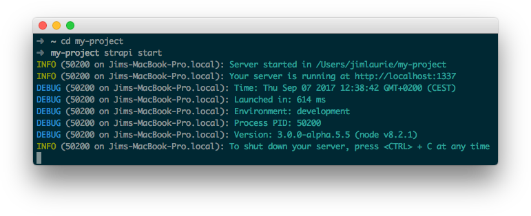

# Start your server

To launch your app, go in its directory and run the following command:

```
$ strapi start
```



Visit http://localhost:1337 to see it live!

You can also discover the admin panel at the following address: http://localhost:1337/admin.

***

Your server is up and running.
