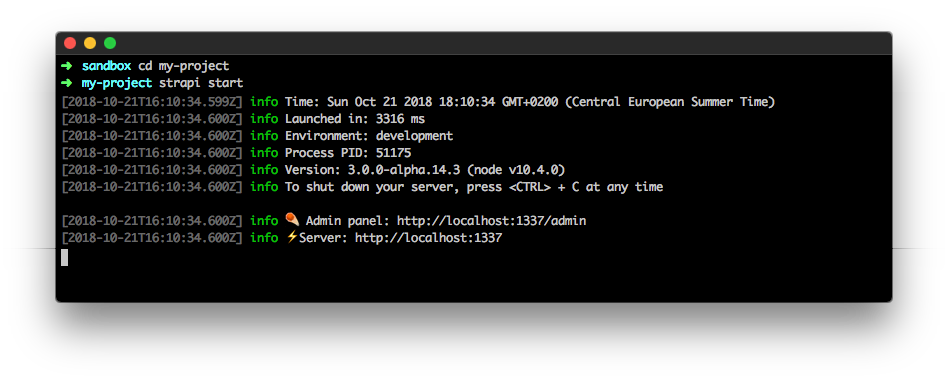
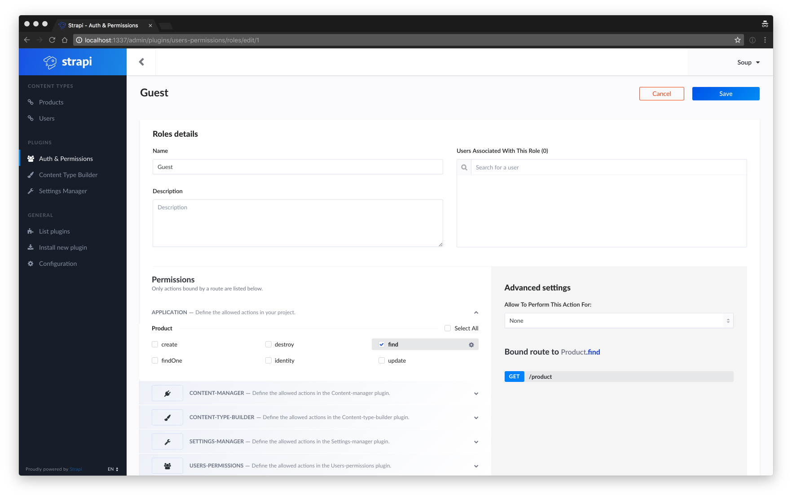

# Quick start

This section explains how to handle Strapi for the first time, ([check out our video tutorial](https://www.youtube.com/watch?v=yMl5IcFHA74)).

**Table of contents:**
- [1. Create your first project](#_1-create-a-project)
- [2. Create your first user](#_2-register-the-first-user)
- [3. Create your first Content Type](#_3-create-a-content-type)
  - [Files structure](#files-structure)
- [4. Manage your data](#_4-add-content)
- [5. Consume your API](#_5-consume-the-api)
  - [List entries (GET)](#list-entries-get)
  - [Get a specific entry (GET)](#get-a-specific-entry-get)
  - [Create data (POST)](#create-data-post)
  - [Update data (PUT)](#update-data-put)
  - [Delete data (DELETE)](#delete-data-delete)

***

## 1. Create a project

Creating your first project with Strapi is easy:

**#1 — Open your terminal**

Open your terminal in the directory you want to create your application in.

**#2 — Run the following command line in your terminal:**

```bash
strapi new my-project
```


::: note
The CLI will ask you to choose your database: select MongoDB, Postgres or MySQL. Then, fill the database information in. The default values should work if you correctly installed the database system on your machine.
:::

This action creates a new folder named `my-project` with the entire [files structure](../concepts/concepts.md#files-structure) of a Strapi application.

::: note
Unfortunately, there is an issue on Windows, you will probably be stuck and unable to enter your `Database name` to continue. Using a VM is one of the solutions. See [the issue](https://github.com/strapi/strapi/issues/1281).
:::

**#3 — Go to your project and launch the server:**

In your terminal run the following commands:

```bash
cd my-project
strapi start
```



Now that your app is running let's see how to [create your first user](#_2-register-the-first-user).

***

## 2. Register the first user

In order to use the admin panel and to consume your API you first need to register your first user. This process only happens once and is made to create the `admin user` who has all the permissions granted.

To create your first user, start your server (`strapi start`) and go to [http://localhost:1337/admin](http://localhost:1337/admin).


Now that your first user is registered let's see how to [create your first Content Type](#_3-create-a-content-type).

***

## 3. Create a Content Type

At this point, your project is empty. To create your first Content Type, you are going to use the **Content Type Builder** plugin: a powerful UI to help defining your Content Type's structure within a few clicks. Let's take the example of blog, which manages posts.

**#1 —** Go to the **Content Type Builder** plugin.


**#2 —** Create a Content Type named `Post` and submit the form.


**#3 —** Add three fields in this Content Type.

  - A `string` field named `title`.
  - A `text` field named `content` (tick the `Display as WYSIWYG` in the `Advanced Settings` tab).
  - A `media` field named `cover`.


**#4 —** Save. That's it!


::: note
See the [CLI documentation](../cli/CLI.md#strapi-generateapi) for more information on how to do it the hacker way.
:::

### Files structure

A new directory has been created in the `./api` folder of your application which contains all the needed stuff for your `Post` Content Type: routes, controllers, services and models. Take a look at the [API structure documentation](../concepts/concepts.md#files-structure) for more informations.


**Well done, you created your first Content Type using Strapi!**

***

## 4. Add content

After creating [your first Content Type](#_3-create-a-content-type), you probably want to create, edit or delete entries. No worries, everything is ready for you:

**#1 —** Go to the [**Post list**](http://localhost:1337/admin/plugins/content-manager/post/) by clicking on the link in the left menu (generated by the **Content Manager** plugin).


**#2 —** Click on the button `Add New Post` and fill the form.


**#3 —** Save! You can edit or delete this entry by clicking on the icons at the right of the row.


***

## 5. Consume the API

Your API is now ready and [contains data](#_4-add-content). At this point, you'll probably want to use this data in mobile or desktop applications.
In order to do so, you'll need to allow access to other users (identified as 'Public').

**1 -** Go to the [**Roles & Permissions View**](http://localhost:1337/admin/plugins/users-permissions/roles) by clicking on **Roles & Permissions** link in the left menu.


**2 -** Click on the `Public` role, enable the actions related to your new Content Type and save:



::: note
You should now be able to get the list of posts from the API: [http://localhost:1337/posts](http://localhost:1337/posts). 
:::

### List entries (GET)

To retrieve the list of posts, use the `GET /posts` route.

Generated APIs provide a handy way to filter and order queries. In that way, ordering posts by price is as easy as `GET http://localhost:1337/posts?_sort=price:asc`. For more informations, read the [filters documentation](../guides/filters.md).

Here is an example using Axios:

```js
import axios from 'axios';

// Request API.
axios
  .get('http://localhost:1337/posts', {
    params: {
      _sort: 'createdAt:desc' // Generates http://localhost:1337/posts?_sort=createdAt:desc
    }
  })
  .then(response => {
    // Handle success.
    console.log('Well done, here is the list of posts: ', response.data);
  })
  .catch(error => {
    // Handle error.
    console.log('An error occurred:', error);
  });
```

### Get a specific entry (GET)

If you want to get a specific entry, add the `id` of the wanted post at the end of the url.

Example with Axios:

```js
import axios from 'axios';

const postId = 'YOUR_POST_ID_HERE'; // Replace with one of your posts id.

// Request API.
axios
  .get(`http://localhost:1337/posts/${postId}`)
  .then(response => {
    // Handle success.
    console.log('Well done, here is the post: ', response.data);
  })
  .catch(error => {
    // Handle error.
    console.log('An error occurred:', error);
  });
```

### Create data (POST)

Use the `POST` route to create a new entry.

Example with Axios:

```js
import axios from 'axios';

// Request API.
axios
  .post(`http://localhost:1337/posts/`, {
    title: 'My new post'
  })
  .then(response => {
    // Handle success.
    console.log(
      'Well done, your post has been successfully created: ',
      response.data
    );
  })
  .catch(error => {
    // Handle error.
    console.log('An error occurred:', error);
  });
```

### Update data (PUT)

Use the `PUT` route to update an existing entry.

Example with Axios:

```js
import axios from 'axios';

const postId = 'YOUR_POST_ID_HERE'; // Replace with one of your posts id.

// Request API.
axios
  .put(`http://localhost:1337/posts/${postId}`, {
    title: 'Updated title'
  })
  .then(response => {
    // Handle success.
    console.log(
      'Well done, your post has been successfully updated: ',
      response.data
    );
  })
  .catch(error => {
    // Handle error.
    console.log('An error occurred:', error);
  });
```

### Delete data (DELETE)

Use the `DELETE` route to delete an existing entry.

Example with Axios:

```js
import axios from 'axios';

const postId = 'YOUR_POST_ID_HERE'; // Replace with one of your posts id.

// Request API.
axios
  .delete(`http://localhost:1337/posts/${postId}`)
  .then(response => {
    // Handle success.
    console.log(
      'Well done, your post has been successfully updated: ',
      response.data
    );
  })
  .catch(error => {
    // Handle error.
    console.log('An error occurred:', error);
  });
```
***

#### 👏 Congratulations!

You successfully finished the Getting Started guide! Read the [concepts section](../concepts/concepts.md) to understand more deeply how to use and customize Strapi.

Also, feel free to join the community thanks to the different channels listed in the [community page](http://strapi.io/community): team members, contributors and developers will be happy to help you.
