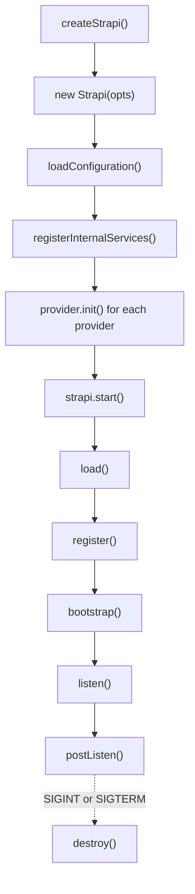

This page describes the boot sequence of the server runtime in `@strapi/core`. Read it before you add code to an internal provider, a loader, or a `register` or `bootstrap` function.

## Phases at a glance

Three kinds of participants receive lifecycle calls:

1. **Internal providers.** `Strapi` calls them directly, in the order of the `providers` array.
2. **Modules.** Each plugin and each API is a module. `Strapi` calls them through the `modules` registry.
3. **The application.** The loader imports `dist/src/index.js` into `strapi.app`. `Strapi` calls its `register`, `bootstrap` and `destroy` functions if they exist.

## Construction

`createStrapi(options)` resolves the application and dist directories and calls `new Strapi(...)`. Then it attaches the signal handlers (`destroyOnSignal`) and assigns the instance to `global.strapi`.

The constructor does three things, in this order:

1. It loads the configuration into `strapi.internal_config`.
2. It calls `registerInternalServices()`. This adds the core services to the container, for example `config`, `logger`, `server`, `eventHub`, `documents` and `db`. Most entries are factories. The container calls a factory on the first `get`. For example, the container creates the `Database` instance on the first access to `strapi.db`.
3. It calls `provider.init?.(strapi)` for each internal provider. `init` is synchronous.

Construction does not read plugins, APIs or content types.

## Internal providers

A provider is an object with optional `init`, `register`, `bootstrap` and `destroy` functions. The `providers` array sets the call order for every phase.

| Order | Provider           | `init`                                                                       | `register`                                                                                                                                    | `bootstrap`                                                                                | `destroy`                        |
| ----- | ------------------ | ---------------------------------------------------------------------------- | --------------------------------------------------------------------------------------------------------------------------------------------- | ------------------------------------------------------------------------------------------ | -------------------------------- |
| 1     | `registries`       | Adds the 14 registries to the container.                                     | Runs `loadApplicationContext()`. Creates the two content-type sync hooks and adds core handlers to them. Adds an internal database migration. |                                                                                            |                                  |
| 2     | `admin`            | Adds `admin`, a factory that requires `@strapi/admin/strapi-server`.         | Loads admin artifacts under `admin::`, then calls the admin `register`.                                                                       | Calls the admin `bootstrap`.                                                               | Calls the admin `destroy`.       |
| 3     | `ai`               | Adds `ai`.                                                                   |                                                                                                                                               |                                                                                            |                                  |
| 4     | `contentStructure` | Adds `content-structure`.                                                    |                                                                                                                                               | Validates the groups file and logs the group count.                                        |                                  |
| 5     | `coreStore`        | Adds the core store model to the `models` registry. Adds `coreStore`.        |                                                                                                                                               |                                                                                            |                                  |
| 6     | `sessionManager`   | Adds `sessionManager`.                                                       |                                                                                                                                               | Throws if `admin.auth.secret` is missing, unless `admin.serveAdminPanel` is `false`.       |                                  |
| 7     | `webhooks`         | Adds the webhook model to `models`. Adds `webhookStore` and `webhookRunner`. |                                                                                                                                               | Reads the webhooks from the database and adds each one to the runner.                      |                                  |
| 8     | `telemetry`        | Adds `telemetry`.                                                            | Calls `telemetry.register()`.                                                                                                                 | Calls `telemetry.bootstrap()`.                                                             | Calls `telemetry.destroy()`.     |
| 9     | `cron`             | Adds `cron`.                                                                 |                                                                                                                                               | Adds `server.cron.tasks` if `server.cron.enabled` is not `false`. Starts the cron service. | Calls `cron.destroy()`.          |
| 10    | `mcp`              | Adds `ai.mcp`.                                                               |                                                                                                                                               | Starts the MCP server if it is enabled. Logs errors and does not throw.                    | Stops the MCP server if it runs. |

The order has effects. `coreStore` and `webhooks` call `strapi.get('models')` in `init`. This works only because `registries` is first in the array.

## Register phase

`strapi.register()` runs these steps:

1. `strapi.ee.init(...)` initializes the Enterprise Edition helper.
2. Each provider runs `register`, in array order. The `registries` provider runs the loaders. The `admin` provider loads the admin artifacts and runs the admin `register`.
3. `strapi.get('modules').register()` runs the `register` function of each module, one after the other, in insertion order.
4. `strapi.app.register({ strapi })` runs, if the application defines it.
5. `convertCustomFieldType()` replaces each custom field attribute type with its underlying type.

At the end of this phase, the registries are full. The database is not ready. `strapi.db` exists, but it has no models. `strapi.db.query(uid)` throws `Model <uid> not found`. The HTTP routes do not exist yet.

### Loaders

`loadApplicationContext()` starts eight loaders with `Promise.all`:

| Loader        | Reads                                                                           | Writes to                                                                          |
| ------------- | ------------------------------------------------------------------------------- | ---------------------------------------------------------------------------------- |
| `src-index`   | `dist/src/index.js`. Only `register`, `bootstrap` and `destroy` keys are valid. | `strapi.app`                                                                       |
| `sanitizers`  | Nothing                                                                         | `sanitizers` registry: empty `content-api` lists for `input`, `output` and `query` |
| `validators`  | Nothing                                                                         | `validators` registry: empty `content-api` lists for `input` and `query`           |
| `plugins`     | Enabled plugins, `config/plugins.js`, `src/extensions`                          | `plugins` registry, which creates `plugin::<name>` modules                         |
| `apis`        | `dist/src/api/*`                                                                | `apis` registry, which creates `api::<name>` modules                               |
| `components`  | `dist/src/components/<category>/<name>.json`                                    | `components` registry, with UID `<category>.<name>`                                |
| `middlewares` | `dist/src/middlewares/*.js` and the internal middlewares                        | `middlewares` registry, under `global::` and `strapi::`                            |
| `policies`    | `dist/src/policies/*.js`                                                        | `policies` registry, under `global::`                                              |

When the `plugins` and `apis` loaders add a module, the `modules` registry creates it and calls `module.load()` at once. `load()` adds the module content types, services, policies, middlewares and controllers to their registries under the module namespace. It also stores the module config under the namespace. Routes stay on the module object. `server.initRouting()` reads them in the bootstrap phase.

:::caution
The loaders run at the same time. Each loader awaits file-system calls before it adds entries. The `plugins` and `apis` loaders add modules to the same `modules` registry, and the code does not set an order between them. The `modules` registry runs `register`, `bootstrap` and `destroy` in insertion order. Do not write a plugin that must run before or after an API module.
:::

All loaders finish before the first module `register` runs. Thus, in `register`, a plugin can read all content types, from plugins and from APIs. The i18n plugin uses this: its `register` adds the `locale` and `localizations` attributes to every content type.

The `admin` `register` runs before any plugin or API `register`, because providers run before modules.

## Bootstrap phase

`strapi.bootstrap()` runs these steps:

1. It configures the global HTTP proxy from `server.proxy`.
2. It builds the database models from all content types and components, plus the entries of the `models` registry.
3. It calls `strapi.db.init({ models })`.
4. It reads the previous content-type schemas from the core store, if the core store table exists.
5. It calls the `strapi::content-types.beforeSync` hook with `{ oldContentTypes, contentTypes }`.
6. It calls `strapi.db.schema.sync()`. If the schema changed, it removes orphan morph types.
7. It runs a one-time repair of unidirectional join tables. A core store flag records that the repair ran.
8. On Enterprise Edition, it checks the license.
9. It calls the `strapi::content-types.afterSync` hook.
10. It saves the current content-type schemas in the core store.
11. It calls `server.initMiddlewares()` and `server.initRouting()`.
12. It registers the Content API permission actions.
13. It runs the `bootstrap` function of each module.
14. It runs the `bootstrap` function of each provider.
15. It runs `strapi.app.bootstrap({ strapi })`, if the application defines it.

:::note
The sync hooks run in steps 5 and 9, before module `bootstrap`. Add sync hook handlers in `register`. A handler that a module adds in `bootstrap` does not run during the current boot.
:::

Module `bootstrap` runs before provider `bootstrap`. Thus, when a plugin `bootstrap` runs, the webhook runner has not read the stored webhooks, the cron service has not started, and the admin `bootstrap` has not run.

## Start and listen

`strapi.start()` calls `load()` if `strapi.isLoaded` is `false`. Then it calls `listen()`. `listen()` uses `server.socket` if it is set. Otherwise it uses `server.host` and `server.port`.

After the server listens, `postListen()` logs the startup message and sends the `didStartServer` telemetry event without awaiting it. In development, it opens the admin panel in a browser, unless `admin.autoOpen` is `false` or an admin user already exists.

If `start()` catches an error, it calls `stopWithError()`. This logs the error and calls `stop()`. `stop()` calls `destroy()` without awaiting it, sends `stop` to the parent process when `autoReload` is on, and calls `process.exit(1)`.

## Destroy phase

`strapi.destroy()` runs these steps:

1. The `destroy` function of each module.
2. The `destroy` function of each provider.
3. `strapi.app.destroy({ strapi })`, if the application defines it.
4. `server.destroy()`.
5. `eventHub.destroy()`, which removes all listeners and subscribers.
6. `db.destroy()`.
7. `process.removeAllListeners()`.
8. `delete global.strapi`. This lets a test create a new instance.

`destroyOnSignal` calls `destroy()` on the first `SIGTERM` or `SIGINT` and then calls `process.exit()`. It ignores the next signals.

## Idempotency guards

- Each module records which lifecycle functions ran. A second call to `register`, `bootstrap` or `destroy` on the same module throws, for example `Register for plugin::i18n has already been called`.
- `start()` skips `load()` when `isLoaded` is `true`. `load()` has no guard of its own. A second `load()` throws from the module guards.
- The `modules`, `plugins` and `apis` registries throw when a name is added twice.
- Provider functions have no guard.

## Code map

| Concern                                                     | Path                                                                                                                                                                                   |
| ----------------------------------------------------------- | -------------------------------------------------------------------------------------------------------------------------------------------------------------------------------------- |
| Phases, `start`, `load`, `register`, `bootstrap`, `destroy` | [`packages/core/core/src/Strapi.ts`](https://github.com/strapi/strapi/blob/develop/packages/core/core/src/Strapi.ts)                                                                   |
| `createStrapi()`                                            | [`packages/core/core/src/index.ts`](https://github.com/strapi/strapi/blob/develop/packages/core/core/src/index.ts)                                                                     |
| Signal handling                                             | [`packages/core/core/src/utils/signals.ts`](https://github.com/strapi/strapi/blob/develop/packages/core/core/src/utils/signals.ts)                                                     |
| Provider type                                               | [`packages/core/core/src/providers/provider.ts`](https://github.com/strapi/strapi/blob/develop/packages/core/core/src/providers/provider.ts)                                           |
| Provider order                                              | [`packages/core/core/src/providers/index.ts`](https://github.com/strapi/strapi/blob/develop/packages/core/core/src/providers/index.ts)                                                 |
| Registries provider                                         | [`packages/core/core/src/providers/registries.ts`](https://github.com/strapi/strapi/blob/develop/packages/core/core/src/providers/registries.ts)                                       |
| Loaders entry                                               | [`packages/core/core/src/loaders/index.ts`](https://github.com/strapi/strapi/blob/develop/packages/core/core/src/loaders/index.ts)                                                     |
| Module wrapper and guards                                   | [`packages/core/core/src/domain/module/index.ts`](https://github.com/strapi/strapi/blob/develop/packages/core/core/src/domain/module/index.ts)                                         |
| Module fan-out                                              | [`packages/core/core/src/registries/modules.ts`](https://github.com/strapi/strapi/blob/develop/packages/core/core/src/registries/modules.ts)                                           |
| Directory layout (`dist/src/...`)                           | [`packages/core/core/src/configuration/get-dirs.ts`](https://github.com/strapi/strapi/blob/develop/packages/core/core/src/configuration/get-dirs.ts)                                   |
| Content types to database models                            | [`packages/core/core/src/utils/transform-content-types-to-models.ts`](https://github.com/strapi/strapi/blob/develop/packages/core/core/src/utils/transform-content-types-to-models.ts) |
| Middleware and route setup                                  | [`packages/core/core/src/services/server/index.ts`](https://github.com/strapi/strapi/blob/develop/packages/core/core/src/services/server/index.ts)                                     |

## Related

- [Architecture overview](./index.md)
- [Container and registries](./03-container-and-registries.md)
- [Extension points](./04-extension-points.md)
- [`@strapi/core` package](../packages/core/core/index.md)
- [`@strapi/database` package](../packages/core/database/index.md)
