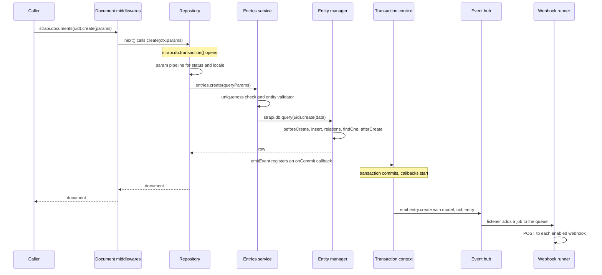

This page follows one write through the server. It explains the layers and the order in which they run. It is not an API reference for the Document Service.

## Documents and rows

A document is one logical entry. In the database, one document can have many rows in the content-type table.

- `documentId` identifies the document. All rows of the document share it. The database layer generates it with `createId` from `@paralleldrive/cuid2`, as the default value of the `documentId` attribute.
- `id` identifies one row. A row `id` can change: each publish deletes the old published rows and creates new ones.
- `publishedAt` separates versions. On a content type with draft and publish (D&P), `publishedAt: null` marks the draft row and a date marks the published row. Without D&P, every row has a `publishedAt` date and there are no drafts.
- `locale` separates languages. The i18n plugin adds a `locale` attribute to every content type. It is private when the content type is not localized.

A localized content type with D&P can have one draft row and one published row per locale. When the data of a new row already has a `documentId` (for example a new locale or a publish), the entries service looks for an existing row with the same `documentId`, the same locale (if localized) and the same state (draft or published, if D&P). It throws an `ApplicationError` if it finds one.

:::note
Use `documentId` for stable references. Do not store a row `id` of a D&P content type, because publish replaces the published row.
:::

## The layers

| Order | Layer           | Code                                 | What it does                                                                                                                                                  |
| ----- | --------------- | ------------------------------------ | ------------------------------------------------------------------------------------------------------------------------------------------------------------- |
| 1     | Factory         | `document-service/index.ts`          | `strapi.documents(uid)` returns one cached instance per content type. The instance wraps the repository with the middleware manager.                          |
| 2     | Middlewares     | `document-service/middlewares/`      | Runs the built-in `databaseErrorsMiddleware` first, then the middlewares added with `strapi.documents.use()`, in order.                                       |
| 3     | Repository      | `document-service/repository.ts`     | Each public method runs in `strapi.db.transaction()`. It turns the params into an internal query and calls the entries service. It schedules events.          |
| 4     | Entries service | `document-service/entries.ts`        | Resolves relation `documentId` values to row `id` values, checks uniqueness, runs the entity validator, writes components, then calls `strapi.db.query(uid)`. |
| 5     | Entity manager  | `@strapi/database` `entity-manager/` | Runs the database lifecycles, applies attribute defaults, inserts or updates the row, attaches relations and reads the row back.                              |
| 6     | Event manager   | `document-service/events.ts`         | After the commit, reads the row with a deep populate, sanitizes it and emits the event on the event hub.                                                      |
| 7     | Webhook runner  | `services/webhook-runner.ts`         | Queues the event and sends an HTTP `POST` to each enabled webhook for that event.                                                                             |

The built-in middleware converts invalid date, time, datetime and relation errors from the database layer into `ValidationError`.

## A create, step by step

The middlewares run outside the repository transaction. The transaction opens when the middleware chain calls the repository method. If the caller already runs inside `strapi.db.transaction()`, the repository reuses that transaction.

## Parameter pipeline

Each repository method builds its query with a pipeline of small transforms. For `create`, the order is:

1. `validateParams` checks filters, sort, fields and populate against the schema. It rejects a user-provided `lookup`. When `api.documents.strictParams` is `true`, it also checks `status`, `locale` and pagination, and rejects unknown root params.
2. `filterDataPublishedAt` sets `data.publishedAt` to `null` if the caller sent one. Callers cannot set it directly.
3. `setStatusToDraft` forces `status: 'draft'` on D&P content types.
4. `statusToData` writes `publishedAt`: `null` for a draft, the current date for published, and always the current date without D&P.
5. `defaultLocale` sets the default locale from the i18n plugin when the content type is localized and no locale is given.
6. `localeToData` writes the locale into `data` on localized content types. It rejects `'*'`.

Read methods use the same idea. `statusToLookup` and `localeToLookup` write conditions into an internal `lookup` object, and `transformParamsToQuery` merges `lookup` into the `where` clause.

## Create, update and publish

**`create`** writes one row. On a D&P content type, this is always the draft. The repository schedules `entry.create`. If the caller passed `status: 'published'`, it then calls the inner `publish` function and returns the published row.

**`update`** targets the draft row on a D&P content type. It looks for the row with the `documentId` and the requested locale.

- If the row exists, the entries service updates it, and the repository schedules `entry.update`.
- If the row does not exist, but the document exists in another locale, the repository creates a row for the new locale. It copies the non-localized fields from an existing row. It schedules `entry.create`, not `entry.update`.
- If the document does not exist, `update` returns `null`.

If the caller passed `status: 'published'` and a row was written, `update` then calls the inner `publish` function.

**`publish`** exists only on D&P content types. For the requested locales, it:

1. reads the draft rows (with a deep populate) and the current published rows;
2. loads the relations that point to the current published rows;
3. deletes the current published rows;
4. sets `firstPublishedAt` on each draft if the content type has that field and the value is empty;
5. creates a new published row from each draft, with `publishedAt` set to the current date;
6. points the loaded relations to the new published rows;
7. schedules one `entry.publish` per new row.

The draft rows stay. After a publish, the document has a draft row and a published row with the same content.

:::caution
When `create` or `update` calls the inner `publish` function, the call does not pass through the middlewares again. A middleware sees one call with `action: 'create'` or `action: 'update'`, not a separate `publish` call.
:::

The other D&P methods follow the same model. `unpublish` deletes the published rows. `discardDraft` replaces the draft rows with copies of the published rows. `delete` removes all rows of the requested locales and throws if the caller passes `status: 'draft'`.

## Validation

The entries service calls the entity validator before each insert or update. The validator builds a Yup schema from the content type. It receives `isDraft`, which is `true` when `data.publishedAt` is empty. For drafts, it skips `required`, `min`, `minLength` and `regex` checks. When `api.documents.strictRelations` is `true`, it also enforces required relations and media on non-draft writes.

Database lifecycles run after the entity validator. Data that a `beforeCreate` or `beforeUpdate` subscriber adds is not validated.

## Transactions

Each public repository method runs inside `strapi.db.transaction()`. The transaction context uses `AsyncLocalStorage`. A nested call reuses the open transaction and does not commit it. Only the outermost call commits or rolls back.

Database lifecycles run inside the transaction. If the transaction rolls back later, a side effect in a lifecycle subscriber, such as an HTTP call, is not undone.

## Events and webhooks

The repository does not emit events directly. `emitEvent` calls `strapi.db.transaction(({ onCommit }) => ...)` and registers a callback. The callback runs only after the outermost transaction commits. It does not run on rollback.

The transaction context starts the commit callbacks but does not await them. The Document Service call can return before the event reaches the listeners.

When the callback runs, the event manager:

1. reads the row again with a deep populate, except for `entry.delete` and `entry.unpublish`, where the row is gone;
2. sanitizes it with `defaultSanitizeOutput`, which removes private fields;
3. calls `strapi.eventHub.emit(eventName, { model, uid, entry })`.

| Method         | Events                                                                                            |
| -------------- | ------------------------------------------------------------------------------------------------- |
| `create`       | `entry.create`, then `entry.publish` if `status: 'published'`                                     |
| `update`       | `entry.update`, or `entry.create` for a new locale, then `entry.publish` if `status: 'published'` |
| `clone`        | `entry.create` per new row                                                                        |
| `delete`       | `entry.delete` per deleted row                                                                    |
| `publish`      | `entry.publish` per new published row                                                             |
| `unpublish`    | `entry.unpublish` per deleted published row                                                       |
| `discardDraft` | `entry.draft-discard` per new draft row                                                           |

The webhook runner adds an event hub listener for an event when the first webhook for that event is registered. The listener only adds a job to an in-memory queue with a concurrency of 5. For each job, the runner sends a `POST` to each enabled webhook. The body is `{ event, createdAt, model, uid, entry }`. The headers are the `server.webhooks.defaultHeaders`, the webhook headers, `X-Strapi-Event` and `Content-Type: application/json`. Each request has a 10-second timeout. The runner does not retry. In the event path, it also does not report failed deliveries: `run()` turns network errors and non-2xx responses into a returned status object, and `executeListener()` does not read that object.

When a webhook is created or updated, the webhook store rejects events that are not in its allowed list. Core allows the six `entry.*` events. Plugins add their own events with `addAllowedEvent`.

## Code map

| Concern                          | Path                                                                                                                                                                                                                     |
| -------------------------------- | ------------------------------------------------------------------------------------------------------------------------------------------------------------------------------------------------------------------------ |
| Factory and middleware wiring    | [`packages/core/core/src/services/document-service/index.ts`](https://github.com/strapi/strapi/blob/develop/packages/core/core/src/services/document-service/index.ts)                                                   |
| Middleware manager               | [`packages/core/core/src/services/document-service/middlewares/middleware-manager.ts`](https://github.com/strapi/strapi/blob/develop/packages/core/core/src/services/document-service/middlewares/middleware-manager.ts) |
| Database errors middleware       | [`packages/core/core/src/services/document-service/middlewares/errors.ts`](https://github.com/strapi/strapi/blob/develop/packages/core/core/src/services/document-service/middlewares/errors.ts)                         |
| Repository methods               | [`packages/core/core/src/services/document-service/repository.ts`](https://github.com/strapi/strapi/blob/develop/packages/core/core/src/services/document-service/repository.ts)                                         |
| Transaction wrapper              | [`packages/core/core/src/services/document-service/common.ts`](https://github.com/strapi/strapi/blob/develop/packages/core/core/src/services/document-service/common.ts)                                                 |
| D&P transforms                   | [`packages/core/core/src/services/document-service/draft-and-publish.ts`](https://github.com/strapi/strapi/blob/develop/packages/core/core/src/services/document-service/draft-and-publish.ts)                           |
| i18n transforms                  | [`packages/core/core/src/services/document-service/internationalization.ts`](https://github.com/strapi/strapi/blob/develop/packages/core/core/src/services/document-service/internationalization.ts)                     |
| Entries service                  | [`packages/core/core/src/services/document-service/entries.ts`](https://github.com/strapi/strapi/blob/develop/packages/core/core/src/services/document-service/entries.ts)                                               |
| Event manager                    | [`packages/core/core/src/services/document-service/events.ts`](https://github.com/strapi/strapi/blob/develop/packages/core/core/src/services/document-service/events.ts)                                                 |
| Entity validator                 | [`packages/core/core/src/services/entity-validator/index.ts`](https://github.com/strapi/strapi/blob/develop/packages/core/core/src/services/entity-validator/index.ts)                                                   |
| `documentId` default             | [`packages/core/core/src/utils/transform-content-types-to-models.ts`](https://github.com/strapi/strapi/blob/develop/packages/core/core/src/utils/transform-content-types-to-models.ts)                                   |
| Entity manager                   | [`packages/core/database/src/entity-manager/index.ts`](https://github.com/strapi/strapi/blob/develop/packages/core/database/src/entity-manager/index.ts)                                                                 |
| Transactions                     | [`packages/core/database/src/transaction-context.ts`](https://github.com/strapi/strapi/blob/develop/packages/core/database/src/transaction-context.ts)                                                                   |
| Event hub                        | [`packages/core/core/src/services/event-hub.ts`](https://github.com/strapi/strapi/blob/develop/packages/core/core/src/services/event-hub.ts)                                                                             |
| Webhook runner                   | [`packages/core/core/src/services/webhook-runner.ts`](https://github.com/strapi/strapi/blob/develop/packages/core/core/src/services/webhook-runner.ts)                                                                   |
| Webhook store and allowed events | [`packages/core/core/src/services/webhook-store.ts`](https://github.com/strapi/strapi/blob/develop/packages/core/core/src/services/webhook-store.ts)                                                                     |
| Document Service types           | [`packages/core/types/src/modules/documents/index.ts`](https://github.com/strapi/strapi/blob/develop/packages/core/types/src/modules/documents/index.ts)                                                                 |

## Related

- [Extension points](./04-extension-points.md)
- [Container and registries](./03-container-and-registries.md)
- [Glossary](./11-glossary.md)
- [`@strapi/core` package](../packages/core/core/index.md)
- [`@strapi/database` package](../packages/core/database/index.md)
