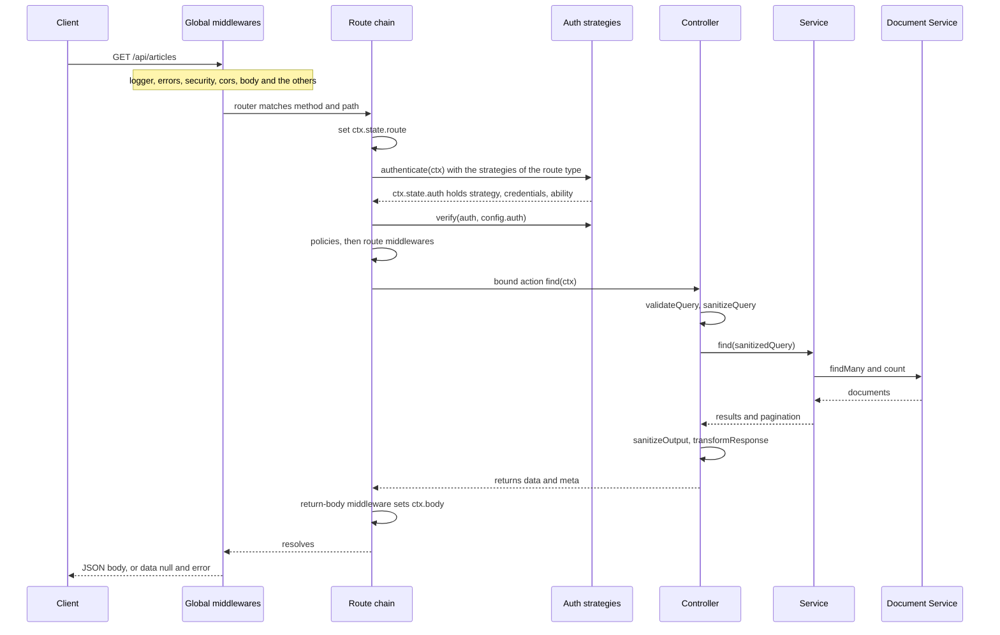

This page follows one HTTP request through the server, from the Koa app to the response body. It covers the Content API (`/api/...`) and the admin API. What happens inside the Document Service is in [Document write path](./05-document-write-path.md). Tokens and sessions are in [Sessions and JWT](./08-authentication.md).

## Overview

## The Koa app and global middlewares

`createServer` in [`services/server/index.ts`](https://github.com/strapi/strapi/blob/develop/packages/core/core/src/services/server/index.ts) creates the Koa app with the `server.proxy.*` settings and `server.app.keys`. It adds response helpers such as `ctx.send` and `ctx.notFound` (see [Response and errors](#response-and-errors)). The first middleware stores `ctx` in an `AsyncLocalStorage` (`services/request-context.ts`). Code that has no `ctx` argument can read the current request. For example, the core controller reads the `strapi-response-format` header this way.

In the bootstrap phase, `server.initMiddlewares()` reads the `middlewares` config (`config/middlewares.ts` in the app). Each entry is a name (`'strapi::cors'`), an object `{ name, config }`, or an object `{ resolve, config }` that loads a package or a path. Names come from the `middlewares` registry: `strapi::` for internal middlewares, `global::` for `src/middlewares`, and `plugin::` or `api::` for module middlewares. Each factory is called once as `factory(config, { strapi })`, and the result is added with `app.use()` in list order. The new-project template uses this order:

| Middleware          | What it does                                                                                                                                           |
| ------------------- | ------------------------------------------------------------------------------------------------------------------------------------------------------ |
| `strapi::logger`    | Logs method, URL, duration and status after the rest of the chain completes.                                                                           |
| `strapi::errors`    | Catches the errors of every later middleware and writes the error body. Returns 404 when nothing set a status.                                         |
| `strapi::security`  | Sets security headers (CSP, HSTS, frame options) with `koa-helmet`.                                                                                    |
| `strapi::cors`      | Handles CORS with `@koa/cors`. The default origin is `*`.                                                                                              |
| `strapi::poweredBy` | Sets the `X-Powered-By` header.                                                                                                                        |
| `strapi::query`     | Replaces the Koa query getter with a `qs` parser, so `filters[title][$eq]=x` becomes a nested object.                                                  |
| `strapi::body`      | Parses JSON, form and multipart bodies with `koa-body`. Skips the GraphQL endpoint. Deletes uploaded temp files after the rest of the chain completes. |
| `strapi::session`   | Adds `koa-session`. Throws at boot if `app.keys` is empty.                                                                                             |
| `strapi::favicon`   | Serves the favicon.                                                                                                                                    |
| `strapi::public`    | Registers two routes: `GET /` redirects to the admin URL, and a `GET` route serves the `public` folder (except `/uploads`).                            |

Without a `middlewares` config, Strapi uses the same list with `strapi::session` before `strapi::query`. The boot fails if `strapi::errors`, `strapi::security`, `strapi::cors`, `strapi::query`, `strapi::body`, `strapi::public` or `strapi::favicon` is missing. `strapi::compression`, `strapi::ip`, `strapi::responseTime` and `strapi::responses` exist but are not in the default list.

:::note
`strapi::query`, `strapi::session` and `strapi::public` return no handler, so the list gets a pass-through handler at their position. `strapi::query` patches `app.request`. `strapi::public` registers routes. `strapi::session` calls `strapi.server.use()` while the list is resolved, which is before the listed handlers are added. Its position in the list does not change where `koa-session` runs.
:::

The Koa order is the order of the `app.use()` calls: the request context, then any `strapi.server.use()` call from a `register` function, then the configured list, then any `strapi.server.use()` call from a `bootstrap` function. `listen()` mounts the router after all of these. A middleware added in a `register` function runs before `strapi::errors`, so `strapi::errors` does not catch its errors.

## Routers and route registration

The server has one root router and two API routers. `listen()` calls `mount()`, which attaches both API routers to the root router and adds the root router to the Koa app.

- The content API router has the prefix `api.rest.prefix` (default `/api`).
- The admin API router has no prefix. Each admin router sets its own prefix.
- The root router holds `/_health` (always 204) and routes passed as an array to `strapi.server.routes()`, such as the `strapi::public` routes.

In the bootstrap phase, `server.initRouting()` calls [`register-routes.ts`](https://github.com/strapi/strapi/blob/develop/packages/core/core/src/services/server/register-routes.ts). It registers admin routes, then API routes, then plugin routes, then the OpenAPI route. A router can be an object or a factory. Strapi calls a factory with `{ strapi }` and writes the result back on the module. Then `strapi.server.routes(router)` sends the router to the API router that matches `router.type`.

| Source                                   | `type`               | Router prefix               | Example                                        |
| ---------------------------------------- | -------------------- | --------------------------- | ---------------------------------------------- |
| Admin package (`strapi.admin.routes`)    | `admin` if not set   | `/admin` if not set         | `POST /admin/login`                            |
| App API (`src/api/<name>/routes`)        | always `content-api` | the router `prefix`, if any | `GET /api/articles`                            |
| Plugin router with `type: 'content-api'` | `content-api`        | `/<pluginName>` if not set  | `GET /api/upload/files`                        |
| Plugin router without `type`             | `admin`              | `/<pluginName>` if not set  | `GET /content-manager/collection-types/:model` |

Plugin routes given as a plain array get the type `admin` and the prefix `/<pluginName>`. A route that has a `config.prefix` key skips the router prefix and goes on the API router directly. The users-permissions plugin sets `prefix: ''` on its auth routes, so the login route is `POST /api/auth/local`, not `/api/users-permissions/auth/local`.

For each route, the registration step also:

- sets `route.info` to `{ apiName }` or `{ pluginName }` (`pluginName: 'admin'` for the admin package);
- generates `config.auth.scope` when the handler is a string (see [Route config](#route-config));
- for API and plugin routes, merges the extra params from `strapi.contentAPI.addQueryParams()` and `addInputParams()` into `route.request`.

The route manager in [`routing.ts`](https://github.com/strapi/strapi/blob/develop/packages/core/core/src/services/server/routing.ts) validates each route with a Yup schema and adds `info.type` from the API router (`api` on the root router). An invalid route stops the boot with `Invalid route config`. An unknown handler, policy or middleware stops it with `Error creating endpoint <METHOD> <path>`.

## Route config

| Key                   | Meaning                                                                                                                     |
| --------------------- | --------------------------------------------------------------------------------------------------------------------------- |
| `method`, `path`      | HTTP method (`GET`, `POST`, `PUT`, `PATCH`, `DELETE`, `ALL`) and Koa router path.                                           |
| `handler`             | A string `'<controller>.<action>'`, a full UID such as `'api::article.article.find'`, a function, or an array of functions. |
| `config.auth`         | `false` for a public route, or `{ scope?, strategies? }`.                                                                   |
| `config.policies`     | Policy names or `{ name, config }` objects.                                                                                 |
| `config.middlewares`  | Middleware UIDs, `{ name, config }` objects, or functions.                                                                  |
| `request`, `response` | Zod schemas. See [Validation and sanitization](#validation-and-sanitization).                                               |

For a string handler, the generated scope is the handler prefixed with the module namespace, unless the handler already starts with it. In `src/api/article`, `article.find` gets the scope `api::article.article.find`. In the admin package, `admin.init` gets `admin::admin.init`. A scope set in the route wins. The scope has the same format as a Content API permission action, which is how the permission check matches a route.

## The route chain

[`compose-endpoint.ts`](https://github.com/strapi/strapi/blob/develop/packages/core/core/src/services/server/compose-endpoint.ts) builds one `koa-compose` chain per route, in this order:

1. The route info middleware copies the route to `ctx.state.route`.
2. `authenticate` runs the auth strategies.
3. `authorize` calls `verify` on the strategy that authenticated the request.
4. The policies middleware runs each policy in order.
5. The route middlewares run in order.
6. The return-body middleware waits for the controller and sets `ctx.body` from its return value if `ctx.body` is still empty.
7. The controller action runs.

Strapi resolves the policies, the route middlewares and the controller action when it registers the route, not per request. Configuration errors show at boot, and the route chain does no registry lookup per request.

## Authentication and authorization

The `auth` container service ([`services/auth/index.ts`](https://github.com/strapi/strapi/blob/develop/packages/core/core/src/services/auth/index.ts)) stores strategies by route type. A strategy has a `name`, an `authenticate(ctx)` function and an optional `verify(auth, config)` function.

`authenticate` does this:

- If `config.auth` is `false`, it calls the next middleware and sets nothing.
- Otherwise it tries the strategies registered for `route.info.type`, in registration order. `config.auth.strategies` can restrict them by name.
- If a strategy returns `authenticated: true`, it sets `ctx.state.isAuthenticated` and `ctx.state.auth = { strategy, credentials, ability }` and stops.
- If a strategy returns an `error`, it responds 401 with that error at once.
- If no strategy authenticates, it responds 401 `Missing or invalid credentials`.

`verify` skips routes with `auth: false`, throws `UnauthorizedError` when `ctx.state.auth` is empty, and otherwise calls the `verify` function of the strategy, if it has one.

### Content API

Two strategies are registered for `content-api`. The admin package registers `content-api-token` in its `register` function, which runs as an internal provider before plugins. The users-permissions plugin then registers `users-permissions`.

- **`content-api-token`** looks up the bearer token as an API token. Its `verify` allows every scope for a full-access token, only scopes that end with `find` or `findOne` for a read-only token, and the token permissions for a custom token.
- **`users-permissions`** validates a users-permissions JWT, loads the user and builds an ability from the role permissions. Without a token, it builds an ability from the permissions of the Public role. If the Public role has no permissions, it does not authenticate the request. Its `verify` requires `ability.can(scope)` for each scope. A route without a scope requires a logged-in user.

After `initRouting()`, `strapi.contentAPI.permissions.registerActions()` registers one action per controller action that a `content-api` route uses. When Strapi binds a controller action, it tags the function with the route type (the `Symbol.for('__type__')` property). The tag limits the actions in the Roles and API token settings to the actions that a Content API route can reach. The permission engine ignores a permission whose action is not registered.

### Admin API

The admin package registers two strategies for `admin`: `admin` validates a session access token, and `admin-token` validates an admin API token. Both set `ctx.state.user` and `ctx.state.userAbility`. The `admin` strategy has no `verify`, and `admin-token` only checks that the token exists and has not expired. The generated scope is not checked on admin routes.

Admin routes authorize with policies instead. Most admin routes list `admin::isAuthenticatedAdmin`. Routes that need an RBAC action also list `admin::hasPermissions` with that action. Plugins use their own policies, for example `plugin::content-manager.hasPermissions`. These policies read `ctx.state.userAbility`.

:::caution
`authorize` wraps the rest of the chain. When a later policy, middleware or controller throws `UnauthorizedError` or `ForbiddenError`, `authorize` replaces it with a generic 401 or 403 body and drops the message and details. `PolicyError` is the exception. It goes to `strapi::errors` with its message, so a policy can return a public reason.
:::

## Policies and route middlewares

|                   | Policies                                                                     | Route middlewares                                        |
| ----------------- | ---------------------------------------------------------------------------- | -------------------------------------------------------- |
| Runs              | After `authorize`, before route middlewares                                  | After policies, before the controller                    |
| Signature         | `(policyContext, config, { strapi })`                                        | Koa `(ctx, next)`, made by `factory(config, { strapi })` |
| Result            | `true` or `undefined` continues. Any other value throws `PolicyError` (403). | Calls `next()`. Can act before and after the controller. |
| Name lookup       | Full name, or a short name resolved in the route plugin or API namespace     | Full UID only (`plugin::users-permissions.rateLimit`)    |
| Config validation | The policy `validator` runs when the route is registered                     | The factory runs when the route is registered            |

Use a policy for a yes or no decision. Use a route middleware when you need to change the request or the response.

## Controller resolution

For a string handler, `getAction` splits the string at the last dot into a controller name and an action name. It then looks up the controller in the `controllers` registry:

1. If `info.pluginName` is `admin`: `admin::<controller>`.
2. If `info.pluginName` is another plugin: `plugin::<pluginName>.<controller>`.
3. If `info.apiName` is set: `api::<apiName>.<controller>`.
4. If nothing matched: the controller name as a full UID. This is how core routes, which use `'<uid>.find'`, resolve.

If the action is not a function, the boot fails with `Handler not found "<handler>"`. Otherwise the route stores `controller[action].bind(controller)`. A function or array handler is used as is, gets no scope and no type tag.

The first registry `get` instantiates the controller. Because the route keeps the bound function, a `set` or `extend` on the controller after `initRouting()` does not change the mounted route. Change controllers in a `register` function, because `initRouting()` runs in the bootstrap phase before any `bootstrap` function. See [Container and registries](./03-container-and-registries.md) for the registry operations.

## Core controllers

`createCoreController(uid, cfg)` in [`factories.ts`](https://github.com/strapi/strapi/blob/develop/packages/core/core/src/factories.ts) returns a controller factory. The factory builds the base controller for the content type, copies the base actions that `cfg` does not define, and sets the base controller as the prototype. A custom action can call the core action with `super.find(ctx)` and use `this.sanitizeQuery`, `this.sanitizeOutput` and `this.transformResponse`.

The collection type `find` action in [`core-api/controller/collection-type.ts`](https://github.com/strapi/strapi/blob/develop/packages/core/core/src/core-api/controller/collection-type.ts):

1. calls `validateQuery(ctx)` and `sanitizeQuery(ctx)`;
2. calls `strapi.service(uid).find(query)`, where `uid` is the content type UID;
3. calls `sanitizeOutput(results, ctx)`;
4. returns `transformResponse(results, { pagination })`, which is `{ data, meta }`.

`create` and `update` also throw `ValidationError` when `body.data` is not an object, then call `validateInput` and `sanitizeInput` on `body.data`. `create` sets status 201. `delete` sets status 204 and returns nothing.

The core service (`createCoreService`) calls the Document Service: `strapi.documents(uid).findMany()`, `findOne()`, `create()`, `update()` or `delete()`. Its params default to `status: 'published'`, so the Content API reads published documents unless the query asks for drafts. For `create` and `update`, the same default makes the Document Service publish the document. The core service passes no auth to the Document Service. The route chain and the controller apply permissions before and after the call.

## Validation and sanitization

The core controller helpers call `strapi.contentAPI.validate` and `strapi.contentAPI.sanitize` ([`services/content-api/index.ts`](https://github.com/strapi/strapi/blob/develop/packages/core/core/src/services/content-api/index.ts)), which wrap the functions in `@strapi/utils`. They pass `ctx.state.auth`, `ctx.state.route` and `api.rest.strictParams`.

- **`validateQuery`** checks `filters`, `sort`, `fields` and `populate` against the schema and throws `ValidationError` (400). It also rejects filters and sorts on relations whose target the caller cannot `find`. With `strictParams`, it rejects unknown top-level query keys.
- **`sanitizeQuery`** returns a copy of the query without private fields, invalid keys and restricted relations. With `strictParams`, it also drops unknown top-level keys.
- **`validateInput`** rejects `id`, `documentId`, non-writable attributes, unknown attributes and restricted relations.
- **`sanitizeInput`** removes the same data instead of throwing.
- **`sanitizeOutput`** removes passwords, private attributes and relations that the caller cannot `find`.

Validation runs first, so a client gets a clear 400 for bad input. Sanitization then removes what the caller may not read or write. Plugins add steps through the `sanitizers` registry (`content-api.input`, `content-api.output`) and the `validators` registry (`content-api.input`).

The Zod schemas in `route.request` and `route.response` are not a request validator. `createCoreRouter` builds them with `CoreContentTypeRouteValidator` from the content type schema. At runtime, Strapi only uses them to validate or sanitize the extra params added with `addQueryParams` and `addInputParams`, and to accept those keys in strict mode. `@strapi/openapi` uses them to generate the OpenAPI document.

The Document Service runs the entity validator on every write. See [Document write path](./05-document-write-path.md#validation).

Admin controllers do not use `strapi.contentAPI`. The content-manager controllers build a permission checker from `ctx.state.userAbility` and use it to sanitize the query and the output.

## Response and errors

A controller writes the response in one of three ways:

- It returns a value. The return-body middleware sets `ctx.body` if it is empty.
- It sets `ctx.body` and `ctx.status`.
- It calls a helper: `ctx.send(data, status)`, `ctx.created(data)`, `ctx.deleted(data)`, or an error helper such as `ctx.badRequest(message, details)` or `ctx.notFound()`. Strapi generates one error helper per 4xx and 5xx status of `node:http`.

The `strapi::errors` middleware in [`middlewares/errors.ts`](https://github.com/strapi/strapi/blob/develop/packages/core/core/src/middlewares/errors.ts) handles the rest:

- If no middleware set a status, it responds 404.
- An `ApplicationError` from `@strapi/utils` gets its status from its class: `UnauthorizedError` 401, `ForbiddenError` and `PolicyError` 403, `NotFoundError` 404, `PayloadTooLargeError` 413, `RateLimitError` 429, `NotImplementedError` 501, and 400 for the others, such as `ValidationError`.
- An `http-errors` error keeps its status.
- Any other error is logged. If it carries a 4xx status, the status and message are kept. Otherwise the response has a generic message and status 500 (or the 5xx status of the error), so internal details do not leak.

`strapi::errors` and the error helpers on `ctx` write the same body: `{ data: null, error: { status, name, message, details } }`. A controller that sets `ctx.body` directly can use another shape.

## Related

- [Server lifecycle](./02-server-lifecycle.md)
- [Container and registries](./03-container-and-registries.md)
- [Extension points](./04-extension-points.md)
- [Document write path](./05-document-write-path.md)
- [Sessions and JWT](./08-authentication.md)
- [Glossary](./11-glossary.md)
- [`@strapi/core` package](../packages/core/core/index.md)
- [`@strapi/strapi` package](../packages/core/strapi/index.md)
- [`@strapi/admin` package](../packages/core/admin/index.md)
- [`@strapi/plugin-users-permissions` package](../packages/plugins/users-permissions/index.md)
- [`@strapi/utils` package](../packages/core/utils/index.md)
