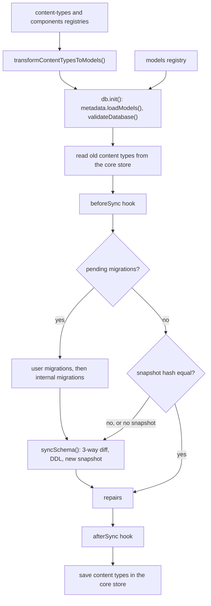

At each boot, Strapi compares the content-type and component schemas with the database and changes the tables to match. This page explains the inputs, the conversion to database metadata, the diff, the hooks around it and the migrations. It also lists what Strapi never does automatically. Read it before you change the schema code of `@strapi/database`, the content-type transform in `@strapi/core`, or a sync hook handler.

## Overview

Schema sync runs in the bootstrap phase. At that point, the registries are final. See [Server lifecycle](./02-server-lifecycle.md#bootstrap-phase) for the full list of bootstrap steps.

`db.init()` runs before Strapi reads the old content types, because the core store uses `db.query('strapi::core-store')`, and a query needs the metadata.

## Where schemas come from

- The `apis` loader reads `src/api/<api>/content-types/<name>/schema.json`. It sets `collectionName` to `info.singularName` when the schema has none. Plugins declare content types in their server entry.
- The `content-types` registry passes each schema to `createContentType()`. This function adds `createdAt`, `updatedAt`, `publishedAt`, `createdBy` and `updatedBy` to every content type. It adds `firstPublishedAt` only when that experimental option is on.
- The `components` loader reads `src/components/<category>/<name>.json`. A component must declare `collectionName`. If it does not, the loader stops Strapi.
- Plugins change schemas in `register`. The i18n plugin adds `locale` and `localizations` to every content type. At the end of the register phase, Strapi replaces each custom field type with its underlying type.
- The `models` registry holds database models that are not content types, for example the core store (`strapi_core_store_settings`) and the webhooks (`strapi_webhooks`).

`publishedAt` exists on every content type, also when draft and publish (D&P) is off. The code comment says that without D&P, entries are always published. The i18n plugin adds `locale` to every content type, localized or not. Thus, when a content type turns D&P or i18n on or off, the data changes but the table shape does not. The [sync hooks](#sync-hooks) move that data.

## From schemas to database models

[`transformContentTypesToModels()`](https://github.com/strapi/strapi/blob/develop/packages/core/core/src/utils/transform-content-types-to-models.ts) converts content types and components into `@strapi/database` models. The database layer knows scalar attributes and relations only. It does not know components, dynamic zones or media, so the transform rewrites them as relations:

| Schema attribute | Model attribute                                                          | Storage                                                                           |
| ---------------- | ------------------------------------------------------------------------ | --------------------------------------------------------------------------------- |
| `media`          | `morphOne` or `morphMany` to `plugin::upload.file`, `morphBy: 'related'` | The join table of the `related` attribute of the file model (`files_related_mph`) |
| `component`      | `oneToOne` (single) or `oneToMany` (repeatable) to the component UID     | The `<collection>_cmps` join table                                                |
| `dynamiczone`    | `morphToMany`                                                            | The same `<collection>_cmps` table. `component_type` holds the component UID.     |

The transform also does these things:

- It adds `id` (`increments`) to every model and `documentId` to each content type. Components have no `documentId`.
- It throws when the snake-case name of an attribute is `id` or `document_id`.
- It adds a `<collection>_cmps` model for each content type or component that has a component or dynamic zone attribute. The table has the columns `entity_id`, `cmp_id`, `component_type`, `field` and `order`, a foreign key to the owner with `ON DELETE CASCADE`, and a unique index on the four link columns.
- It adds a `<collection>_documents_idx` index on `document_id`, `locale` and `published_at` to each content type. The model declares this index so that schema sync owns it. The internal migration that created it before is now a no-op.

## Metadata

`db.init({ models })` calls `metadata.loadModels()` and then `validateDatabase()`. `loadModels()` does these steps:

1. It shortens table names with the identifiers service. A name longer than 55 characters gets a compressed form with a hash. Suffixes always use their short form, for example `lnk`, `mph`, `idx`, `uq` and `pk`.
2. It skips attributes with `unstable_virtual`. The i18n `localizations` attribute is virtual, so it creates no column and no table.
3. It sets a snake-case column name on each scalar attribute.
4. It calls `createRelation()` for each relation. This adds join-table models to the metadata and join-column data to the attributes. It throws on an invalid shape, for example an unknown target, or a `oneToMany` that is the owner side of a bidirectional relation.
5. It throws when two models have the same table name.

The storage rules for relations are in `metadata/relations.ts`:

- By default, a relation uses a join table `<table>_<attribute>_lnk`. It has two id columns, a foreign key on each with `ON DELETE CASCADE`, and a unique index on the pair. A `oneToMany` or `manyToMany` relation adds an order column. A bidirectional `manyToOne` or `manyToMany` relation also adds an inverse order column.
- `useJoinTable: false` on a `oneToOne` or `manyToOne` owner creates a join column `<attribute>_id` on the owner table, with a foreign key `ON DELETE SET NULL`. Core uses this for `createdBy` and `updatedBy`.
- In a bidirectional relation, only the owner side (`inversedBy`) creates storage. The `mappedBy` side reuses it.
- `morphToOne` stores a target id and a target type in two columns of the owner table. `morphToMany` creates a `<table>_<attribute>_mph` join table with id, type, `field` and `order` columns. `morphOne` and `morphMany` store nothing. See [Polymorphic relations](../packages/core/database/01-relations/polymorphic-relations.md).

`validateDatabase()` checks one case: a bidirectional relation where both sides use `inversedBy`. It emits a warning that names the side to change, based on which link table is empty.

`metadataToSchema()` in `schema/schema.ts` turns the metadata into a plain `Schema`: a list of tables with columns, indexes and foreign keys. It maps attribute types to Knex column types. For example, `string`, `email`, `password`, `enumeration` and `uid` become `string`, `json` and `blocks` become `jsonb`, and `datetime` becomes `datetime` without time zone, with precision 6. A `unique` or `primary` column option adds an index.

## The schema diff

[`db.schema.sync()`](https://github.com/strapi/strapi/blob/develop/packages/core/database/src/schema/index.ts) chooses between a full diff and a fast exit:

1. If a migration is pending, it runs the migrations and then `syncSchema()`. It does not check the hash.
2. If no snapshot is stored, it runs `syncSchema()`.
3. It hashes the target schema (SHA-256 of the JSON, with tables sorted by name). If the hash equals the stored hash, it returns `UNCHANGED` and does not inspect the database schema. The sort makes the hash independent of the order in which content types were registered.
4. Otherwise, it runs `syncSchema()`.

The snapshot is in the `strapi_database_schema` table, with the columns `schema` (JSON), `hash` and `time`. Each write deletes the old rows first, so the table holds one snapshot.

`syncSchema()` compares three schemas:

| Schema   | Variable         | Source                                | Meaning                            |
| -------- | ---------------- | ------------------------------------- | ---------------------------------- |
| Live     | `databaseSchema` | `dialect.schemaInspector.getSchema()` | What the database has now          |
| Previous | `previousSchema` | The stored snapshot                   | The target schema of the last sync |
| Target   | `userSchema`     | `metadataToSchema(metadata)`          | What the current schemas require   |

[`schema/diff.ts`](https://github.com/strapi/strapi/blob/develop/packages/core/database/src/schema/diff.ts) applies the same rules to tables, columns, indexes and foreign keys:

- In the target and not in the database: added.
- In the target and in the database: compared, and updated if different.
- In the database, not in the target, and in the previous snapshot: removed.
- In the database, not in the target, and not in the previous snapshot: ignored. Strapi did not create this object, so it can be a table or a column that a user added. The code comment says: "it is a user custom table that we should not touch".

The column comparison checks the type (through the dialect `getSqlType()`), `notNullable`, `defaultTo` and `unsigned`. It does not compare type arguments such as length or precision. The index comparison checks columns and type. The foreign key comparison checks columns, the referenced table and columns, `onDelete` and `onUpdate`.

When the status is `CHANGED`, [`schema/builder.ts`](https://github.com/strapi/strapi/blob/develop/packages/core/database/src/schema/builder.ts) applies the diff. Then `syncSchema()` stores the target schema as the new snapshot, also when nothing changed. The builder works in this order:

1. It calls `dialect.startSchemaUpdate()`.
2. It reads the current indexes and foreign keys of the updated tables. On PostgreSQL, it also reads the current column types. It does this before the transaction. The code comment says this avoids transaction timeouts on PostgreSQL.
3. In one Knex transaction, it creates the added tables, then their foreign keys. It adds foreign keys after all tables exist, so a foreign key can point to a table that the same run creates.
4. If `forceMigration` is on, it drops the foreign keys of the removed tables, then the tables.
5. For each updated table, it drops foreign keys, drops indexes, drops columns, alters columns, adds columns, and then recreates the indexes and foreign keys. It drops foreign keys first to avoid foreign key errors when columns change.
6. It calls `dialect.endSchemaUpdate()`.

If the status is `CHANGED`, `Strapi.bootstrap()` then removes orphan morph rows (`component_type` and `related_type` pivots). A one-time repair of unidirectional join tables follows. See [Server lifecycle](./02-server-lifecycle.md#bootstrap-phase).

## Sync hooks

The `registries` provider creates `strapi::content-types.beforeSync` and `strapi::content-types.afterSync` in its `register` step. Both are parallel hooks: all handlers run at the same time, and each one receives a deep clone of `{ oldContentTypes, contentTypes }`. `oldContentTypes` holds the schemas that the previous boot saved in the core store. On the first boot, the core store table does not exist, so `oldContentTypes` is `undefined` and the core handlers return at once.

The core handlers are in [`packages/core/core/src/migrations`](https://github.com/strapi/strapi/blob/develop/packages/core/core/src/migrations/index.ts). Each hook has one core handler that runs its steps in series:

| Hook         | Step             | Condition                                     | Action                                                                                     |
| ------------ | ---------------- | --------------------------------------------- | ------------------------------------------------------------------------------------------ |
| `beforeSync` | i18n disable     | The content type was localized and is not now | Deletes entries that are not in the default locale. Sets `locale` to `null` on the rest.   |
| `beforeSync` | D&P disable      | D&P was on and is off now                     | Deletes the rows where `published_at` is `null` (the drafts).                              |
| `afterSync`  | i18n enable      | The content type was not localized and is now | Sets the default locale where `locale` is `null`.                                          |
| `afterSync`  | D&P enable       | D&P was off and is on now                     | Calls `strapi.documents(uid).discardDraft()` for each entry, in batches, to create drafts. |
| `afterSync`  | firstPublishedAt | The experimental option is on                 | Copies `publishedAt` into `firstPublishedAt` for published documents that have no value.   |

The disable steps delete data that the new configuration does not allow. They run before the schema changes. The enable steps can need a column that sync adds, for example `first_published_at`, so they run after sync.

The hooks do not disable database lifecycles. The D&P enable step goes through the Document Service, so the subscribers and middlewares that exist at that time run for each entry. Only the data-transfer package calls `strapi.db.lifecycles.disable()`.

Plugins also add handlers: i18n (`afterSync`, permissions of newly localized types), content-releases (both hooks, Enterprise Edition) and review-workflows (`afterSync` data migrations). Add handlers in `register`, because the hooks run before module `bootstrap`. See [Extension points](./04-extension-points.md#hooks-registry).

## Migrations

Two providers share one runner, [`migrations/runner.ts`](https://github.com/strapi/strapi/blob/develop/packages/core/database/src/migrations/runner.ts). Strapi used Umzug before. The internal runner replaced it and reuses the same storage tables.

|                | User migrations                                                                  | Internal migrations                                                                            |
| -------------- | -------------------------------------------------------------------------------- | ---------------------------------------------------------------------------------------------- |
| Source         | `.js` and `.sql` files in `database/migrations` of the app, sorted by name       | The list in `internal-migrations/index.ts`, plus `db.migrations.providers.internal.register()` |
| Tracking table | `strapi_migrations`                                                              | `strapi_migrations_internal`                                                                   |
| Runs when      | A migration is pending and `database.settings.runMigrations` is `true` (default) | A migration is pending                                                                         |
| `down`         | Exported by a `.js` file. A `.sql` file has none.                                | Defined by each migration                                                                      |

Each migration runs in its own transaction (`wrapTransaction`). The runner records the name after the migration succeeds. If a migration throws, the runner throws `Migration <name> (up) failed` and the boot fails. With `database.settings.useTypescriptMigrations`, Strapi reads user migrations from the compiled output folder.

Migrations run inside `db.schema.sync()`: after `beforeSync` and before the diff. User migrations run before internal migrations. Thus, a migration sees the database that the previous boot left, plus the `beforeSync` changes. The tables and columns of the new schemas do not exist yet.

The internal list holds the v4 to v5 upgrade migrations, for example identifier shortening, `document_id`, `locale` and `published_at`. Core registers `core::5.0.0-discard-drafts` in the `registries` provider. To add an internal migration, see [Migrations](../packages/core/database/03-migrations.md).

## Dialects

`createConnection()` maps `connection.client` to a Knex driver: `sqlite` to `better-sqlite3`, `mysql` to `mysql2` and `postgres` to `pg`. MariaDB uses the `mysql` client and dialect. Each dialect provides a schema inspector and capability flags. The diff and the builder read these flags instead of checking the client name, with a few exceptions noted below.

| Behavior                            | SQLite                                   | PostgreSQL                                           | MySQL and MariaDB                                          |
| ----------------------------------- | ---------------------------------------- | ---------------------------------------------------- | ---------------------------------------------------------- |
| Foreign keys in the diff            | No (`usesForeignKeys()` is `false`)      | Yes                                                  | Yes                                                        |
| Foreign keys inside `CREATE TABLE`  | Yes (`canAlterConstraints()` is `false`) | No, added after all new tables exist                 | No, added after all new tables exist                       |
| `unsigned` in the column comparison | No                                       | No                                                   | Yes                                                        |
| During a schema update              | `pragma foreign_keys = off`              | Nothing                                              | `foreign_key_checks = 0` and `sql_require_primary_key = 0` |
| New `increments` column on a table  | `integer` plus a primary key             | `increments`                                         | `increments`                                               |
| Type conversions with custom SQL    | None                                     | `time` to `datetime` and back, with a logged warning | None                                                       |

`getSqlType()` maps a Knex type to the name that the inspector reads back. For example, Knex creates `double` and `decimal` columns as `float` on SQLite, and the inspector reads `float` back. So the SQLite dialect maps both types to `float`. Without this mapping, the diff would report a type change at every sync.

The builder also checks the client name directly for PostgreSQL and MySQL. On PostgreSQL, it runs the custom conversion SQL before the standard `ALTER`. On MySQL, dropping a foreign key can also drop an index with the same name. Strapi gives each foreign key and its index the same name, so the builder removes the dropped foreign keys from its list of existing indexes before it drops indexes.

## Safety rules

Strapi never does these things automatically:

- **Drop untracked objects.** A table, column, index or foreign key that is not in the previous snapshot stays. On the first sync there is no snapshot, so Strapi drops nothing and starts to track the target schema.
- **Drop reserved or persisted tables.** The diff never removes `strapi_migrations`, `strapi_migrations_internal` and `strapi_database_schema`. It also keeps the tables that Enterprise Edition features list in the core store key `persisted_tables`, for example the audit logs table. This keeps their data after a downgrade to Community Edition.
- **Detect renames.** The diff matches objects by name. A renamed attribute or `collectionName` is a drop plus an add. When `forceMigration` is on, the data of the old column or table is lost.
- **Convert data on a type change.** The builder alters the column with Knex `.alter()`. Only the two PostgreSQL conversions above use custom SQL.
- **Run `down` migrations.** No code in the boot path calls `db.migrations.down()`.
- **Check the live database when the hash matches.** If someone changes a table by hand, Strapi does not repair it until the target schema changes or a migration runs.

The `database.settings.forceMigration` setting is `true` by default. When it is `false`, the builder does not drop tables, columns or indexes. It still drops the foreign keys of updated tables.

:::caution
Core deletes content automatically in two cases. When a content type turns D&P off, the next boot deletes its drafts. When it turns localization off, the next boot deletes its entries that are not in the default locale. The `beforeSync` handlers do this before the schema sync.
:::

:::note
`schema/diff.ts` reads `persisted_tables` through the global `strapi.store`. This is the only link from the diff to `@strapi/core`. Keep it in mind if you change the diff or test it in isolation.
:::

## Code map

| Concern                           | Path                                                                                                                                                           |
| --------------------------------- | -------------------------------------------------------------------------------------------------------------------------------------------------------------- |
| Bootstrap, hooks call, repairs    | [`packages/core/core/src/Strapi.ts`](https://github.com/strapi/strapi/blob/develop/packages/core/core/src/Strapi.ts)                                           |
| Attributes added to content types | [`packages/core/core/src/domain/content-type/index.ts`](https://github.com/strapi/strapi/blob/develop/packages/core/core/src/domain/content-type/index.ts)     |
| Sync hooks creation               | [`packages/core/core/src/providers/registries.ts`](https://github.com/strapi/strapi/blob/develop/packages/core/core/src/providers/registries.ts)               |
| Metadata and relations            | [`packages/core/database/src/metadata/relations.ts`](https://github.com/strapi/strapi/blob/develop/packages/core/database/src/metadata/relations.ts)           |
| Metadata to schema                | [`packages/core/database/src/schema/schema.ts`](https://github.com/strapi/strapi/blob/develop/packages/core/database/src/schema/schema.ts)                     |
| Snapshot storage                  | [`packages/core/database/src/schema/storage.ts`](https://github.com/strapi/strapi/blob/develop/packages/core/database/src/schema/storage.ts)                   |
| Migration providers               | [`packages/core/database/src/migrations/index.ts`](https://github.com/strapi/strapi/blob/develop/packages/core/database/src/migrations/index.ts)               |
| Dialect base class                | [`packages/core/database/src/dialects/dialect.ts`](https://github.com/strapi/strapi/blob/develop/packages/core/database/src/dialects/dialect.ts)               |
| Identifier shortening             | [`packages/core/database/src/utils/identifiers/index.ts`](https://github.com/strapi/strapi/blob/develop/packages/core/database/src/utils/identifiers/index.ts) |

## Related

- [Server lifecycle](./02-server-lifecycle.md)
- [Container and registries](./03-container-and-registries.md)
- [Extension points](./04-extension-points.md)
- [Glossary](./11-glossary.md)
- [`@strapi/database` package](../packages/core/database/index.md)
- [Migrations](../packages/core/database/03-migrations.md)
- [Polymorphic relations](../packages/core/database/01-relations/polymorphic-relations.md)
- [`@strapi/core` package](../packages/core/core/index.md)
- [i18n plugin](../packages/plugins/i18n/index.md)
