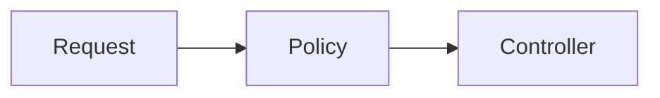

This page is the source of truth for the conventions of these docs. It applies to people and to agents. The site is in `docs/` and the content is in `docs/docs/`. The file [`docs/AGENTS.md`](https://github.com/strapi/strapi/blob/develop/docs/AGENTS.md) summarizes the rules.

## Where content goes

Readers pick a section by intent. Put a page where its reader looks for it.

| Section       | Reader intent                                 | Folder                            | Examples                                                            |
| ------------- | --------------------------------------------- | --------------------------------- | ------------------------------------------------------------------- |
| Contributing  | Do a task in the monorepo (how-to)            | `docs/docs/contributing/`         | Testing, TypeScript conventions, this page                          |
| Architecture  | Understand how several packages work together | `docs/docs/architecture/`         | Authentication, future flags                                        |
| Packages      | Understand or look up one package             | `docs/docs/packages/<repo path>/` | `packages/core/database` is documented in `packages/core/database/` |
| API reference | Look up the `Strapi` class and its parts      | `docs/docs/api/`                  | Container, event hub                                                |
| Exports       | Browse the generated TypeDoc output           | `docs/docs/exports/`              | Generated at build time and gitignored. Do not edit it.             |

Design proposals (RFCs) are not in this repository. They happen in [GitHub Discussions](https://github.com/strapi/strapi/discussions/categories/rfcs).

- Packages mirror repo paths. The docs of `packages/core/database` live in `docs/docs/packages/core/database/`. Anyone can find them without searching.
- A topic that crosses package boundaries goes in Architecture. Link to it from the package pages that it concerns.
- Prefix files and folders with `01-`, `02-` to set the sidebar order. The prefix is not part of the URL. An `index.md` is the landing page of its folder.
- Do not set `slug`. The URL follows the file path. Only `docs/docs/api/` sets `slug`, to keep its existing URLs.

## Markdown or MDX

`docs/docusaurus.config.ts` sets `markdown.format: 'detect'`. A `.md` file is CommonMark. A `.mdx` file is MDX.

- Write `.md` by default.
- Use `.mdx` only when the page imports a component, for example `import PackageTable from '@site/src/components/PackageTable'`. See `docs/docs/contributing/08-docs-health.mdx`.
- Admonitions (`:::note`, `:::caution`) work in `.md`.
- In MDX, `{` and `<` in text start an expression or a tag. Escape them or put them in code.
- Never keep knowledge only inside a component. A component may render data, but the page must also state the facts in text. Readers on GitHub and agents read the source files and do not run the site.

## Frontmatter

Every page starts with frontmatter.

| Key             | Required           | Value                                                               | Notes                                                                                                                                                                       |
| --------------- | ------------------ | ------------------------------------------------------------------- | --------------------------------------------------------------------------------------------------------------------------------------------------------------------------- |
| `title`         | Yes                | String                                                              | The page title.                                                                                                                                                             |
| `description`   | For new pages      | One or two factual sentences                                        | Feeds `llms.txt`, the page metadata and the cards of generated index pages. Keep it under 150 characters, because `llms.txt` cuts longer text. The build does not check it. |
| `sidebar_label` | No                 | String                                                              | A shorter label for the sidebar.                                                                                                                                            |
| `tags`          | No                 | List of tag keys from `docs/docs/tags.yml`                          | An unknown tag fails the build.                                                                                                                                             |
| `package`       | Package pages only | The npm name of a workspace package, for example `@strapi/database` | Must match the `name` in the `package.json` of a workspace under `packages/`.                                                                                               |
| `status`        | No                 | `stub`, `draft` or `needs-review`                                   | No `status` means the page is trusted.                                                                                                                                      |
| `review_notes`  | No                 | List of strings                                                     | Why the page is flagged. Shown in the banner and on the Docs health page.                                                                                                   |

Docusaurus keys such as `sidebar_position`, `hide_title` and `hide_table_of_contents` are also allowed. Use them only when you need them.

The build throws when:

- `status` is not one of the three values.
- `review_notes` is not a list of strings.
- `package` is not a workspace package under `packages/`.
- Two pages set the same `package`.
- `tags` contains a key that is not in `docs/docs/tags.yml`.

The build only warns when a workspace package has no page.

```yaml
---
title: Example page
description: What this page explains, in one or two factual sentences.
tags:
  - backend
status: draft
review_notes:
  - The retry rules are not verified against the code.
---
```

## Page status

A page with no `status` is trusted: someone checked it against the code. Any page that is not verified must carry a status.

| Status         | Meaning                                                        | Use it when                                                                        |
| -------------- | -------------------------------------------------------------- | ---------------------------------------------------------------------------------- |
| `stub`         | Headings only, no real content.                                | You create a placeholder. `yarn scaffold:packages` sets it.                        |
| `draft`        | Content exists but is incomplete or not verified against code. | You write a page and did not check every claim, or you seed a page.                |
| `needs-review` | Existing content that is suspected to be stale.                | You find outdated claims and cannot fix them now, or your change makes them stale. |

`review_notes` explains the flag. Write one item per problem. Name the claim or the missing part, and where to check it. Do not write "TODO" or "outdated".

A theme wrapper (`docs/src/theme/DocItem/Content/`) renders a banner above the page. The banner shows the status, the notes, and a link to [Docs health](./08-docs-health.mdx). That page lists every flagged page with its notes, and every package that has no page or only a stub. It is generated at build time.

To promote a page to trusted:

1. Read the code that the page describes.
2. Check each claim: names, paths, flows, examples and commands. Run the commands and examples when you can.
3. Fix or delete what is wrong. Add what is missing.
4. Remove `status` and `review_notes` in the same pull request.
5. State in the pull request description what you verified.

Never remove a status only to hide the banner. If you change code that a page describes, update the page. If you cannot, set `status: needs-review` and add a note that says what changed.

## Package pages

Each workspace package under `packages/` has one page at `docs/docs/<repo path>/index.md`. Other pages of the package go in the same folder. Only `index.md` sets `package`. Package pages are plain `.md`.

The scaffold script creates this template:

```md
---
title: '@strapi/database'
sidebar_label: database
description: <description from package.json>
package: '@strapi/database'
status: stub
---

## Purpose

## Key concepts

## Code map

## Testing

## Related
```

Each heading carries one italic guidance line while the page is a stub. Replace the guidance with content. Delete a heading that you do not fill.

The `package` key drives the package header. The theme wrapper renders it between the title and the content. It shows the npm name, version, private flag, a link to the folder on GitHub, the description from `package.json`, the internal dependencies and dependents, and a link to the [package map](../architecture/01-package-map.mdx). Do not repeat this data in the page text.

To add docs for a new package:

1. Add the package under `packages/` with a `name` and a `description` in its `package.json`.
2. Run `yarn scaffold:packages` in `docs/`. The script is idempotent. It creates the missing pages and the `_category_.json` of each group folder. It never changes an existing file.
3. Fill in the page and set the honest status.

A new group folder under `packages/` must be added to `PACKAGE_GROUPS` in `docs/plugins/workspace-packages/groups.mjs`, or the build throws. Workspaces outside `packages/`, such as `examples/`, have no package pages.

## Links

- Link to pages with relative file links that include the extension: `[Package map](../architecture/01-package-map.mdx)`. The build checks them (`onBrokenLinks` and `onBrokenMarkdownLinks` are `throw`). They also work on GitHub and in editors, and they survive a URL change.
- Broken anchors only warn. Read the warnings anyway.
- Link to code with `https://github.com/strapi/strapi/blob/develop/<path>` for a file and `https://github.com/strapi/strapi/tree/develop/<path>` for a folder. The site cannot resolve paths outside `docs/docs/`, and the site deploys from `develop`.
- Do not use line anchors. Lines move with every change, and the link then points at the wrong code without any error. Name the file and the symbol in the text instead.
- Repo-root markdown that the site imports, such as `CONTRIBUTING.md`, may use repo-relative links. `docs/repo-root-markdown-links.ts` rewrites links to a page under `docs/docs/` (`.md` or `.mdx`) into site links that the build checks, and every other link into a GitHub `develop` URL.

## Diagrams

Write diagrams as `mermaid` code fences. The config enables them (`markdown.mermaid: true`). The source is plain text, so reviewers can diff it and agents can read it. For an example, see `docs/docs/packages/core/permissions/index.md`.

````md

````

## Images

Prefer a mermaid diagram when a text diagram is enough. For other images:

- Put the file in `docs/static/img/<area>/`, where `<area>` is the package or topic folder, for example `docs/static/img/database/`.
- Reference it with an absolute path and always write alt text: ``.
- Keep the editable source (for example a `.drawio` or `.excalidraw` file) next to the exported image, with the same name.

## Tags

Tags are cross-cutting labels such as `backend`, `frontend`, `rbac` and `testing`. The vocabulary is in [`docs/docs/tags.yml`](https://github.com/strapi/strapi/blob/develop/docs/docs/tags.yml). The config sets `onInlineTags: 'throw'`, so a tag that is not in that file fails the build.

To add a tag, add an entry with a `label` and a `description`. Keep the list short. Do not add a tag that repeats a package folder name, because the folder is the navigation. Do not add a tag for a status, because `status` covers it.

## Components

| Component       | What it does                                                               |
| --------------- | -------------------------------------------------------------------------- |
| `PackageGraph`  | Interactive map of the workspace packages and their internal dependencies. |
| `PackageTable`  | Server-rendered table of the packages, grouped by folder.                  |
| `PackageHeader` | Package header, rendered from the `package` key. Pages do not import it.   |
| `DocsHealth`    | Report of the flagged pages and of the packages without docs.              |

To add a component:

1. Create it in `docs/src/components/<Name>/`.
2. Import it from an `.mdx` page: `import Name from '@site/src/components/Name';`.
3. Read data from repo files, such as `package.json` or frontmatter. Load it in a plugin, as `docs/plugins/workspace-packages/` does, and read it in the component with the hook in `docs/src/lib/workspace-packages.ts`.
4. State the same knowledge in the page text (see [Markdown or MDX](#markdown-or-mdx)).
5. Run `yarn tsc --noEmit` in `docs/`.

## Moving or renaming pages

Old URLs must keep working. When you move, rename or delete a page:

1. Add an entry to `docs/redirects.ts`: `{ from: '/old/path', to: '/new/path' }`. Use site URLs, without numeric prefixes or extensions. Never list a `from` that is still a route. For a deleted page, redirect to the closest page.
2. Fix the relative links to the page. The build lists the ones you miss.
3. Fix the references outside `docs/`. Run `rg 'docs/docs/' --glob '!docs/**'` at the repo root. Typical places are `AGENTS.md`, `CONTRIBUTING.md`, `tests/e2e/README.md` and code comments.

Redirects only work in a production build. `yarn start` does not serve them. Test them with `yarn build && yarn serve`.

## Local workflow

Run these in `docs/`:

```bash
yarn install            # once
yarn start              # dev server with live reload
yarn build              # production build; fails on broken links and invalid frontmatter
yarn serve              # serve the production build (redirects work here)
yarn scaffold:packages  # create the missing package pages
yarn tsc --noEmit       # type-check the components and plugins
```

Format changed files from the repo root: `yarn prettier --write <paths>`. CI runs `yarn build` when a pull request changes `docs/` (job `docs_build` in `.github/workflows/tests.yml`). The deploy runs on each push to `develop`.

## Writing style

- Use plain technical English. Prefer short words.
- Use the active voice. Write one idea per sentence.
- Write headings in sentence case.
- Explain why, not only what.
- Point to the code instead of restating it. Name the real path, command or symbol.
- Do not use em dashes. Start a new sentence or use a comma.
- Do not use filler or promotional words.

## Docs and agents

`docs/` holds knowledge: what Strapi internals are and why they work that way. It serves people and agents. `AGENTS.md` at the repo root holds the rules for agents that work in the repo. `docs/AGENTS.md` holds the rules for editing these docs. `.ai/skills/` holds procedures that tell an agent how to do a task. The skill [`contributor-docs`](https://github.com/strapi/strapi/blob/develop/.ai/skills/contributor-docs/SKILL.md) is the procedure for this guide.

A skill links to the docs and never copies them. Two copies drift apart.

The site publishes `/llms.txt` and `/llms-full.txt`, built from the page sources. The `exports/` output is excluded. They list pages by title and description, so write a precise `description`.

An agent that works in a checkout reads the `.md` sources under `docs/docs/` directly. Before it changes a package, it reads the page in `docs/docs/packages/<repo path>/` and checks the `status` of that page.
