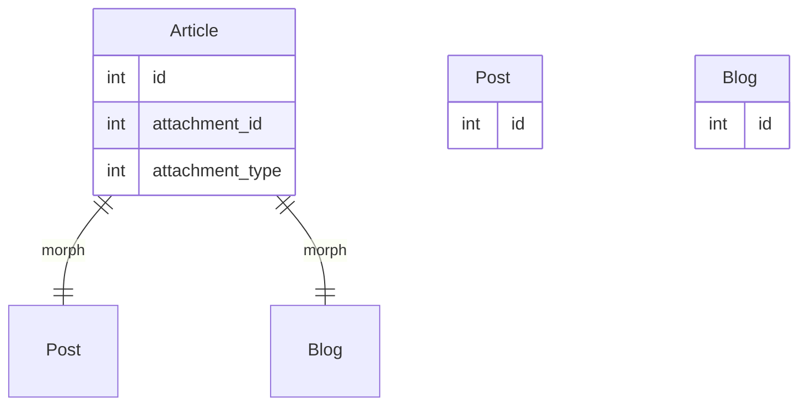
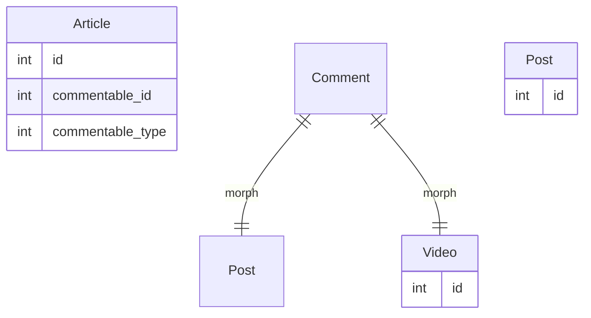
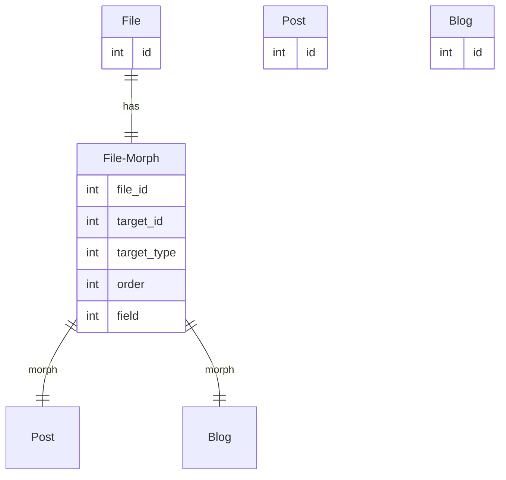

# Relations

In Strapi, relations are a way of linking two content types (or collections) together. They allow you to establish a connection between two content types, so that you can query and display related content in your application.

There are multiple type of relations in strapi.

## Relation types

### **Regular relations:**

1. **One-to-One:** This type of relation connects one item of one content type to one item of another content type. For example, a user can have only one profile, so the "User" content type can have a one-to-one relation with the "Profile" content type.
2. **One-to-Many**: This type of relation connects one item of one content type to multiple items of another content type. For example, a user can have many posts, so the "User" content type can have a one-to-many relation with the "Post" content type.
3. **Many-to-One:** Similar to One-to-Many, but in reverse. In a Many-to-One relation, multiple items of one content type are connected to a single item of another content type.
4. **Many-to-Many:** This type of relation connects multiple items of one content type to multiple items of another content type. For example, a user can have many roles and a role can belong to many users, so the "User" content type can have a many-to-many relation with the "Role" content type.

### **Polymorphic relations:**

- **One-to-One (morph OneToOne):**



- **One-to-Many (morph oneToMany)**:



- **Many-to-One:** -
- **Many-to-Many:** This type allows to associate a Content Type with multiple other Content Types. An example is how we handle Media in Strapi. Where you can link any asset to any content type.



All relations in Strapi are stored using a join table by default, which is a table that connects the two related content types. However, you can configure a relation to not use a join table by setting the `useJoinTable` property to `false` in your attribute schema.

For example, in Strapi we add a `createdBy` (and `updatedBy`) field to every content type that links to the "User" content type in a one-to-one relation, by using the following code:

```jsx
createdBy: {
  type: 'relation',
  relation: 'oneToOne',
  target: 'admin::user',
  configurable: false,
  writable: false,
  visible: false,
  useJoinTable: false, // <-- It will not be stored in a join table
};
```

## Relation actions

Strapi allows to perform actions on relational fields, used to update that same field with relations. These actions include `connect`, `set`, `disconnect` and `clone` which allow you to modify the relationships between content types. ([See more in the official docs](https://docs.strapi.io/dev-docs/api/rest/relations))

- **Connect**: The "connect" action adds a new relation to an entity, on top of any existing relations it had before.

**Example**: If you have a "User" content type and a "Post" content type with a many-to-many relation, you can use the "connect" action to add a new "Post" to a user's collection of posts. This action will create a new row in the join table between "User" and "Post", linking them together.

- **Set**: The "set" action overwrites all existing relations of an entity with a new set of relations.

Example: If you have a "Product" content type and a "Category" content type with a many-to-many relation, you can use the "set" action to update the categories associated with a product. This action will remove all existing categories and replace them with the new categories specified.

- **Disconnect**: The "disconnect" action removes a specific relation from an entity.

Example: If you have a "Customer" content type and an "Order" content type with a one-to-many relation, you can use the "disconnect" action to remove an order from a customer's collection of orders. This action will remove the corresponding row from the "Order" table and the foreign key from the "Customer" table.

- **Clone**: The "clone" action copies the relations from a specific entity to another entity. This action is useful when you want to create a new entity that has the same relations as an existing entity.

Example: If you have a "Page" content type with a many-to-many relation to a "Tag" content type, you can use the "clone" action to create a new "Page" with the same "Tag" relations as an existing "Page". This action creates new rows in the join table, linking the new entity with the same tags as the existing entity.

These actions allow you to easily modify the relationships between content types in your Strapi.

⚠️ Not all type of relations support every action yet:


