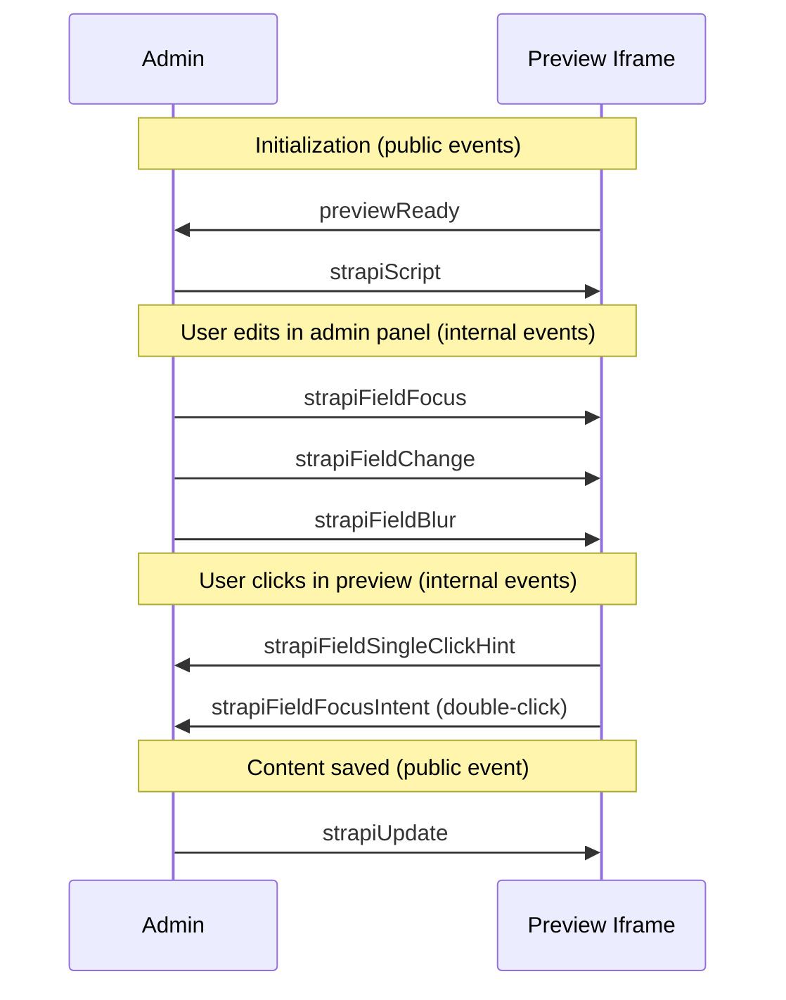

The live preview feature lets users see their content rendered on their frontend while editing. It includes visual editing that identifies and highlights editable fields.

## Why not an SDK

Visual editing requires running some of our code on the user's frontend to detect fields and draw highlights. The obvious approach would be an SDK package users install in their project. We intentionally avoided this.

An SDK would require ongoing maintenance and create version mismatch risks between the SDK and Strapi. It would also tie us to specific frameworks or require multiple framework-specific packages.

Instead, the preview script is defined inside Strapi and sent to the frontend via `postMessage`. The frontend just needs a small snippet to receive and execute it. This keeps the script always in sync with the CMS version, works with any framework, and requires no package installation.

## How the script works

### Self-contained constraint

The preview script (`packages/core/content-manager/admin/src/preview/utils/previewScript.ts`) is stringified before being sent to the iframe:

```ts
const script = `(${previewScript.toString()})(${JSON.stringify(config)})`;
```

Because of this, it **cannot import dependencies or reference external variables**. All logic must be self-contained. The only external code (`@vercel/stega` for decoding) is loaded dynamically from a CDN at runtime.

This is why the file has an unusual structure with many functions defined inline.

### Field identification with stega

We use [stega encoding](https://github.com/vercel/stega) to identify which Strapi field each piece of text comes from. Stega embeds invisible metadata into text content using Unicode zero-width characters that are imperceptible to users but can be decoded programmatically.

1. The Document Service encodes field metadata into text values (invisible to users)
2. The frontend renders the content normally
3. The preview script decodes the metadata and attaches `data-strapi-source` attributes to DOM elements
4. Highlights are drawn over elements with source attributes

The metadata uses URL search params format, because it makes it easy to encode and decode multiple pieces of information into a single string: `path=title&type=string&documentId=abc123&locale=en&model=api::page.page`

### Stega limitations

Stega can only encode strings. This means:

- **Blocks fields don't support visual editing** — their content is a JSON object, not a string. Supporting them would require a custom implementation.
- **Numbers and booleans aren't encoded** — we can't modify their type in the response.
- **Fields inside components and dynamic zones work** — we encode individual string fields within them, not the parent object. The path includes indices (e.g., `components.2.title`) to identify the exact field.
- **Media fields work partially** — the string properties inside media objects (like `url`, `name`, `alternativeText`) get encoded when traversed.

### Communication protocol

The admin panel and preview iframe communicate via `postMessage`.



Public events (`previewReady`, `strapiScript`, `strapiUpdate`) are documented to users—changing them is a breaking change.

Internal events (for field focus/blur/change synchronization) are defined in `packages/core/content-manager/admin/src/preview/utils/constants.ts` and can be changed freely since we control both ends.

### Frontend configuration

Users can configure the preview behavior from their frontend via `window` globals, without modifying Strapi:

- `window.STRAPI_DISABLE_STEGA_DECODING` - disable field detection entirely. When true, users need to write the `data-strapi-source` attribute manually for fields to be editable
- `window.STRAPI_HIGHLIGHT_HOVER_COLOR` - customize hover highlight color
- `window.STRAPI_HIGHLIGHT_ACTIVE_COLOR` - customize active highlight color
