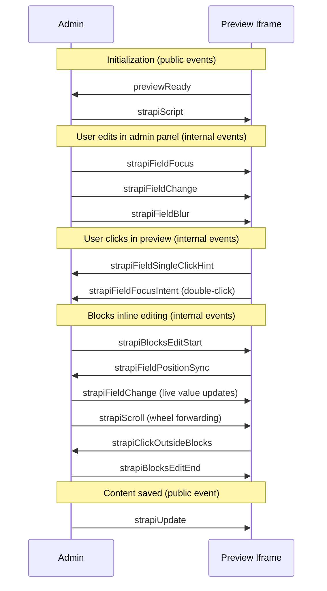

The live preview feature lets users see their content rendered on their frontend while editing. It includes visual editing that identifies and highlights editable fields.

## Why not an SDK

Visual editing requires running some of our code on the user's frontend to detect fields and draw highlights. The obvious approach would be an SDK package users install in their project. We intentionally avoided this.

An SDK would require ongoing maintenance and create version mismatch risks between the SDK and Strapi. It would also tie us to specific frameworks or require multiple framework-specific packages.

Instead, the preview script is defined inside Strapi and sent to the frontend via `postMessage`. The frontend just needs a small snippet to receive and execute it. This keeps the script always in sync with the CMS version, works with any framework, and requires no package installation.

## How the script works

### Self-contained constraint

The preview script (`packages/core/content-manager/server/src/preview/controllers/previewScript.js`) is served verbatim from a server endpoint (`GET /content-manager/preview/script`). The admin fetches it, wraps it with its runtime config, and posts the result to the iframe:

```ts
const previewScriptSource = await fetch(
  `${window.strapi.backendURL}/content-manager/preview/script`
).then((res) => res.text());
const config = {
  colors: previewHighlightColors,
  events: INTERNAL_EVENTS,
  parentOrigin: window.location.origin,
};
const script = `(${previewScriptSource})(${JSON.stringify(config)})`;
```

Because of this, it **cannot import dependencies or reference external variables**. All logic must be self-contained. The only external code (`@vercel/stega` for decoding) is loaded dynamically from a CDN at runtime.

It lives in a standalone `.js` file served as-is rather than being bundled with the admin: a bundler wraps the module in helper code that breaks once the function is stringified and injected into the iframe. The file is still type-checked via `@ts-check` and JSDoc.

This is why the file has an unusual structure with many functions defined inline.

### Field identification with stega

We use [stega encoding](https://github.com/vercel/stega) to identify which Strapi field each piece of text comes from. Stega embeds invisible metadata into text content using Unicode zero-width characters that are imperceptible to users but can be decoded programmatically.

1. The Document Service encodes field metadata into text values (invisible to users)
2. The frontend renders the content normally
3. The preview script decodes the metadata and attaches `data-strapi-source` attributes to DOM elements
4. Highlights are drawn over elements with source attributes

The metadata uses URL search params format, because it makes it easy to encode and decode multiple pieces of information into a single string: `path=title&type=string&documentId=abc123&locale=en&model=api::page.page`

### Stega limitations

Stega can only encode strings. This means:

- **Numbers and booleans aren't encoded** — we can't modify their type in the response.
- **Fields inside components and dynamic zones work** — we encode individual string fields within them, not the parent object. The path includes indices (e.g., `components.2.title`) to identify the exact field.
- **Media fields work partially** — the string properties inside media objects (like `url`, `name`, `alternativeText`) get encoded when traversed.

Blocks fields are JSON, not strings, so they can't be stega-encoded in the normal sense. They use a different approach described below.

### Communication protocol

The admin panel and preview iframe communicate via `postMessage`.


```mermaid
sequenceDiagram
    participant Admin
    participant Iframe as Preview Iframe

    Note over Admin,Iframe: Initialization (public events)
    Iframe->>Admin: previewReady
    Admin->>Iframe: strapiScript

    Note over Admin,Iframe: User edits in admin panel (internal events)
    Admin->>Iframe: strapiFieldFocus
    Admin->>Iframe: strapiFieldChange
    Admin->>Iframe: strapiFieldBlur

    Note over Admin,Iframe: User clicks in preview (internal events)
    Iframe->>Admin: strapiFieldSingleClickHint
    Iframe->>Admin: strapiFieldFocusIntent (double-click)

    Note over Admin,Iframe: Blocks inline editing (internal events)
    Admin->>Iframe: strapiBlocksEditStart
    Iframe->>Admin: strapiFieldPositionSync
    Admin->>Iframe: strapiFieldChange (live value updates)
    Admin->>Iframe: strapiScroll (wheel forwarding)
    Iframe->>Admin: strapiClickOutsideBlocks
    Admin->>Iframe: strapiBlocksEditEnd

    Note over Admin,Iframe: Content saved (public event)
    Admin->>Iframe: strapiUpdate
```

Public events (`previewReady`, `strapiScript`, `strapiUpdate`) are documented to users—changing them is a breaking change.

Internal events (for field focus/blur/change synchronization) are defined in `packages/core/content-manager/admin/src/preview/utils/constants.ts` and can be changed freely since we control both ends.

### Frontend configuration

Users can configure the preview behavior from their frontend via `window` globals, without modifying Strapi:

- `window.STRAPI_DISABLE_STEGA_DECODING` - disable field detection entirely. When true, users need to write the `data-strapi-source` attribute manually for fields to be editable
- `window.STRAPI_HIGHLIGHT_HOVER_COLOR` - customize hover highlight color
- `window.STRAPI_HIGHLIGHT_ACTIVE_COLOR` - customize active highlight color

## Blocks inline editing

Blocks fields hold a JSON AST, so they can't use the stega string encoding that other field types use. Instead they get a dedicated inline editing flow that overlays a full `BlocksEditor` directly on top of the iframe's rendered content.

### Stega encoding for blocks

Even though a blocks field is JSON, we still need a way for the preview script to identify which DOM elements belong to a given blocks field, so it can draw a highlight and compute the field's bounding box. The server-side content-source-maps service (`packages/core/core/src/services/content-source-maps.ts`) handles this with a dedicated encoding pass over the blocks AST.

Instead of encoding every text node, it encodes **one stega marker per visual block**:

- For `paragraph`, `heading`, and `quote` nodes: the first `{ type: 'text' }` leaf in the subtree.
- For `list` nodes: the first text leaf of each `list-item` (recursively for nested lists).
- For `image` nodes: the `url` and `alternativeText` string fields inside the image object.
- `code` blocks are skipped entirely (encoding their content would corrupt syntax).

All markers within one blocks field share the same metadata — specifically, the `fieldPath` key set to the field's path (e.g. `content`) and `type: 'blocks'`. The individual `path` key still varies per leaf, but the preview script uses `fieldPath` as the group key so all marked elements cluster into a single highlight whose bounding box spans the entire rendered field.

### Highlight grouping for blocks

Standard fields group highlights by their full `data-strapi-source` attribute value. For blocks, every marker shares the same `fieldPath` but different `path` values (each leaf has its own position in the AST). The `deriveGroupKey` function in the preview script detects the `fieldPath` key and strips `path` from the group key, collapsing all marked elements into one highlight.

### The edit session

Double-clicking a blocks field highlight starts an edit session. The flow is:

1. **Admin** receives `strapiFieldFocusIntent` with the field path and the highlight's current bounding rect.
2. **Admin** sets `blocksEditSession` in `PreviewContext` — this mounts `LivePreviewBlocksSurface`.
3. **Admin** posts `strapiBlocksEditStart` to the iframe.
4. **Iframe** (preview script) responds:
   - Injects a CSS rule (`visibility: hidden`) targeting all elements whose `data-strapi-source` contains `fieldPath=<path>`. This hides the host-rendered blocks so the overlay doesn't double-render.
   - Disables pointer events on the highlight so it can't be accidentally double-clicked during editing.
   - Attaches a `click` listener to the document to detect clicks outside the editor (`strapiClickOutsideBlocks`).
   - Reads computed typography (`lineHeight`, `fontSize`, paragraph `marginBottom`) from the first matching element and sends it immediately with `strapiFieldPositionSync`.
   - Attaches a `scroll` listener and a `ResizeObserver` on the field container, both firing `strapiFieldPositionSync` on every change so the overlay tracks the field as the iframe scrolls or reflows.
5. **Admin** (`LivePreviewBlocksSurface`) positions the `BlocksEditor` overlay using the received rect, translated from iframe-relative to viewport-relative coordinates. CSS custom properties (`--preview-line-height`, `--preview-font-size`, `--preview-block-gap`) are set on the overlay container so the editor's paragraph elements match the iframe's computed typography.
6. As the user types, `BlocksEditor` fires `onChange` synchronously on every keystroke (`livePreviewSync` mode). The admin posts `strapiFieldChange` to the iframe so the host app can re-render the hidden blocks container in sync — this matters because the overlay's height is computed from the iframe's own DOM layout.
7. Wheel events on the overlay container are forwarded to the iframe as `strapiScroll`, so the iframe scrolls naturally even though the pointer is over the admin's overlay.
8. The session ends when: the user clicks outside the editor in the admin, presses Escape, a `strapiClickOutsideBlocks` message arrives from the iframe, or the field scrolls entirely out of the iframe viewport.
9. On end, the admin posts `strapiBlocksEditEnd` and then one final `strapiFieldChange` with the latest value, so the host app can re-render with the edited content without a save.
10. **Iframe** tears down the CSS hide rule, removes event listeners, and re-enables pointer events on the highlight.

### Admin-side components

| File                                              | Role                                                                                                                               |
| ------------------------------------------------- | ---------------------------------------------------------------------------------------------------------------------------------- |
| `preview/components/LivePreviewBlocksSurface.tsx` | Mounts the overlay when `blocksEditSession` is set; handles all postMessage coordination and session lifecycle                     |
| `preview/components/PreviewBlocksToolbar.tsx`     | Renders `BlocksToolbar` in a `document.body` portal, positioned over the current text selection using `useFloatingToolbarPosition` |
| `preview/hooks/useFloatingToolbarPosition.ts`     | Computes toolbar position from Slate's selection rect; flips above/below when near the iframe top edge                             |
| `preview/utils/constants.ts`                      | Exports `TOOLBAR_HEIGHT` / `TOOLBAR_WIDTH` used by both the hook and the toolbar component                                         |

`BlocksEditor` is rendered with two special props:

- `isLivePreviewInline` — omits `EditorLayout` (the title bar / expand button shell) and renders the floating toolbar node passed via `floatingToolbar` instead.
- `livePreviewSync` — calls `onChange` synchronously on every Slate change instead of debouncing. `flushPendingFormSync` safely no-ops in this mode because there is never a pending debounced update.

### Toolbar positioning

The floating toolbar follows the Slate text selection. `useFloatingToolbarPosition` reads `ReactEditor.toDOMRange(editor, selection).getBoundingClientRect()` and positions the toolbar above the selection. It flips below when there is not enough room above within the iframe's visible area — this is computed relative to the iframe top (`iframeRef.current.getBoundingClientRect().top`), not the viewport top, to account for the Strapi admin header above the iframe.

On mobile (`useIsMobile`), the toolbar is centered horizontally (`left: 50%; transform: translateX(-50%)`) and capped at `calc(100vw - 16px)` width instead of following the cursor.

### Live update integration for host apps

When a blocks edit session is active, the admin fires `strapiFieldChange` messages on every keystroke. Host apps can listen for these on the `window` `message` event or as a native `CustomEvent` dispatched on `window` by the preview script under the same event name. This lets frameworks like Next.js or Nuxt re-render their `BlocksRenderer` in real time without waiting for a save.

```js
// Listen via postMessage (from a parent frame or service worker)
window.addEventListener('message', (e) => {
  if (e.data?.type === 'strapiFieldChange') {
    const { field, value } = e.data.payload;
    // update your local state
  }
});

// Or via the CustomEvent dispatched by the preview script on the same window
window.addEventListener('strapiFieldChange', (e) => {
  const { field, value } = e.detail;
  // update your local state
});
```
