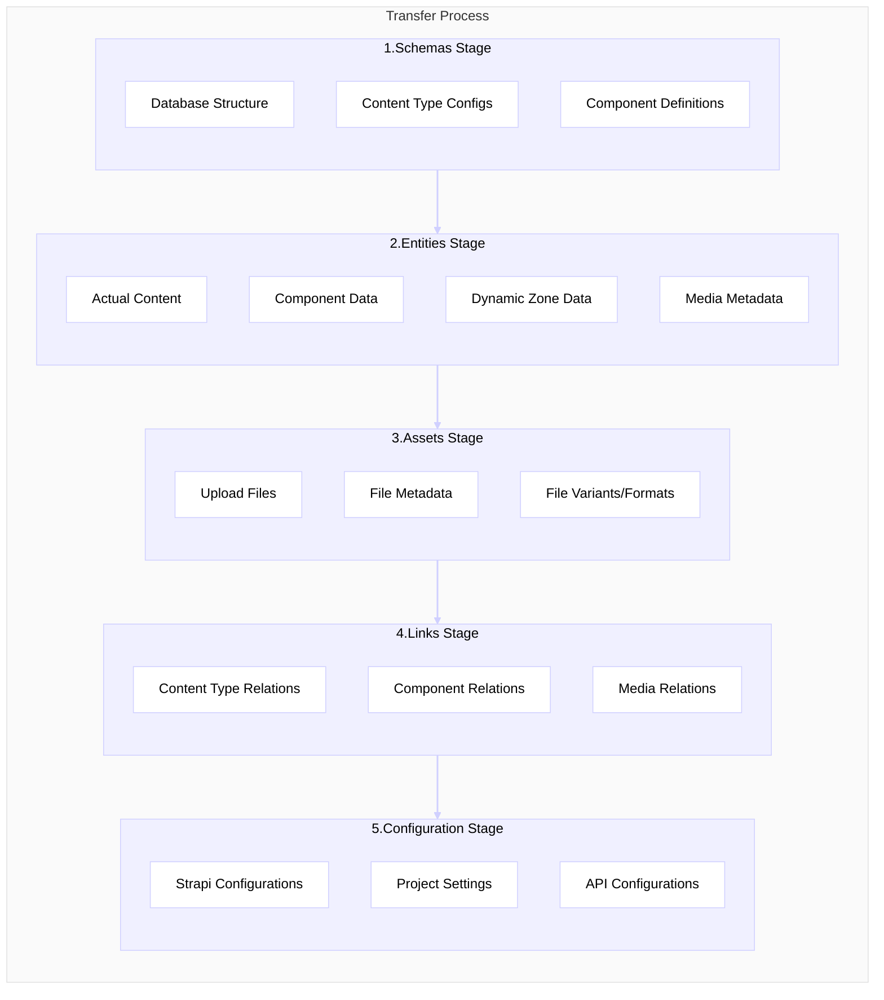
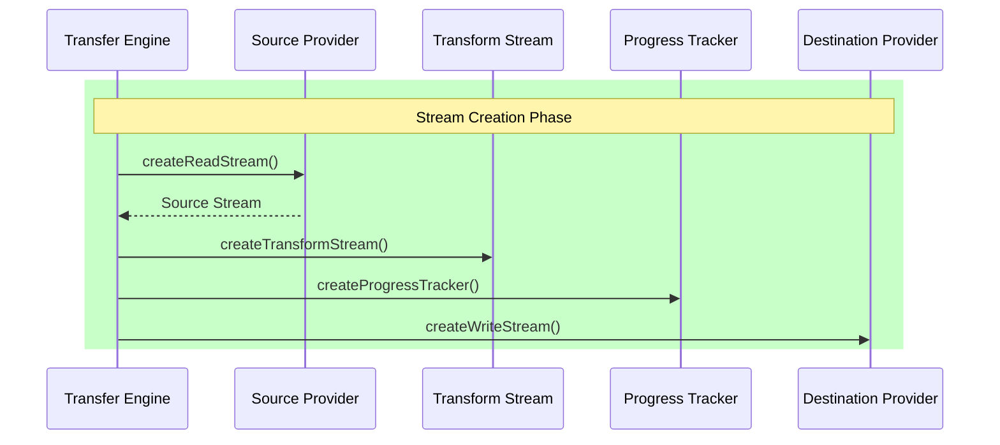
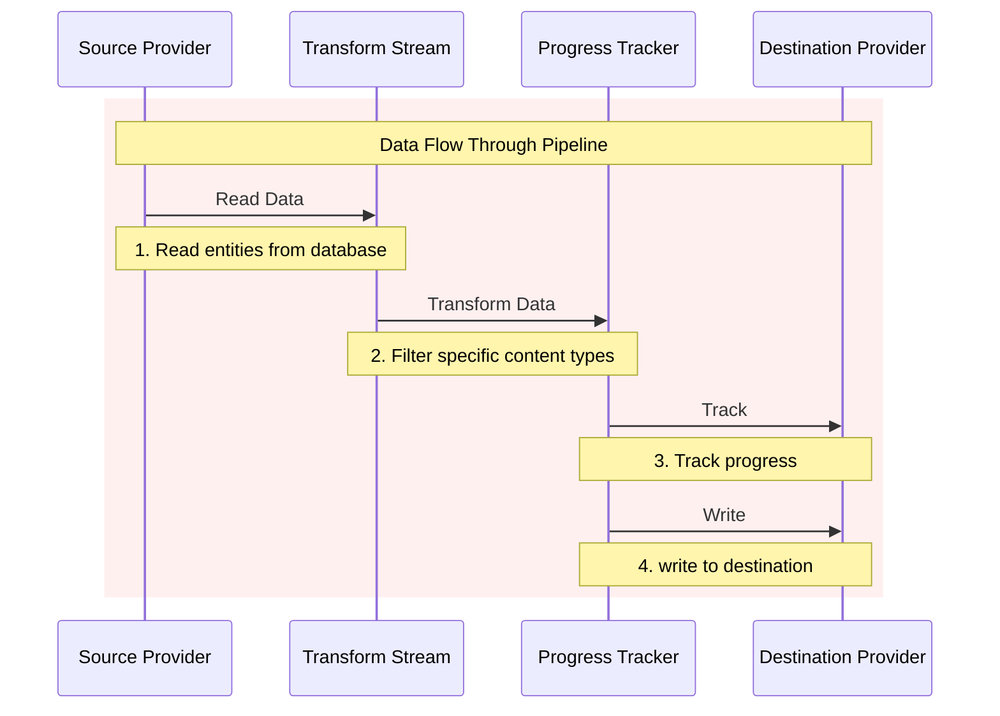
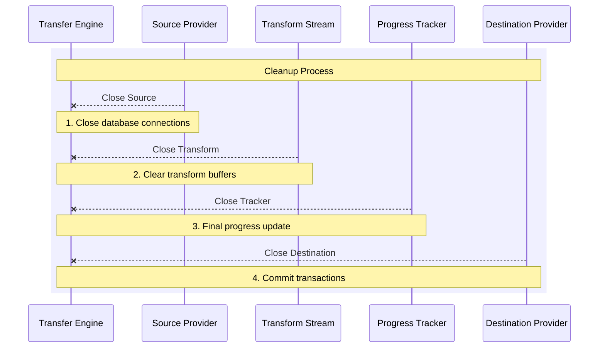
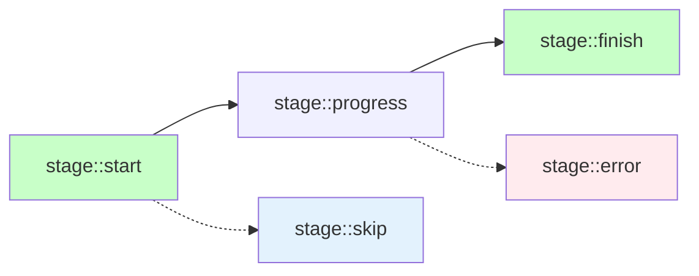

# Stream Lifecycle in Data Transfer

## Overview

The transfer process consists of five sequential stages. Each stage follows the same stream lifecycle pattern but handles different types of data:



1. **Schemas Stage**: Content type definitions

   - Transfers database structure
   - Content type configurations
   - Component definitions

2. **Entities Stage**: Content without relations

   - Actual content data
   - Component data
   - Dynamic zone data
   - Media metadata (not files)

3. **Assets Stage**: Media files

   - Files from /uploads folder
   - File metadata
   - File variants/formats

4. **Links Stage**: Relations between entities

   - Content type relations
   - Component relations
   - Media relations

5. **Configuration Stage**: Project settings
   - Strapi configurations
   - Project-specific settings
   - API configurations

## Stream Lifecycle Phases

### 1. Stream Creation Phase

During this phase, the Transfer Engine initializes and connects all necessary streams for the data transfer.



**Process:**

1. The Transfer Engine requests a read stream from the Source Provider
2. A transform stream is created to handle data modifications
3. A progress tracker stream is initialized for monitoring
4. A write stream is requested from the Destination Provider

**Example Implementation:**

```typescript
async transferEntities(): Promise {
  const stage: TransferStage = 'entities';

  // 1. Create read stream from source
  const source = await this.sourceProvider.createEntitiesReadStream?.();

  // 2. Create transform stream for data modifications
  const transform = this.#createStageTransformStream(stage);

  // 3. Create progress tracker
  const tracker = this.#progressTracker(stage);

  // 4. Create write stream from destination
  const destination = await this.destinationProvider.createEntitiesWriteStream?.();

  // 5. Start the transfer
  await this.#transferStage({
    stage,
    source,
    destination,
    transform,
    tracker
  });
}
```

### 2. Stream Pipeline Phase

This phase represents the active data transfer process where data flows through the connected streams.



**Process:**

1. Source Provider reads data (e.g., from database, file system)
2. Data passes through transform stream for any modifications
3. Progress tracker monitors and reports transfer progress
4. Destination Provider writes processed data

**Key Aspects:**

- Data flows in chunks through the pipeline
- Each stream can process data asynchronously
- Progress events are emitted for monitoring
- Errors are caught and handled at each step

**Example Flow:**

```typescript
async #transferStage(options: {
  stage: TransferStage;
  source?: Readable;
  destination?: Writable;
  transform?: PassThrough;
  tracker?: PassThrough;
}) {
  const { stage, source, destination, transform, tracker } = options;

  // Create pipeline
  let stream: Readable = source;

  // Add transform if provided
  if (transform) {
    stream = stream.pipe(transform);
  }

  // Add progress tracker
  if (tracker) {
    stream = stream.pipe(tracker);
  }

  // Connect to destination
  await new Promise((resolve, reject) => {
    this.#currentStream = stream
      .pipe(destination)
      .on('error', (error) => {
        this.#emitStageUpdate('error', stage);
        reject(error);
      })
      .on('close', () => {
        this.#emitStageUpdate('finish', stage);
        resolve();
      });
  });
}
```

### 3. Stream Closing Phase

The closing phase handles the cleanup of resources and ensures proper completion of the transfer.



**Process:**

1. Source stream indicates end of data
2. Transform stream processes final data chunks
3. Progress tracker records final metrics
4. Destination stream completes writing
5. Resources are cleaned up

**Example Implementation:**

```typescript
async close(): Promise {
  try {
    // Clean up providers
    const results = await Promise.allSettled([
      this.sourceProvider.close?.(),
      this.destinationProvider.close?.()
    ]);

    // Handle any cleanup errors
    results.forEach((result) => {
      if (result.status === 'rejected') {
        this.reportError(result.reason, 'error');
      }
    });

    // Final cleanup
    this.#currentStream = undefined;
    this.progress.data = {};
  } catch (error) {
    this.panic(error);
  }
}
```

## Progress Tracking

The transfer engine maintains progress information for each stage:



Progress events are emitted throughout the transfer:

- `stage::start`: When a stage begins
- `stage::progress`: During data transfer
- `stage::finish`: When a stage completes
- `stage::error`: If an error occurs
- `stage::skip`: If a stage is skipped

```typescript
interface TransferProgress {
  [stage: TransferStage]: {
    count: number; // Number of items processed
    bytes: number; // Amount of data transferred
    startTime: number; // When stage started
    endTime?: number; // When stage completed
    aggregates?: {
      // Optional grouped metrics
      [key: string]: {
        count: number;
        bytes: number;
      };
    };
  };
}
```
