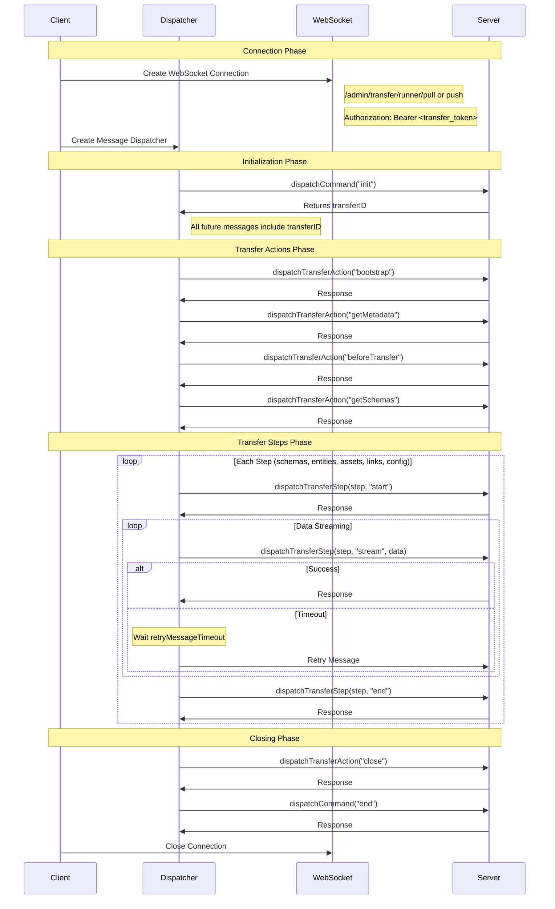
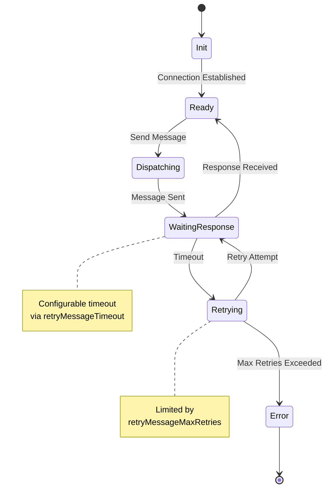

# WebSocket

## Websocket Messages / Dispatcher

The remote websocket server only accepts specific websocket messages which we call transfer commands. These commands must also be sent in a specific order, and an error messages will be returned if an unexpected message is received by the server.

A message dispatcher object should be created to send messages to the server. See `packages/core/data-transfer/src/strapi/providers/utils.ts` for more inofrmation on the dispatcher.

The dispatcher includes

### dispatchCommand

Accepts "commands" used for opening and closing a transfer.

Allows the following `command` values:

- `init`: for initializing a connection. Returns a transferID that must be sent with all future messages in this transfer
- `end`: for ending a connection

### dispatchTransferStep

Used for switching between stages of a transfer and streaming the actual data of a transfer.

Accepts the following `action` values:

- `start`: sent with a `step` value for the name of the step/stage
  - any number of `stream`: sent with a `step` value and the `data` being sent (ie, an array of entities)
- `end`: sent with a `step` value for the step being ended

### dispatchTransferAction

Used for triggering 'actions' on the server equivalent to the local providers.

- `bootstrap`
- `getMetadata`
- `beforeTransfer`
- `getSchemas`
- `rollback` (destination only)
- `close`: for completing a transfer (but doesn't close the connection)

See `packages/core/data-transfer/dist/strapi/remote/handlers/pull.d.ts` and `packages/core/data-transfer/dist/strapi/remote/handlers/push.d.ts` for complete and precise definitions of the messages that must be sent.

## Transfer Lifecycle



### 1. Connection Phase

When the data transfer feature is enabled for a Strapi server (an `admin.transfer.token.salt` config value has been set and `server.transfer.remote.enabled` is not set to false), Strapi will create websocket servers available on the routes `/admin/transfer/runner/pull` and `/admin/transfer/runner/push`.

**Create WebSocket Connection**

- Opening a websocket connection on those routes requires a valid transfer token as a bearer token in the Authorization header.:
  ```
  Authorization: Bearer <transfer_token>
  ```
- Server validates the token and establishes the connection

Please see the `bootstrap()` method of the remote providers for an example of how to make the initial connection to the Strapi websocket.

**Event Listener Attachment**
Immediately after WebSocket creation, the following listeners are attached:

- `'open'`: Handles successful connection establishment
- `'close'`: Manages connection termination
- `'error'`: Handles connection and transmission errors
- `'message'`: Processes incoming messages from server

### 2. Initialization Phase

Client sends initial command to establish transfer, server responds with unique transferID.

```javascript
const transferID = await dispatcher.dispatchCommand('init');
// All subsequent messages must include this transferID
```

All subsequent messages must include this transferID

### 3. Transfer Actions Phase

Sequential actions executed through `dispatchTransferAction`:

1. `bootstrap`: Initializes transfer environment
2. `getMetadata`: Retrieves transfer metadata
3. `beforeTransfer`: Performs pre-transfer preparations
4. `getSchemas`: Retrieves content type schemas, used for validation between source and destination

### 4. Transfer Steps Phase

The main phase where actual data transfer occurs, processing different types of data (schemas, entities, assets, links, configuration) in sequence:

**Stage Start**

```javascript
dispatchTransferStep(action: "start", step)
```

**Data Streaming**

```javascript
dispatchTransferStep(action:"stream", step, data)
```

**Stage Completion**

```javascript
dispatchTransferStep(action:"end", step)
```

**Retry Mechanism**
During data transfer:

- If server response not received within `retryMessageTimeout`
- System attempts retry up to `retryMessageMaxRetries` times
- Automatic retry on timeout
- Transfer aborts if max retries exceeded

### 5.Closing Phase

**Cleanup Actions**

1. Send close action:
   ```javascript
   dispatchTransferAction('close');
   ```
2. Send end command:
   ```javascript
   dispatchCommand({ command: 'end', params: { transferID } });
   ```

**Connection Termination**

1. Remove event listeners in reverse order:
   - Remove `message` listener
   - Remove `error` listener
   - Remove `open` listener
   - Remove `close` listener
2. Close WebSocket connection

## Message Timeouts and Retries



Because the transfer relies on a message->response protocol, if the websocket server is unable to send a reply, for example due to network instability, the connection would halt. For this reason, each provider's options includes `retryMessageOptions` which attempt to resend a message after a given timeout is reached and a max retry option to abort the transfer after a given number of failed retry attempts.
