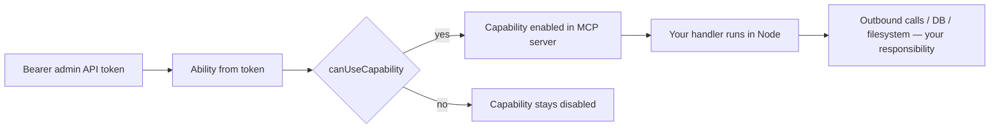

# MCP plugin author security

Strapi exposes a Model Context Protocol (MCP) surface for admin API tokens. Plugins register **tools**, **prompts**, and **resources** on `strapi.ai.mcp` during the `register()` phase (for example `registerTool`, `registerPrompt`, `registerResource`). Capabilities must be registered **before** the MCP server starts; registration during `register()` is the supported pattern.

Type definitions for capability shapes, Zod schemas, and handlers live in [`packages/core/types/src/modules/mcp.ts`](https://github.com/strapi/strapi/blob/develop/packages/core/types/src/modules/mcp.ts).

---

## What Strapi enforces vs what you must implement

| Area                                | What core enforces                                                                                                                                                                                                                                                                                                    | What you must still implement                                                                                                              |
| ----------------------------------- | --------------------------------------------------------------------------------------------------------------------------------------------------------------------------------------------------------------------------------------------------------------------------------------------------------------------- | ------------------------------------------------------------------------------------------------------------------------------------------ |
| **Capability metadata**             | Every non-`devModeOnly` capability must declare `auth: { action, subject? }` at registration ([`McpCapabilityDefinitionRegistry.define`](https://github.com/strapi/strapi/blob/develop/packages/core/core/src/services/mcp/internal/McpCapabilityDefinitionRegistry.ts)). `devModeOnly` capabilities may omit `auth`. | Choose actions/subjects that honestly match what the handler does; split or tighten definitions when behavior spans unrelated permissions. |
| **Exposure to the client**          | For each request, the admin API token’s CASL **ability** decides which registered capabilities are **enabled** on the MCP server ([`canUseCapability`](https://github.com/strapi/strapi/blob/develop/packages/core/core/src/services/mcp/internal/McpServerFactory.ts)).                                              | Treat this as a **gate for visibility and invocation**, not as automatic sandboxing of your Node handler.                                  |
| **Handler robustness**              | [`createSafeCapabilityRegistration`](https://github.com/strapi/strapi/blob/develop/packages/core/core/src/services/mcp/utils/createSafeCapabilityRegistration.ts) isolates factory errors, runtime throws, and SDK registration failures so one bad plugin does not take down MCP registration.                       | Correctness, authorization inside your code, safe I/O, and no leaking of secrets in responses.                                             |
| **Network / process / data access** | No built-in restriction on `fetch`, filesystem, `child_process`, raw DB, or ad hoc outbound URLs inside **your** handler.                                                                                                                                                                                             | Validate inputs, avoid SSRF, use Strapi APIs that respect the same security model as the rest of the app where appropriate.                |

---

## Normative rules

Conventions: **must** (required for secure design or core contract), **must not**, **should** (review checklist).

### Registration and permissions

1. **Must** declare the narrowest `auth.action` and optional `auth.subject` that match what the capability does, using the same CASL vocabulary as [admin permissions](../admin/02-permissions/00-intro.mdx). If the handler performs multiple unrelated actions, split into multiple capabilities or pick the strictest subject users must hold, and document the mapping in the plugin PR when it is ambiguous.

2. **Must** treat `auth` as the minimum permission to **see and invoke** the capability, not as automatic enforcement inside your handler. Handlers that call Strapi services should use APIs that respect the same security model (for example the Document Service and existing permission checks) and **must not** introduce new side channels (raw database access, server-only environment reads, etc.) unless that is intentional and reviewed.

3. **Should** set `devModeOnly: true` for experimental or high-risk tools until behavior and threat model are reviewed. Core allows `devModeOnly` without `auth`.

### Input, output, and user-controlled data

4. **Must** define strict Zod `inputSchema` / `argsSchema` for any capability that accepts arguments: reject unknown keys and bound string length where appropriate. User-controlled strings **must not** be passed to `fetch`, `http(s).request`, `child_process`, or dynamic `require` without validation.

5. **Must not** return environment secrets, connection strings, full stack traces, or internal file paths in tool/resource text aimed at end users. Prefer generic failure messages; log detail with `strapi.log` at appropriate levels.

6. **Should** keep `description` and `title` accurate about data access and side effects (bulk delete, export, etc.) so admin token scoping and review stay meaningful.

### SSRF and URL as input

7. **Must not** use MCP arguments (or untrusted parts of resource URIs) as raw URLs for outbound requests without an **allowlist** (host or host+path), a **scheme allowlist** (typically `https` only for external calls), and protection against **internal network** access (for example block private and link-local ranges). Be explicit about whether redirects are followed and whether redirect targets are validated. **Plugin authors** own this mitigation; core does not block outbound SSRF inside your handler.

8. **Should** treat resource `uri` and parameters as untrusted and avoid a generic “fetch this URL” resource. Prefer fixed templates, plugin-defined schemes, or server-side resolution from IDs the client cannot turn into arbitrary URLs.

### Operations breadth and token risk

9. **Should** avoid “god tools” that wrap many admin operations under a single broad `auth` unless the plugin’s purpose is a vetted admin automation surface. Prefer smaller, reviewable tools aligned with specific permissions. For how document-level permissions relate to subjects, see [RBAC in the Content Manager](../content-manager/03-RBAC.md).

10. **Should** document in the plugin or PR that **MCP sessions snapshot** which capabilities are enabled for that session. If an admin revokes token permissions, an existing session may still expose previously enabled tools until the session ends. Do not rely on instant revocation for safety-critical operations inside a long-lived session.

---

## Request flow (high level)

---

## Related reading

- [How permissions work](../admin/02-permissions/01-how-they-work.mdx) — CASL and admin token abilities.
- [RBAC and documents](../content-manager/03-RBAC.md) — subject-scoped actions for content.
- [Permissions engine intro](../permissions/00-intro.md) — `@strapi/permissions` and the ability model.
