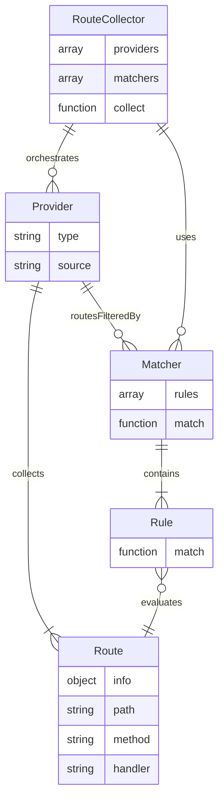
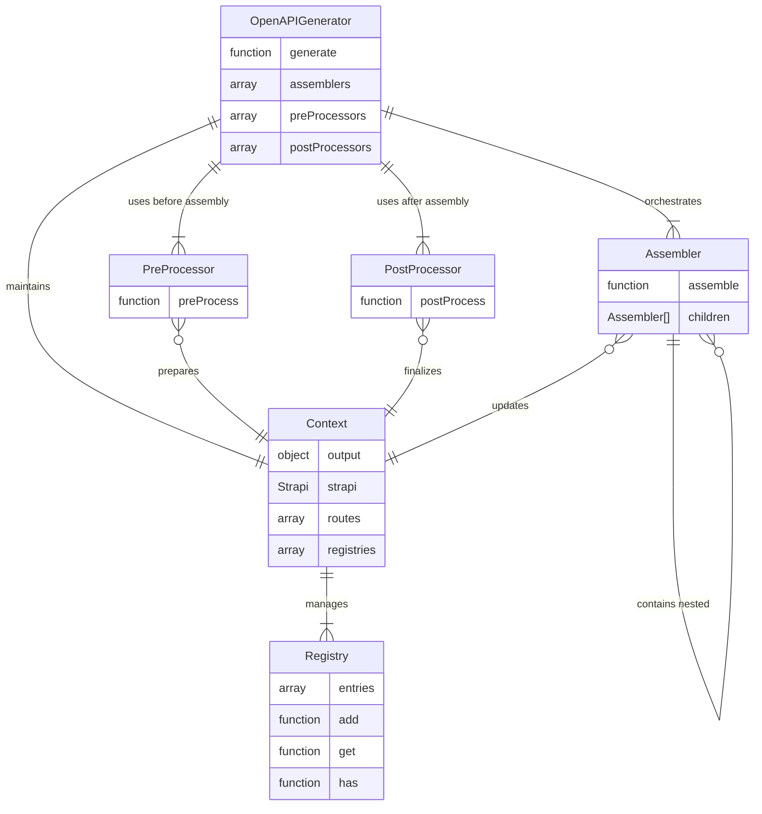

# OpenAPI

This section explores the overall architecture and main components of the OpenAPI package.

---

## Overview

The package is organized into two main domains:

### The Route Collection

This domain provides objects that extract different sets of routes from a Strapi application.

You can find related files in `src/routes`.

:::info
This domain could potentially be moved to the Strapi core or Strapi utils in the future since it doesn't have any direct dependencies on OpenAPI itself.
:::

### The OpenAPI Document Generation

This domain contains all the components necessary to generate a valid OpenAPI document from a Strapi application:

| Component         | Path                                       |
| ----------------- | ------------------------------------------ |
| OpenAPI Generator | `src/generator`                            |
| Assemblers        | `src/assemblers`                           |
| Contexts          | `src/context`                              |
| Registries        | `src/registries`                           |
| Processors        | `src/pre-processor`, `src/post-processors` |

---

Additionally, the package centralizes all exports for the public API in an `src/exports.ts` file.

This approach decouples the package root exports from the public programmatic API it exposes.

## Design Pattern

The package follows Object-Oriented Design principles and patterns to ensure code that's both maintainable and extensible:

- **SOLID Principles**: Adheres to single responsibility, open/closed, Liskov substitution, interface segregation, and
  dependency inversion principles
- **Dependency Injection**: Components receive dependencies through their constructors rather than creating them
  internally
- **Factory Pattern**: Used to instantiate complex objects with configurable behaviors
- **Registry Pattern**: Maintains global state and configuration in a controlled manner (see Registries and Context)

The architecture emphasizes:

- Atomic components with single responsibilities, particularly for the assembly process (see Assemblers)
- Clear separation of concerns (orchestrator, routes collection, assembler, lifecycle, etc.)
- Extensible design that enables adding new capabilities without modifying existing code (see Assembler, Processors)

This results in a modular system where each component focuses on a specific task while maintaining clear boundaries with
other parts of the system.

## Components

### Route Collector

Orchestrates the route collection process based on provided providers and matchers:

- **Providers**
  - Collect sets of routes for specific purposes (Admin, Core API, plugins, etc.)
- **Matchers**
  - Filter route collections based on rules
- **Rules**
  - Match (or exclude) a single route based on specific criteria

### OpenAPI Generator

Generates valid OpenAPI documents from a Strapi application:

- **Processors**

  - Lifecycle objects and methods
  - **Pre-processors**: Prepare data and registries before assembly
  - **Post-processors**: Clean up and finalize the output after assembly

- **Assemblers**

  - Generate specific parts of the final document
  - Each has a single responsibility
  - **Sub-Assemblers**
    - Specialized assemblers for nested components (operations, etc.)
    - Are provided with custom contexts

- **Context**
  - Holds information and instances for assembly processes
  - Maintains reference to the final built object in `context.output.data`
  - **Registries**
    - Data structures for storing/retrieving configurations and common objects

