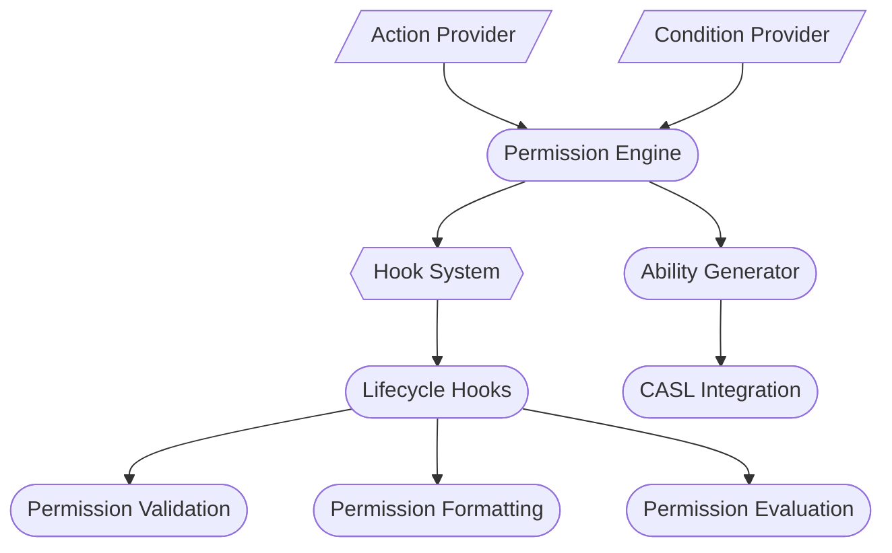
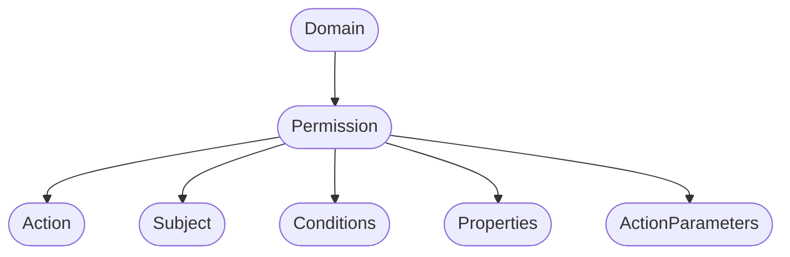

# @strapi/permissions

## Introduction

The `@strapi/permissions` package is a sophisticated permission management system designed to provide flexible, granular
control over access rights in Strapi systems.

Built on top of CASL's ability system, it extends the basic permission model with advanced features like parametrized
actions, conditional evaluation, and a hook system for custom behaviors.

It serves as the backbone for building advanced implementations in Strapi, enabling developers to design customized
permission systems tailored to specific Strapi business objectives and application demands like RBAC, users and permissions, or API tokens.

## Core Architecture

### Engine



### Domain



## Key Features

### Dynamic Evaluation

Runtime permission checking at the time of the request, ensuring that permissions align with the most current context
and data.

_Example Use Case_: API endpoint access control, where user roles and data states impact access decisions dynamically.

### Parametrized Actions

Actions that leverage context-specific parameters to enable fine-grained control, allowing flexibility in defining
permissions.

_Example Use Case_: `publish?postId=123`, restricting operation to a specific post identified by its ID.

### Conditional Logic

Implementation of complex permission rules that consider different conditions, enabling nuanced access control tailored
to resource state or user data.

_Example Use Case_: Validate resource ownership by checking if the requesting user is the owner of a specific resource.

### Hook System

A modular mechanism to inject custom behaviors during various stages of the permission validation process, offering
extensibility and adaptability.

_Example Use Case_: Implement audit logging for permission evaluations or perform additional data validation before
granting access.

## Integration Example

```typescript
import { engine, domain } from '@strapi/permissions';

// 1. Define Providers
const providers = {
  action: providerFactory(),
  condition: providerFactory(),
};

// 2. Register Custom Conditions
providers.condition.register({
  name: 'isOwner',
  handler: (ctx) => ctx.user.id === ctx.resource.ownerId,
});

// 3. Create Engine
const permissionEngine = engine.new({ providers });

// 4. Define Permissions
const permissions = [
  domain.permission.create({
    action: 'read',
    subject: 'article',
    conditions: ['isPublished'],
  }),
  domain.permission.create({
    action: 'update',
    subject: 'article',
    conditions: ['isOwner'],
    properties: {
      fields: ['title', 'content'],
    },
  }),
];

// 5. Generate Ability
const ability = await permissionEngine.generateAbility(permissions);

// 6. Evaluate Permission
const canReadArticle = ability.can('read', 'article');
```

---

```mdx-code-block
import DocCardList from '@theme/DocCardList';
import { useCurrentSidebarCategory } from '@docusaurus/theme-common';

<DocCardList items={useCurrentSidebarCategory().items} />
```
