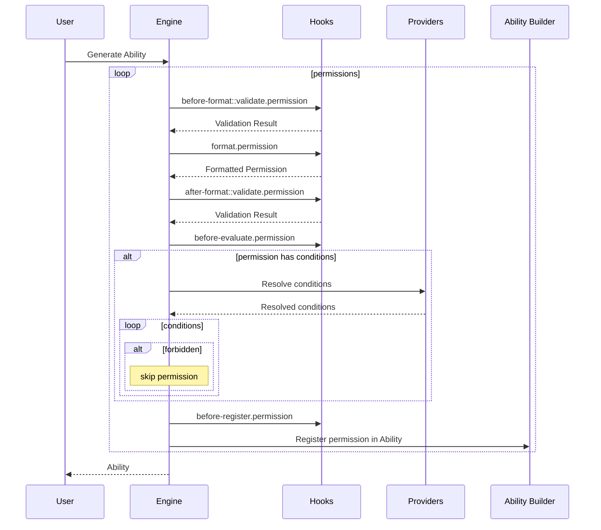

# Permission Engine

The permission engine is the entity responsible for generating new ability instances based on provided permissions,
actions, and conditions.

This is the abstraction used by other Strapi systems to create their custom permissions' engine:

- [RBAC](https://github.com/strapi/strapi/blob/develop/packages/core/admin/server/src/services/permission/engine.ts)
- [Transfer Tokens](https://github.com/strapi/strapi/blob/develop/packages/core/admin/server/src/services/transfer/permission.ts)
- [API Tokens](https://github.com/strapi/strapi/blob/develop/packages/core/core/src/services/content-api/permissions/engine.ts)

## Usage

```typescript
import * as permissions from '@strapi/permissions';

const engine = permissions.engine.new({
  providers: {
    action: myActionProvider,
    condition: myConditionProvider,
  },
});

const permission = {
  action: 'read',
  subject: 'article',
  conditions: ['isPublished'],
};

const ability = engine.generate([permission]);

console.log('Can read article?:', ability.can('read', 'article'));
```

## Ability Generation Diagram



## Hook System

### Available Hooks

| Hook Name                          | Phase            | Purpose                                                      |
| ---------------------------------- | ---------------- | ------------------------------------------------------------ |
| before-format::validate.permission | Pre-formatting   | Initial validation                                           |
| format.permission                  | Formatting       | Transform permission                                         |
| after-format::validate.permission  | Post-formatting  | Validate formatted permission                                |
| before-evaluate.permission         | Pre-evaluation   | Transform the permission after formatting and validation     |
| before-register.permission         | Pre-registration | Final modifications after evaluation but before registration |

### Hook Implementation Example

```typescript
const engine = permissions.engine.new({ providers });

// Validation hook
engine.on('before-format::validate.permission', ({ permission }) => {
  if (permission.action === 'delete' && !permission.conditions.includes('isAdmin')) {
    return false; // Prevent non-admin delete
  }
  return true;
});

// Format hook
engine.on('format.permission', ({ permission }) => {
  // Add timestamp to tracking actions
  if (permission.action.startsWith('track')) {
    return {
      ...permission,
      timestamp: Date.now(),
    };
  }
  return permission;
});
```

## Engine Configuration Options

```typescript
interface EngineConfiguration {
  providers: {
    action: ActionProvider;
    condition: ConditionProvider;
  };
  abilityBuilderFactory?: () => CustomAbilityBuilder;
}
```

### Action Provider

A provider instance that contains all available actions that can be used in permissions when generating abilities.

### Condition Provider

A provider instance mapping the conditions' name to their definitions.

Used to resolve conditions by name when evaluating and registering a permission during the ability creation process.

### Ability Builder Factory

A factory that is used to create an ability instance out of multiple permissions.

It must implement the `CustomAbilityBuilder` interface.

## Advanced Usage Examples

### Custom Ability Builder

```typescript
const customAbilityBuilder = () => {
  const { can, build } = new AbilityBuilder(Ability);

  return {
    can(permission) {
      // Custom permission logic
      const { action, subject, properties = {}, condition } = permission;
      return can(action, subject, properties.fields, condition);
    },

    build() {
      return build({
        // Custom matcher implementation
        conditionsMatcher: (rule, context) => {
          // Custom condition matching logic
          return true / false;
        },
      });
    },
  };
};

const engine = permissions.engine.new({
  providers,
  abilityBuilderFactory: customAbilityBuilder,
});
```

### Conditional Permission Chain

```typescript
const permission = domain.permission.create({
  action: 'update',
  subject: 'article',
  conditions: ['isOwner'],
});

engine.on('before-evaluate.permission', ({ permission }) => {
  // Add dynamic conditions based on context
  if (permission.action === 'update') {
    permission.conditions.push('isNotLocked');
    permission.conditions.push('isWithinBusinessHours');
  }
});
```
