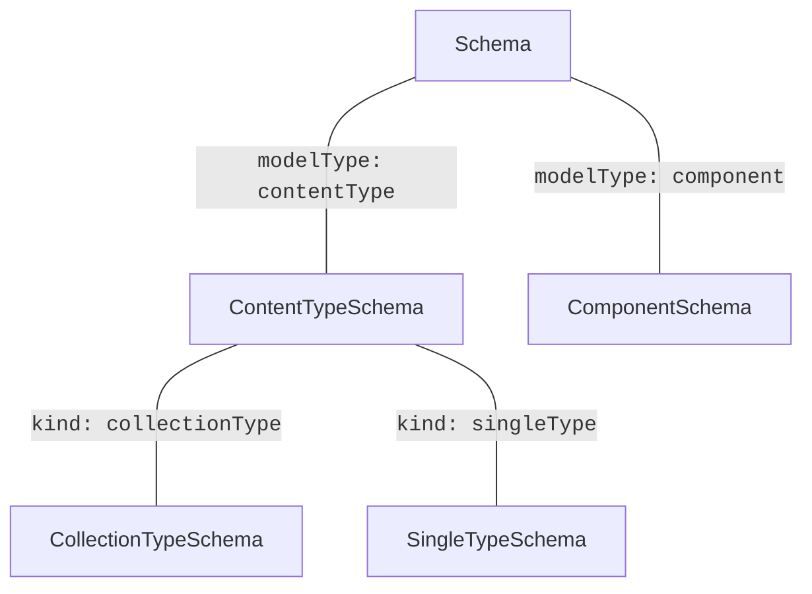

The schema is the primary data structure leveraged within the Strapi Type System, defining how content is structured and managed in the application.

It serves several key functions:

- **Representation**: At its core, a schema outlines and defines the structure of Strapi content. This is useful when dealing with features that need access to low level schema properties (_e.g. attributes, plugin options, etc..._).

- **Inference**: The schema allows inferring and configuring numerous other types. This includes entities like `ContentType` or `Component`, among others.

### Scope

Schema types represent **loaded** schemas in the context of a Strapi server application and should be used accordingly.

:::caution
Database models and raw schema definitions (_aka schemas before being loaded by the Strapi server_) are **not** the same types and can't be used interchangeably.
:::

### Sub-Types

Each box is a type that extends the base Schema interface.

In between each box is text that represents the discriminant used to differentiate the subtype from others.



### Properties

Schema types contain useful information that helps other types know how to interact with the Strapi content.

This is facilitated through multiple properties.

#### Options

A set of properties used to configure the schema. It contains information on features activation among other things.

This can be really useful to make the types adapt to a given schema.

For instance, the document service uses the `options.draftAndPublish` property to determine whether it should add publication methods to the service type.

#### Plugin Options

These options provide the ability to alter or enhance the behaviour of the system based on specific values.

If a plugin is enabled, it might bring functionality that can affect how types interact with each other.

For example, it's possible to add or remove certain entity-service filters from the query type based on whether a plugin is enabled.

#### Attributes

Strongly typed schema attributes allows the Type System to infer actual entities types based on their properties.

For instance, a string attribute will resolve to a primitive string in an entity, whereas a repeatable component attribute will resolve to an array of objects.

### Usage

import Tabs from '@theme/Tabs';
import TabItem from '@theme/TabItem';

<Tabs>
<TabItem value="public" label="Public" default>
When designing public APIs (and in most other scenarios), it's advised to use the high-level schema types found in the `Schema` namespace.

Schema definitions exported from the `Schema` namespace are targeting the dynamic types found in the public schema registries, and will dynamically adapt to the current context while extending the base Schema types.

:::info
If the public registries are empty (_e.g. types are not generated yet, not in the context of a Strapi application, ..._), schema types will fallback to their low-level definitions.
:::

```typescript
import type { Schema } from '@strapi/strapi';

declare const schema: Schema.Schema;
declare const contentType: Schema.ContentType;
declare const component: Schema.Component;

declare function processAnySchema(schema: Schema.Schema): void;

processAnySchema(schema); // ✅
processAnySchema(contentType); // ✅
processAnySchema(component); // ✅

declare function processContentTypeSchema(schema: Schema.ContentType): void;

processContentTypeSchema(schema); // ✅
processContentTypeSchema(contentType); // ✅
processContentTypeSchema(component); // ❌ Error, a component schema is not assignable to a content-type schema

declare function processComponentSchema(schema: Schema.Component): void;

processComponentSchema(schema); // ✅
processComponentSchema(contentType); // ❌ Error, a content-type schema is not assignable to a component schema
processComponentSchema(component); // ✅
```

</TabItem>
<TabItem value="internal" label="Internal">
Schema definitions exported from the `Struct` namespace defines the low level type representation of Strapi schemas.

:::caution
Those types can be useful when you want to validate other types against the base ones, but realistically, the public Schema types should almost always be preferred.
:::

```typescript
import type { Struct } from '@strapi/strapi';

declare const schema: Struct.Schema;
declare const contentType: Struct.ContentTypeSchema;
declare const component: Struct.ComponentSchema;

declare function processAnySchema(schema: Struct.Schema): void;

processAnySchema(schema); // ✅
processAnySchema(contentType); // ✅
processAnySchema(component); // ✅

declare function processContentTypeSchema(schema: Struct.ContentTypeSchema): void;

processContentTypeSchema(schema); // ✅
processContentTypeSchema(contentType); // ✅
processContentTypeSchema(component); // ❌ Error, a component schema is not assignable to a content-type schema

declare function processComponentSchema(schema: Struct.ComponentSchema): void;

processComponentSchema(schema); // ✅
processComponentSchema(contentType); // ❌ Error, a content-type schema is not assignable to a component schema
processComponentSchema(component); // ✅
```

</TabItem>
</Tabs>
