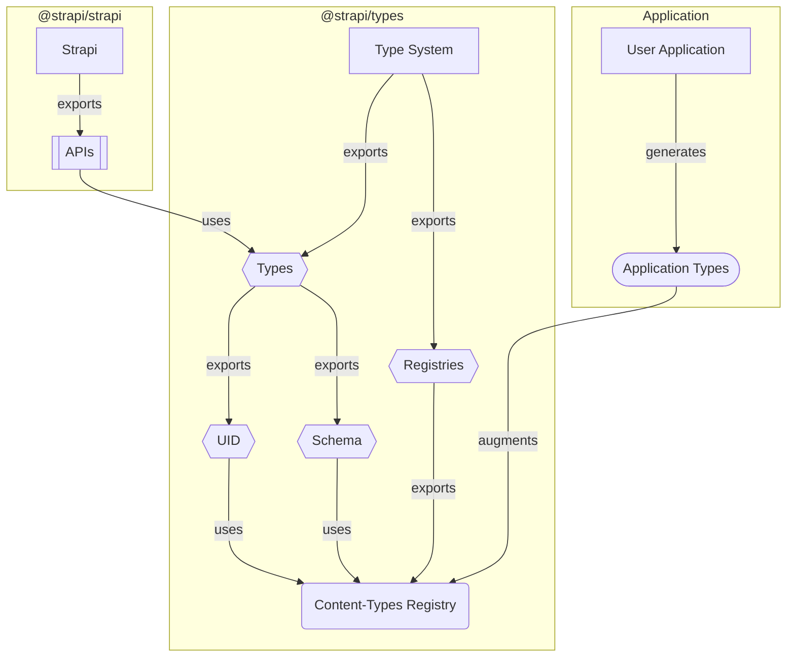

import Tabs from '@theme/Tabs';
import TabItem from '@theme/TabItem';

### Context

#### Why?

The Strapi Type System is designed to provide developers with a fully customizable experience.

It's engineered to adapt and modify its type definitions automatically according to the context of each application and associated resources.

This adaptability extends to various components such as schemas, services, controllers, and more.

:::note
See the [type system principles](../philosophy#key-principles) page for more information about the mission.
:::

#### How?

To meet this requirement, the Type System employs "public registries".

In simple terms, public registries are basic indexed interface definitions that are made publicly available by the types package.

```typescript
export interface MyRegistry {
  [key: string]: GenericResourceDefinition;
}
```

Every resource comes with its own registry that has a set of rules acting as the default state (the index).

Because every registry can be augmented (publicly exported), developers have the freedom to inject their own definitions.

Doing so allows Strapi APIs to respond in a way that aligns with the developers' custom definitions.

:::info[Did you know?]
The `Schema` and `UID` namespaces rely solely on public registries to infer their type definitions.

This is why it's heavily encouraged to use them over their low level counter-parts.
:::

### How it works

#### Architecture



#### Usage

##### 1. Registry Definition

Creating a new registry is as simple as exporting an indexed interface from the right namespace.

Let's declare the content-type schema registry.

It should accept:

- Content-type UIDs as keys
- Content-type schemas as values

```ts title="@strapi/types/public/registries.ts"
import type { Internal, Struct } from '@strapi/types';

export interface ContentTypeSchemas {
  [key: Internal.UID.ContentType]: Struct.ContentTypeSchema;
}
```

:::note
We use low level types to define our index (`Internal`/`Struct`) to keep it as generic as possible.
:::

##### 2. Dynamic Type Definitions

###### UID.ContentType

To define `UID.ContentType`, we extract every key (`Internal.Registry.Keys`) from the public content-type registry (`Public.ContentTypeSchemas`) that matches with the base definition of a content-type UID (`Internal.UID.ContentType`).

```ts title="@strapi/types/uid.ts"
import type { Internal, Public } from '@strapi/types';

export type ContentType = Internal.Registry.Keys<
  Public.ContentTypeSchemas,
  Internal.UID.ContentType
>;
```

:::note
Only selecting keys that extend `Internal.UID.ContentType` ensures we don't end up with manually added malformed keys, and tells the type-checker we're confident about what's in our union type.
:::

###### Schema.ContentType

To declare `Schema.ContentType`, we simply query the content-type schema registry (`Public.ContentTypeSchemas`) with the provided content-type UID (`TUID`).

:::note
Since `UID.ContentType` (`TUID`) is [dynamically built based on actual keys](#uidcontenttype), we know for sure that there will be a valid corresponding schema in the registry.
:::

```ts title="@strapi/types/schema.ts"
import type { UID, Public } from '@strapi/types';

export type ContentType<TUID extends UID.ContentType> = Public.ContentTypeSchemas[TUID];
```

##### 3. API Design

To create types for a dynamic API (_aka one that reacts to its context_), simply use dynamic type definitions such as `UID`, `Data` or `Schema`.

```ts title="@strapi/core/document-service.ts"
import type { Data, UID } from '@strapi/types';

export type findOne<TUID extends UID.ContentType>(uid: TUID): Data.ContentType<TUID>;
```

:::caution
Remember to use dynamic type definitions (`UID`, `Data`, `Schema`) and not static ones (`Internal`, `Struct`).
:::

:::info[Reminder]
Registries are **indexed**, which means that:

- **When augmented** (_e.g. in users' applications_), they'll return **strongly typed values** that correspond to the defined types.
- **When empty** (_e.g. in Strapi codebase_), they'll return **generic low level types** based on their index definition.

<Tabs>
  <TabItem value="augmented" label="Augmented">
    ```ts
    import type { UID } from '@strapi/types';

    const uid: UID.ContentType;
    // ^ 'api::article.article' | 'admin::user'
    ```

  </TabItem>
  <TabItem value="empty" label="Empty">
    ```ts
    import type { UID } from '@strapi/types';

    const uid: UID.ContentType;
    // ^ `admin::${string}` | `api::${string}.${string}` | `plugin::${string}.${string}` | `strapi::${string}`
    ```

  </TabItem>
</Tabs>
:::

##### 4. Type Augmentation

###### Manual Augmentation

It's possible to manually augment the public registries to create tailor-made experiences.

```ts title="my-app/index.d.ts"
import type { Struct } from '@strapi/strapi';

interface ApiArticleArticle extends Struct.ContentTypeSchema {
  // ...
}

declare module '@strapi/strapi' {
  export module Public {
    export interface ContentTypeSchemas {
      'api::article.article': ApiArticleArticle;
    }
  }
}
```

This will force every type that depends on the `Public.ContentTypeSchemas` registry to recognize `'api::article.article'` as the only valid UID and `ApiArticleArticle` the only valid schema.

:::note
In the context of a Strapi application, developers are strongly encouraged to use types exported by `@strapi/strapi` and not `@strapi/types`.

This is to allow having both an internal (`@strapi/types`) and a public (`@strapi/strapi`) types API.
:::

###### Automated Augmentation

To ease the registries augmentation, Strapi offers an automated way of generating types and extending the registries.

The process will generate type definitions based on the user application state (`schemas`), then augment the registry using the created types.

<Tabs>
  <TabItem value="manual" label="Manual Run">
    Generate the types once.

```shell title="my-app/"
yarn strapi ts:generate-types
```

  </TabItem>
  <TabItem value="dev" label="During Development">
    Start the application in dev mode, and generate types on every server restart.

    Useful when working with the content-type builder.

```shell title="my-app/"
yarn develop
```

  </TabItem>
</Tabs>

The generated types will automatically augment the corresponding registries.

```ts title="my-app/types/generated/contentTypes.d.ts"
import type { Struct } from '@strapi/strapi';

interface ApiArticleArticle extends Struct.ContentTypeSchema {
  // ...
}

interface AdminUser extends Struct.ContentTypeSchema {
  // ...
}

declare module '@strapi/strapi' {
  export module Public {
    export interface ContentTypeSchemas {
      'api::article.article': ApiArticleArticle;
      'admin::user': AdminUser;
    }
  }
}
```

---

When coupling everything together, the end result is a TypeScript developer experience automatically adjusted to the current context.

<!-- prettier-ignore-start -->

<Tabs>
<TabItem value="app" label="User Application">
```ts title="my-app/src/index.ts"
export default () => ({
  bootstrap() {
    strapi.findOne('ap');
    //                ^ TypeScript will autocomplete with "api::article.article"

    strapi.findOne('ad');
    //                ^ TypeScript will autocomplete with "admin::user"

    strapi.findOne('api::blog.blog');
    //                ^ Error, TypeScript will complain
  }
})
```
</TabItem>
<TabItem value="strapi" label="Strapi Codebase">
```ts title="@strapi/strapi/document-service.ts"
import type { UID } from '@strapi/types';

export const findOne<TUID extends UID.ContentType>(uid: TUID) {
  // ...
}

findOne('admin::foo');
//           ^ Valid, matches 'admin::${string}'

findOne('plugin::bar.bar');
//           ^ Valid, matches 'plugin::${string}.${string}'

findOne('baz');
//           ^ Error, does not correspond to any content-type UID format
```
</TabItem>
</Tabs>

<!-- prettier-ignore-end -->
