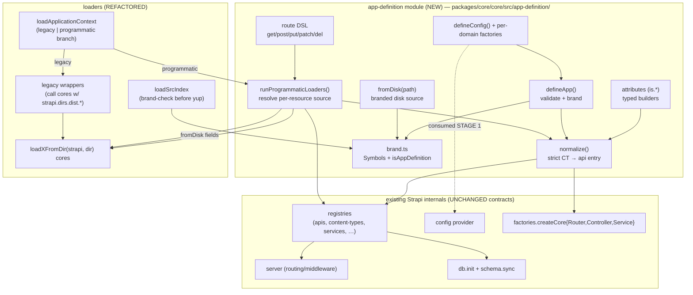

# C4 L3 — Components

Zoom into `@strapi/core`: the new `app-definition` module, the refactored loaders, and
the seams where they meet the existing `Strapi` lifecycle.

## Components in the `app-definition` module

| Component                           | Responsibility                                                                                                                                                                                             | Key collaborators           |
| ----------------------------------- | ---------------------------------------------------------------------------------------------------------------------------------------------------------------------------------------------------------- | --------------------------- |
| **`defineApp(def)`**                | Validate the definition shape, attach a Symbol brand, return it untouched-but-typed. Pure; no side effects.                                                                                                | `brand`, `types`            |
| **`defineConfig(cfg)` + factories** | Typed config builders (`defineDatabaseConfig`, `defineServerConfig`, …) that validate at startup and throw on malformed config.                                                                            | `config` provider (Stage 1) |
| **`fromDisk(path)`**                | Return a branded "disk source" marker for a resource field. Resolved later by the loader to the matching `loadXFromDir` core.                                                                              | `brand`, loader cores       |
| **`attributes` (`is.*`)**           | Typed factory functions returning plain attribute schema objects (`is.string({required:true})` → `{ type:'string', required:true }`).                                                                      | `@strapi/types`             |
| **route DSL**                       | `({ get, post, put, patch, del }) => Route[]` producing existing `Core.RouteInput` with inline handlers.                                                                                                   | server routing              |
| **`normalize()`**                   | Strict CT normalizer: require `singularName`+`pluralName`, build `uid = api::<apiName>.<singular>`, assemble the same `api` object the registry expects, and (default) auto-generate CRUD via `factories`. | `factories`, registries     |
| **`runProgrammaticLoaders()`**      | For each resource, resolve the source (in-code value vs `fromDisk`), apply collision rules, populate registries. Import-and-add plugins.                                                                   | loader cores, registries    |
| **`brand.ts`**                      | Symbols + `isAppDefinition` / `isDiskSource` type guards used by `loadSrcIndex` and `createStrapi`.                                                                                                        | all of the above            |

## Refactored loader components

| Component                             | Before                                                    | After                                                                                                                         |
| ------------------------------------- | --------------------------------------------------------- | ----------------------------------------------------------------------------------------------------------------------------- |
| **`loadXFromDir(strapi, dir)` cores** | logic hard-wired to `strapi.dirs.dist.*`                  | path-parametric; one implementation per resource (apis, components, policies, middlewares, src-index, sanitizers, validators) |
| **legacy wrappers**                   | were the loaders                                          | thin: call the core with the existing dist path → byte-identical behavior                                                     |
| **`loadApplicationContext`**          | runs all file loaders                                     | branches: legacy (existing) vs programmatic (`runProgrammaticLoaders`)                                                        |
| **`loadSrcIndex`**                    | yup `.noUnknown()` against `{register,bootstrap,destroy}` | brand-check first; route `defineApp` exports to programmatic; else existing validation                                        |

## Stable contract (must not change)

Plugins and user code only ever touch **registries** and **instance accessors** — never
loaders. The loader refactor stays entirely behind this boundary. See the RFC
"Loader-level surface (research)" section for the enumerated contract.

See [L4 — Code](./04-code.md) for concrete types and signatures.
