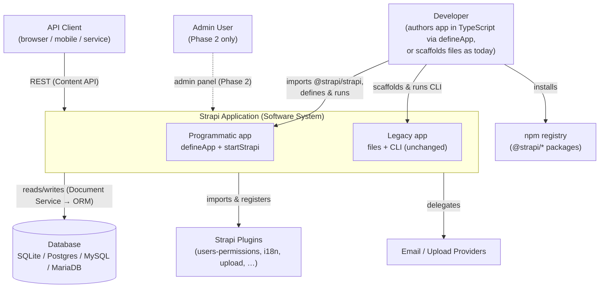

# C4 L1 — System Context

How a **programmatic Strapi app** (Strapi used as a primitive) sits among its users and
the external systems it interacts with. At this zoom level nothing changes versus a
legacy Strapi app except _who authors the application and how_ — the runtime still talks
to the same database, clients, plugins, and email/upload providers.

## Actors

| Actor          | Relationship                                                                                                                                                                                                                 |
| -------------- | ---------------------------------------------------------------------------------------------------------------------------------------------------------------------------------------------------------------------------- |
| **Developer**  | Either authors an app declaratively in TypeScript (`defineApp`) and runs it (`startStrapi` / `strapi start`), **or** uses the existing file-scaffolding + CLI flow. The primitive flow is new; the legacy flow is unchanged. |
| **API Client** | Calls the REST Content API. Identical surface whether the app is programmatic or legacy (same routing, sanitization, RBAC).                                                                                                  |
| **Admin User** | Uses the admin panel. **Out of scope for Phase 1** (no panel built/served); Phase 2.                                                                                                                                         |

## External systems

| System                       | Role                                                   | Change in this initiative                                                                                                 |
| ---------------------------- | ------------------------------------------------------ | ------------------------------------------------------------------------------------------------------------------------- |
| **Database**                 | Persistence via `@strapi/database` + Document Service. | None. Schema is synced from in-memory content types exactly as from file schemas.                                         |
| **Plugins**                  | Extend the app (auth, i18n, upload, …).                | Programmatic mode **imports and adds** plugins instead of scanning `package.json` (ADR-0006). Legacy discovery unchanged. |
| **Email / Upload providers** | Pluggable side-effect providers.                       | None. Configured via `config` (passed in or `fromDisk`).                                                                  |
| **npm registry**             | Source of `@strapi/*` and community packages.          | `@strapi/strapi` gains `defineApp`/`startStrapi`/`/attributes`/`/plugins` exports.                                        |

## System boundary & guarantees

- **One software system, two authoring modes.** "Legacy" and "programmatic" are modes of
  the same Strapi runtime, selected by whether an `app` (a `defineApp` result) is
  provided. They are mutually exclusive per process (ADR-0001).
- **Zero breaking changes.** The legacy mode path is byte-for-byte unchanged; this is the
  top constraint (ADR-0002).
- **Same external contracts.** Database, Content API, plugin, and provider contracts are
  unchanged — the primitive only changes _how the application is described and started_.

See [L2 — Containers](./02-containers.md) for the package/runtime breakdown.
