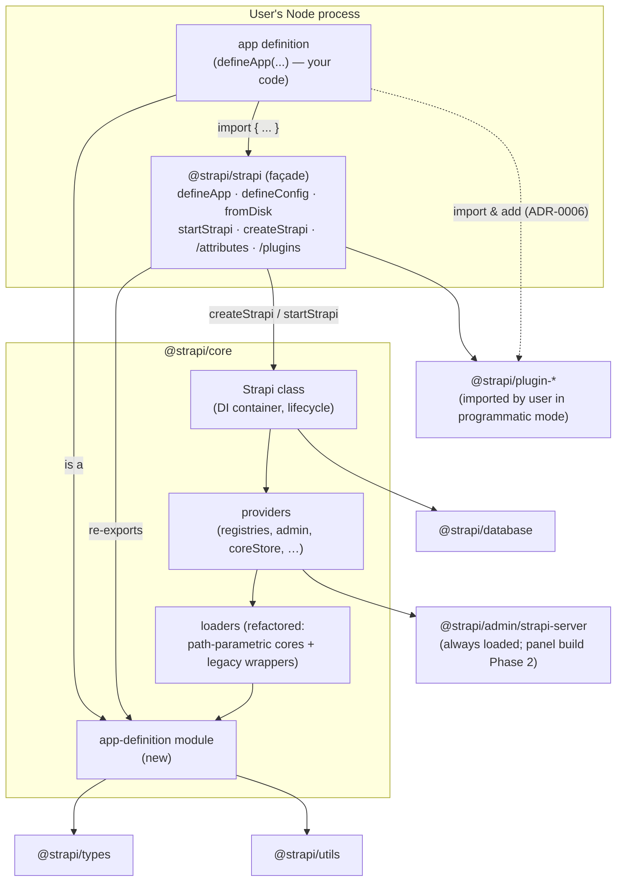
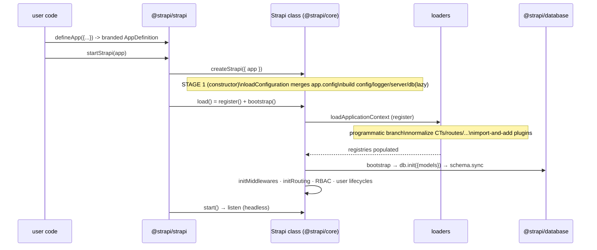

# C4 L2 — Containers

"Containers" here are the **packages / deployable+importable units** and the runtime
process. For a primitive, the "container" is mostly _your Node process_ that imports
`@strapi/strapi`.



## Containers / units

| Unit                              | Type                   | Responsibility                                                                                                                                                  | Change                               |
| --------------------------------- | ---------------------- | --------------------------------------------------------------------------------------------------------------------------------------------------------------- | ------------------------------------ |
| **User Node process**             | Runtime                | Imports `@strapi/strapi`, builds an `AppDefinition`, calls `startStrapi`. Owns TS execution (tsx / ts-node / build) — ADR-0009.                                 | New usage pattern.                   |
| **`@strapi/strapi`**              | Package (façade)       | Public surface. Re-exports the programmatic API from core; adds subpath exports `./attributes` and `./plugins`. CLI (`strapi start`) brand-detects `defineApp`. | New exports; CLI `start` brand path. |
| **`@strapi/core`**                | Package (engine)       | Hosts the new `app-definition` module, the refactored loaders, the `Strapi` class, and providers. All runtime logic lives here (ADR-0005).                      | New module + loader refactor.        |
| **`@strapi/database`**            | Package                | Persistence/ORM. Built lazily from `config.get('database')`.                                                                                                    | None.                                |
| **`@strapi/types`**               | Package                | Source of truth for schema/attribute types reused by the attribute builders.                                                                                    | Reused; possibly extended.           |
| **`@strapi/admin/strapi-server`** | Package (provider dep) | Always loaded as a provider; registers `admin::user`. Panel build/serve is Phase 2.                                                                             | None in Phase 1 (ADR-0007).          |
| **`@strapi/plugin-*`**            | Packages               | In programmatic mode, imported by the user and added to the `plugins` map; no `package.json` scan.                                                              | New consumption pattern (ADR-0006).  |

## Packaging detail (`@strapi/strapi` exports)

```jsonc
// conceptual additions to packages/core/strapi/package.json "exports"
{
  ".": {
    /* existing: createStrapi, factories, … + defineApp, defineConfig, fromDisk, startStrapi */
  },
  "./attributes": {
    /* NEW: is.* attribute builders */
  },
  "./plugins": {
    /* NEW: recommendedPlugins() preset (imports-only) */
  },
}
```

- `defineApp`, `defineConfig`, `fromDisk`, `startStrapi`, `isAppDefinition`,
  `createStrapi`, and types are exported from the root.
- `./attributes` is its own entry so `import * as is from '@strapi/strapi/attributes'`
  stays tree-shakeable and reads cleanly.
- `./plugins` exposes `recommendedPlugins()` — _just imports_ under the hood, no scan.

## Runtime sequence (programmatic)



See [L3 — Components](./03-components.md) to zoom into `@strapi/core`.
