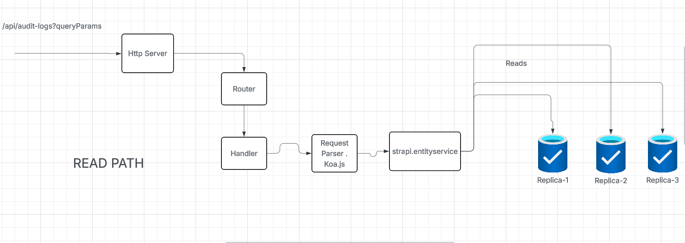
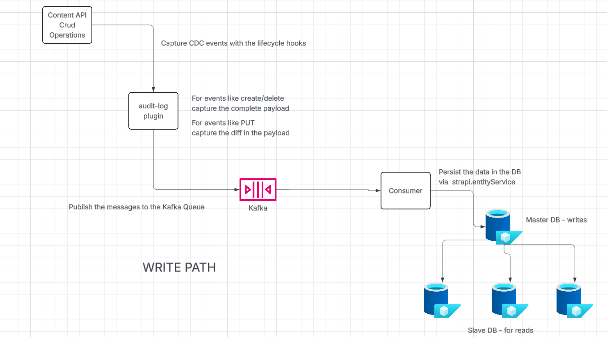

# Design Summary: Automated Audit Logging Feature

## 1. Approach

The automated audit logging feature is implemented as a custom Strapi plugin named `audit-log`. This approach ensures modularity, reusability, and adherence to Strapi's plugin architecture. The core logic for capturing content changes leverages Strapi's lifecycle hooks, which provide a robust mechanism to intercept data modifications at the database level.

## 2. Architecture

### Read Path Flow

### Write Path Flow

The audit logging system is architected around a decoupled, event-driven flow using Kafka, which integrates with Strapi's core in the following manner:

*   **`audit-log` Plugin:**
    *   **Content Type (`audit_log`):** A new collection type `audit_log` is defined within the plugin. This content type stores all audit log entries, including `action` (create, update, delete), `contentType`, `recordId`, `userId`, and a `payload` containing the change details.
    *   **Lifecycle Hooks (`register.ts`):** The plugin subscribes to `afterCreate`, `afterUpdate`, and `afterDelete` lifecycle events for all content types. These hooks are responsible for:
        *   Detecting content modifications.
        *   Constructing the audit log entry.
        *   **Sending the audit log entry as a message to a Kafka topic via the `kafka.ts` service.**
    *   **Kafka Integration:**
        *   **Kafka Producer (`kafka.ts` service):** Handles connecting to Kafka brokers and sending audit log messages to a configured topic. It is initialized during the Strapi `bootstrap` phase and disconnected during the `destroy` phase.
        *   **Kafka Consumer (`kafka-consumer.ts` service):** Runs as a background process, consuming messages from the Kafka topic. Upon receiving a message, it parses the content and persists the audit log entry to the `audit_logs` collection via `strapi.entityService.create()`. This decouples the logging process from the main request flow.
    *   **REST API (`/audit-logs`):** The plugin exposes a custom REST API endpoint `/audit-logs` to retrieve, filter, and paginate audit log entries from the database.
        *   **Route (`routes/index.ts`):** Defines the `GET /audit-logs` endpoint.
        *   **Controller (`controllers/audit-log.ts`):** Handles incoming requests to `/audit-logs`, extracts query parameters, and delegates to the service layer.
        *   **Service (`services/audit-log.ts`):** Contains the business logic for querying the `audit_logs` collection.
    *   **Access Control:** A custom permission `plugin::audit-log.read` is registered to control access to the `/audit-logs` endpoint.
    *   **Configuration:** The plugin is configured via `./config/plugins.js`, including Kafka `brokers` and `topic`.

*   **Strapi Core:**
    *   **Database Layer:** The `audit_logs` content type is automatically mapped to a database table. `strapi.entityService` is used by the Kafka consumer to write the final log entry.
    *   **Lifecycle Event System:** Strapi's built-in lifecycle event system is the trigger for the entire audit logging process.

## 3. Tradeoffs and Considerations

*   **Kafka Integration - Benefits:**
    *   **Decoupling & Backpressure:** The primary benefit is decoupling the audit logging from the main API request-response cycle. If the database is slow, the application doesn't slow down; messages simply queue in Kafka. This prevents backpressure on the API.
    *   **Durability & Reliability:** Kafka acts as a durable buffer, reducing the risk of losing audit logs if the database is temporarily unavailable.
    *   **Scalability:** The event-driven architecture allows both the number of producers (Strapi instances) and consumers to be scaled independently. This makes the system highly scalable for high-traffic applications.

*   **Kafka Integration - Complexities:**
    *   **Infrastructure Overhead:** This design introduces an external dependency on a Kafka cluster, which requires separate setup, maintenance, and monitoring.
    *   **Eventual Consistency:** Audit logs are no longer immediately available in the database after an API call. They are persisted asynchronously by the consumer, leading to a state of eventual consistency.
    *   **Consumer Reliability:** The Kafka consumer (`kafka-consumer.ts`) must be robust. It needs comprehensive error handling, retry logic, and potentially a dead-letter queue (DLQ) strategy to handle malformed messages or persistent database errors.
    *   **Message Ordering:** While Kafka guarantees message order within a single partition, achieving strict global order across the entire system can be complex if multiple consumers or partitions are involved.

*   **General Considerations:**
    *   **User Context in Lifecycle Hooks:** Obtaining the authenticated user within a lifecycle hook remains a challenge. The current implementation uses `strapi.requestContext` which works for standard API requests but might not capture context from other event sources.
    *   **`afterUpdate` "Before" State:** The implementation correctly captures the "before" state by using the `beforeUpdate` hook to temporarily store the record. This adds one extra database read for every update operation, which is a performance tradeoff for accurate logging.
    *   **Payload Size:** Storing the full `payload` in Kafka messages and the database can have significant storage implications.

## 4. Future Enhancements

*   **Date Range Filtering:** Enhance the `auditLog` service to properly parse and apply date range filters to the `createdAt` timestamp of the audit log entries.
*   **User Injection:** Implement a middleware to reliably inject the authenticated user's ID into the lifecycle hook context.
*   **Detailed Diffing for Updates:** Implement a more sophisticated diffing mechanism for `update` operations to only store the actual changes, rather than the full "before" and "after" objects, to reduce payload size.
*   **Admin UI Integration:** Develop a simple UI in the Strapi admin panel to view and manage audit logs.
*   **Export Functionality:** Add an option to export audit logs in various formats (CSV, JSON).